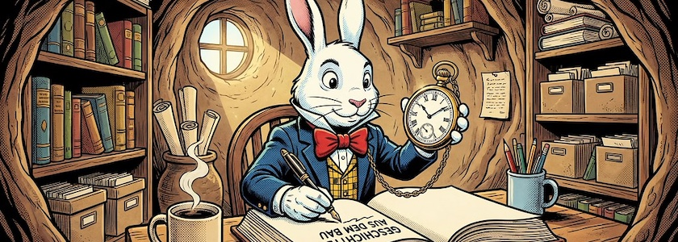

Es gibt mal wieder Neues von [Anytype](https://anytype.io/) zu berichten, meiner digitalen Rumpelkammer, die zusammen mit [Joplin](http://cognitiones.kantel-chaos-team.de/webworking/staticsites/joplin.html) die [Basis für mein »zweites Gehirn«](https://kantel.github.io/posts/2025112701_anytype_051/) bildet. Dabei stellt Anytype wegen der Möglichkeit, die Seiten aufzuhübschen und auch [(einzelne) Seiten für das Web zu exportieren](https://kantel.github.io/posts/2025021401_anytype_web/), ein Zwischending zwischen einem digitalen Garten und einer digitalen Rumpelkammer dar.

Von [Anytype Desktop](https://download.anytype.io/) wurde kürzlich die [Version&nbsp;0.54.2&nbsp;Beta](https://blog.anytype.io/february-community-update-2026/) veröffentlicht. Die in meinen Augen wichtigste Neuerung ist die, daß Anytype »Tabs« kann. Ihr könnt jetzt mehrere Objekte im selben Fenster öffnen, sie per Drag & Drop neu anordnen, Eure meistgenutzten Tabs anheften oder einen Tab in ein eigenes Fenster verschieben. Tabs funktionieren bereichsübergreifend – so können Eure Kanäle, Direktnachrichten und Dokumente nebeneinander angezeigt werden.

<iframe class="if16_9" src="https://www.youtube.com/embed/yBY1lhiAYOQ?si=yiYHRISquh4tJ6HH" title="YouTube video player" frameborder="0" allow="accelerometer; autoplay; clipboard-write; encrypted-media; gyroscope; picture-in-picture; web-share" referrerpolicy="strict-origin-when-cross-origin" allowfullscreen></iframe>

Daneben neu sind erweiterte Filterfunktionen, ein- und ausklappbare Überschriften, Backlinks für Dateien und Bilder und noch einiges mehr. Wie immer führt die *fokussierte Neugierde* in [obigem Video](https://www.youtube.com/watch?v=yBY1lhiAYOQ) durch die wichtigsten Neuerungen dieses Updates. Eine komplette Liste aller Änderungen findet Ihr in den [Release Notes](https://community.anytype.io/t/anytype-desktop-0-54-0-focus-flow/30076).

<iframe class="if16_9" src="https://www.youtube.com/embed/3_7OcgHY49Y?si=-KSagxUvCA2TcCbV" title="YouTube video player" frameborder="0" allow="accelerometer; autoplay; clipboard-write; encrypted-media; gyroscope; picture-in-picture; web-share" referrerpolicy="strict-origin-when-cross-origin" allowfullscreen></iframe>

Außerdem hat Anytype im Rahmen des ersten *Town Hall Meeting* dieses Jahres die [Collections&nbsp;2.0](https://community.anytype.io/t/collections-2-0-architecture-changing-how-we-use-types/30113) vorgestellt, eine neue Art, Objekte zu verwenden. Das Feature ist noch nicht implementiert, sondern soll erst mit der Community diskutiert werden. In obiger Aufzeichnung des *Town Hall Meetings* wird Collections&nbsp;2.0 ab Minute 32:15 etwa eine Viertelstunde lang präsentiert. (Das im Titel des Videos »February&nbsp;**2025**« steht, sollte Euch nicht irritieren, hier hat wohl offensichtlich der Titel-Designer geschlampt.)

Außerdem wurde auf diesem Treffen noch über den Einsatz gekünstelter Intelligenzia in zukünftigen Versionen von Anytype diskutiert. Ihr könnt also in Zukunft noch einiges von dieser digitalen Rumpelkammer erwarten.

---

**Bild**: *[Rudi Rabbit](https://www.flickr.com/photos/schockwellenreiter/55113823648/)*, erstellt mit [OpenArt.ai](https://openart.ai/home). Prompt: »*@Rudi Rabbit sits at a desk in a rabbit burrow. It wears a large pocket watch on a chain. On the desk in front of the rabbit lies an enormous notebook, in which the rabbit is writing with an old-fashioned fountain pen. Next to it is a mug of steaming coffee. Writing utensils are in another mug. Many old books and files line the shelves all around the burrow. Sunlight shines through a window in the burrow wall. Colored DC comic style. Language: German. No speech bubbles, no textboxes.*« Modell: Character 2.0 with Nano Banana Pro.

