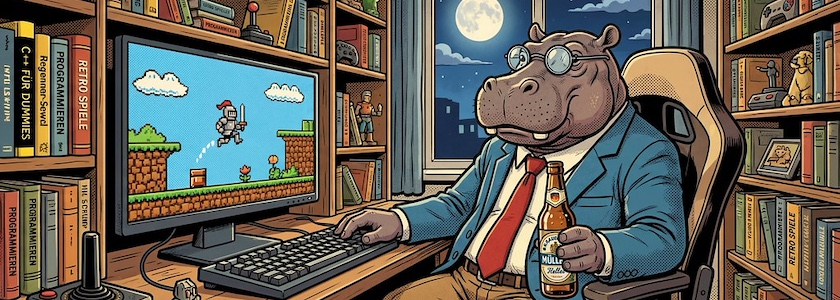

Mit meinem Beitrag vor zehn Tagen, indem ich als Ersatz für fehlende [Pyxel](http://cognitiones.kantel-chaos-team.de/multimedia/spieleprogrammierung/pyxel.html)-Tutorials [TIC-80](http://cognitiones.kantel-chaos-team.de/multimedia/spieleprogrammierung/tic80.html)-Tutorials [vorschlug](https://kantel.github.io/posts/2026021501_tic-80_tutorials/), habe ich mir echt etwas eingebrockt. Denn unsere nie schlafende Datenkrake hat mein Interesse an der kleinen Fantasykonsole bemerkt und noch etliche weitere Tutorials in meinen Feedreader gespült, die ich Euch nicht vorenthalten möchte:

<iframe class="if16_9" src="https://www.youtube.com/embed/LU0NZ-gvvHQ?si=P0_L7uRbrJMlfZWn" title="YouTube video player" frameborder="0" allow="accelerometer; autoplay; clipboard-write; encrypted-media; gyroscope; picture-in-picture; web-share" referrerpolicy="strict-origin-when-cross-origin" allowfullscreen></iframe>

Da ist erst einmal die Tutorial-Reihe »[How to TIC-80](https://www.youtube.com/playlist?list=PLFSr5sRPYh67ol42zlm6mUL7YdFgMkD2g)« des YouTubers *Zach Attakk Codes*, die aus acht Filmen besteht und die gesamten TIV-80-Grundlagen abedeckt. Der Nutzer hat aber noch eines, beziehungsweise zwei draufgesetzt und mit

- Classic Games: »[Making Pong in TIC-80](https://www.youtube.com/playlist?list=PLFSr5sRPYh65sNuTylwTiXm3Ma-EygIXz)« (14 Videos) und 
- Classic Games: »[Making Snake in TIC-80](https://www.youtube.com/playlist?list=PLFSr5sRPYh670SuRwETs5RgxxfgWKmYYo)« (16 Videos)

weitere Tutorials veröffentlicht.

<iframe class="if16_9" src="https://www.youtube.com/embed/KPRHiS0Pe58?si=budyxumARwUSeyw5" title="YouTube video player" frameborder="0" allow="accelerometer; autoplay; clipboard-write; encrypted-media; gyroscope; picture-in-picture; web-share" referrerpolicy="strict-origin-when-cross-origin" allowfullscreen></iframe>

Dann gab es dann noch das fast einstündige Xenium-2025-Seminar mit dem Titel »[Tricks for TIC-80 – how to get the most out of the fantasy console](https://www.youtube.com/watch?v=KPRHiS0Pe58)«, das auch recht vielversprechend klingt.

<iframe class="if16_9" src="https://www.youtube.com/embed/NbNlYb6v0Po?si=KFnKTutrBt-A75Gi" title="YouTube video player" frameborder="0" allow="accelerometer; autoplay; clipboard-write; encrypted-media; gyroscope; picture-in-picture; web-share" referrerpolicy="strict-origin-when-cross-origin" allowfullscreen></iframe>

»Learn to Code By Writing Games« verspricht *Bytes N Bits* und bietet einen »[Beginners game programming course](https://www.youtube.com/playlist?list=PLvOT6zBnJyYF3FzmfXz2QXMA8xk7JHA_b)« an, in dem Ihr in 28 Lektionen lernt, das klassische *Space Invaders* mit TIC-80 zu programmieren.

<iframe class="if16_9" src="https://www.youtube.com/embed/FxQpRoZI3kM?si=KvuOA-lPccLi0R4i" title="YouTube video player" frameborder="0" allow="accelerometer; autoplay; clipboard-write; encrypted-media; gyroscope; picture-in-picture; web-share" referrerpolicy="strict-origin-when-cross-origin" allowfullscreen></iframe>

Den Abschluß bietet ein kurzes Video von *Rabidgremlin*  mit dem Titel »[Create games on your mobile with TIC-80](https://www.youtube.com/watch?v=FxQpRoZI3kM)«, damit auch die Besitzer von Mobiltelephonen zu ihrem Recht kommen.

So langsam werde ich angefixt, auch mal wieder etwas mit dieser kleinen Fantasykonsole anzustellen, die man in [Lua](http://cognitiones.kantel-chaos-team.de/programmierung/lua.html) programmiert. Aber nein, Disziplin, ich wollte ja [Tutorials zu Python und Pyxel](https://kantel.github.io/posts/2026020601_pyxel_update/) schreiben. *Still digging!*

---

**Bild**: *[Retro-Hippo](https://www.flickr.com/photos/schockwellenreiter/55096233752/)*, erstellt mit [OpenArt.ai](https://openart.ai/home). Prompt: »*@Jo Hippo sit at a desk in front of a computer, in a wide gaming chair. A pixelated retro platformer game is displayed on the monitor. One hand is on the keyboard, the other holds an open bottle of beer. All the walls are lined with shelves crammed with computer books and knick-knacks. The full moon shines through a large window in the background. Colored classic American comic style. Language: German. No speech bubbles, no textboxes.*« Modell: Character 2.0 with Nano Banana Pro.

