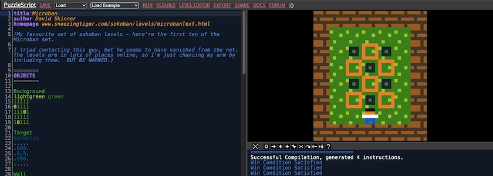
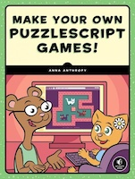

Als ich vor ein paar Tagen mehr oder weniger absichtslos meinen begehbaren Zettelkasten (aka Bibliothek) durchstöberte, geriet mir das Buch »[Make Your Own PuzzleScript Games!](https://nostarch.com/puzzlescriptgames)« der großartigen *[Anna Anthropy](https://en.wikipedia.org/wiki/Anna_Anthropy)* zwischen die Finger. Und sofort begann es in meinem Kopf zu rumoren: [PuzzleScript](http://cognitiones.kantel-chaos-team.de/multimedia/spieleprogrammierung/puzzlescript.html), hatte ich das nicht [vor sechs Jahren](http://blog.schockwellenreiter.de/2020/01/2020011901.html) schon einmal auf dem Schirm?

PuzzleScript ist eine freie (MIT-Lizenz), minimalistische HTML5-Game-Engine von *[Stephen Lavelle](https://en.wikipedia.org/wiki/Increpare)* (aka *[Increpare](https://www.increpare.com/)*). Die Engine läuft im Browser und exportiert nach Fertigstellung eines Spieles HTML-Dateien, die das Spiel beinhalten. Man kann die Engine online [hier ausprobieren](https://www.puzzlescript.net/), aber -- im Sinne der Datensouveränität -- auch lokal auf seinem Rechner (zum Beispiel hinter [MAMP](http://cognitiones.kantel-chaos-team.de/webworking/mamp.html) oder [TinyHost](https://kantel.github.io/posts/2026020502_tinyhost/)) betreiben. Dazu müsst Ihr vom [GitHub-Repositorium der Engine](https://github.com/increpare/PuzzleScript/tree/master) nur das Verzeichnis `src` herunterladen und es auf Eurem Rechner irgendwo ablegen, wo es Euer lokaler Webserver auch findet (siehe [Screenshot](https://www.flickr.com/photos/schockwellenreiter/55115509786/) im Bannerbild oben).

Ich hatte im Oktober 2021 schon einmal ein wenig mit PuzzleScript gespielt. Dabei herausgekommen sind diese drei Beiträge:

- [Puzzledorf versus PuzzleScript (Update in meinem Wiki)](http://blog.schockwellenreiter.de/2021/10/2021101501.html).
- [PuzzleScript – Tutorials, Erweiterungen und Ideen](http://blog.schockwellenreiter.de/2021/10/2021102201.html), hier ist besonders der Abschnitt »PuzzleScript und Künstliche Intelligenz« interessant.
- [Playing around with PuzzleScript](http://blog.schockwellenreiter.de/2021/10/2021102602.html).

Tutorials zu PuzzleScript sind leider immer noch sehr dünn gesät. Vielleicht sollte ich mich mal hinsetzen und ein Tutorial zu dieser extrem minimalistischen Engine verfassen? Denn in der Beschränkung liegt ja bekanntlich die Kraft! Neben dem oben erwähnten, wunderbaren Buch von *Anna Anthropy* gibt es eigentlich nur noch eine [mehrteilige Tutorialreihe](https://stuartspixelgames.com/puzzle-script-tutorials/) inklusive [Playlist](https://www.youtube.com/playlist?list=PLwe5e0Noybg_N4gQfOrbLObnszPNK2LKk) von *Stuart Burfield*, dem Schöpfer von [Puzzledorf](https://www.puzzledorf.com/), der PuzzleScript als *Rapid Prototyping*-Werkzeug für Puzzledorf nutzte. Aber auch die in diesem ~~Blog~~ Kritzelheft schon mehrfach [lobend erwänte](https://kantel.github.io/posts/2026021501_tic-80_tutorials/) »Eingebildete Kartoffel« *(Potato Imaginator)* hat eine kleine [Playlist zu PuzzleScript](https://www.youtube.com/playlist?list=PL5VlvsnKT2RoszT3-K2MG-_yVGeHoU2ED) (fünf Videos) hochgeladen, eine kleine Foliensammlung »[Intro to PuzzleScript](https://docs.google.com/presentation/d/1XapNzQNP6ddCQTM6NaE38HvJysv9kOFHPCxzlG7tW-4/edit?slide=id.p#slide=id.p)« habe ich auf Google Docs gefunden, und *last but not least* gibt es noch den eher kopflastigen, knapp dreieinhalbstündigen Stream »[Live Puzzle Design](https://www.youtube.com/playlist?list=PLXiBcyk0gtyfJMDX8g2QzK6ikz-M6YPFU)« von *Matthew VanDevander*.

Aber egal, ich habe jetzt Lust bekommen, auch mal etwas mit PuzzleScript anzustellen. Als Inspiration könnte mir das »[Aha Alphabet](https://www.youtube.com/playlist?list=PLgX5yD9FMWbfmb1KOmSwztI1qOMeaBL8C)« dienen. Vielleicht kommt dann dabei tatsächlich so etwas wie eine Tutorialreihe heraus? *Still digging!*