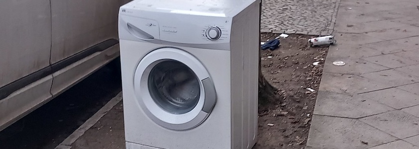
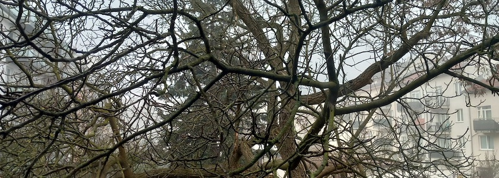

Gestern war die Freiluftwaschküche noch nur auf die Neuköllner Bürgerstraße beschränkt.

Doch heute früh hatte sie sich auf ganz Neukölln verteilt.

---

**Photos** ([cc](https://creativecommons.org/licenses/by-sa/4.0/deed.de)) 2026: *[Jörg Kantel](http://cognitiones.kantel-chaos-team.de/cv.html)*