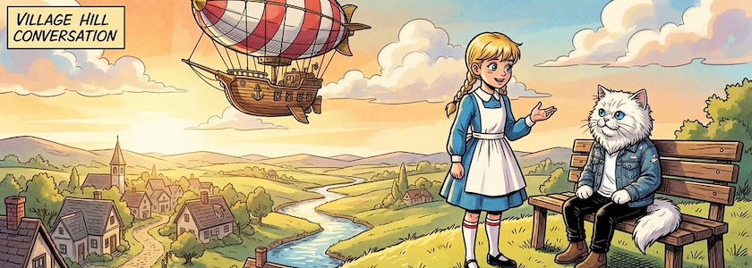

Auch wenn in den letzten Tagen auf diesen Seiten nicht viel darüber zu lesen war, ich habe intensiv an meiner [Rückkehr ins Wunderland](https://kantel.github.io/posts/2026011502_renpy_8_5_2_twine_2_11_1/) mit [Twine](http://cognitiones.kantel-chaos-team.de/multimedia/spieleprogrammierung/twine2.html), [Ren'Py](http://cognitiones.kantel-chaos-team.de/multimedia/spieleprogrammierung/renpy.html) und eventuell auch [Tuesday&nbsp;JS](http://cognitiones.kantel-chaos-team.de/multimedia/spieleprogrammierung/tuesdayjs.html) gearbeitet. Insbesondere habe ich Tonnen von Bildern mit [OpenArt](https://openart.ai/home) und [Character&nbsp;2.0](https://openart.ai/characters) generiert, um herauszufinden, ob und wie sich das [Problem der konsistenten Charaktere](https://kantel.github.io/posts/2026012601_character_2_0/) bei der Nutzung gekünstelter Intelligenzia entschärft hat. Doch darüber später in einem separaten Beitrag.

Erst einmal habe ich folgende Roadmap entwickelt: In einer ersten Lieferung entwickle ich Geschichten mit Twine und dem Standardformat [Harlowe](https://twine2.neocities.org/), dann setze ich aber auf das neuere Format [Chapbook](https://klembot.github.io/chapbook/guide/), weil dieses prädestiniert für *Visual Novels* ist, die dann später unter Umständen auch in Ren'Py (oder Tuesday&nbsp;JS) realisiert werden sollen. Und weil es sich speziell für RPGs anbietet, soll natürlich auch noch das Format [SugarCube](https://www.motoslave.net/sugarcube/2/docs/) berücksichtigt werden.

Ein erster Schritt bei einem neuen Projekt ist immer, nachzuschauen, was andere schon angestellt haben. Und so bin ich wieder über eine Reihe von (Video-) Tutorials gestolpert, die ich Euch nicht vorenthalten möchte:

### Mehr über Twine (unsortierte Fundstücke)

<iframe class="if16_9" src="https://www.youtube.com/embed/MVaKifBgA9E?si=e2l3R7nVjUFghWAm" title="YouTube video player" frameborder="0" allow="accelerometer; autoplay; clipboard-write; encrypted-media; gyroscope; picture-in-picture; web-share" referrerpolicy="strict-origin-when-cross-origin" allowfullscreen></iframe>

Obiges Video leitet die Playlist »[Learn programming with Twine](https://www.youtube.com/playlist?list=PL1clJ-4VwjRt8j-S84AsfXUULXGT5VxzA)« (zehn Videos) von *Fractal Teaches CS* ein. Schon alleine wegen des Kanalnamens ein Muß.&nbsp;🤓

<iframe class="if16_9" src="https://www.youtube.com/embed/T-s61otbHfk?si=53eyQ9g2yd9tzgVC" title="YouTube video player" frameborder="0" allow="accelerometer; autoplay; clipboard-write; encrypted-media; gyroscope; picture-in-picture; web-share" referrerpolicy="strict-origin-when-cross-origin" allowfullscreen></iframe>

Wer weniger Zeit hat, kann sich das Video »[How To Make A Twine Story In Minutes!](https://www.youtube.com/watch?v=T-s61otbHfk)« von *Richard Blumenstein* reinziehen.

### Twine und die Bilder

<iframe class="if16_9" src="https://www.youtube.com/embed/vjTPhp3Ltls?si=vYIZQYOCkASNljXV" title="YouTube video player" frameborder="0" allow="accelerometer; autoplay; clipboard-write; encrypted-media; gyroscope; picture-in-picture; web-share" referrerpolicy="strict-origin-when-cross-origin" allowfullscreen></iframe>

Der von mir regelmäßig konsumierte, extrem produktive und auch schon mehrfach in diesem ~~Blog~~ Kritzelheft erwähnte Kanal *Let's Make A Game* hat auch ein Video zu Hintergrundbildern in Twine mit dem Storyformat SugarCube veröffentlicht.

<iframe class="if16_9" src="https://www.youtube.com/embed/MSqnueqV3Rw?si=DgfbVXYw1GVwRdmt" title="YouTube video player" frameborder="0" allow="accelerometer; autoplay; clipboard-write; encrypted-media; gyroscope; picture-in-picture; web-share" referrerpolicy="strict-origin-when-cross-origin" allowfullscreen></iframe>

Aus *CodeVA's* »[Twine Trail Guide](https://www.youtube.com/playlist?list=PLILyoTXjpxSDRpq6LM35-41fepksK_2-4)« (21 Filme) stammt das Tutorial »[Image Formatting with CSS](https://www.youtube.com/watch?v=MSqnueqV3Rw)«. Ebenfalls sehenswert sind »[Adding Images to Passages](https://www.youtube.com/watch?v=-s3nCDMkPKE)« und »[Delay Text](https://www.youtube.com/watch?v=bSWW-QHAxpI)« (auch wenn letzteres nichts mit Bildern zu tun hat).

<iframe class="if16_9" src="https://www.youtube.com/embed/K70lS5p2puA?si=8doqV0smCk9ef9Gr" title="YouTube video player" frameborder="0" allow="accelerometer; autoplay; clipboard-write; encrypted-media; gyroscope; picture-in-picture; web-share" referrerpolicy="strict-origin-when-cross-origin" allowfullscreen></iframe>

Von *Twineventure* stammt das kurze Tutorial »[Twine 2 - Add Images from Your Computer or Web](https://www.youtube.com/watch?v=K70lS5p2puA)«. Wieder etwas für diejenigen unter Euch, die wenig Zeit haben.

<iframe class="if16_9" src="https://www.youtube.com/embed/-slFpjLiUFQ?si=CyRRgP3s_UWxOlmW" title="YouTube video player" frameborder="0" allow="accelerometer; autoplay; clipboard-write; encrypted-media; gyroscope; picture-in-picture; web-share" referrerpolicy="strict-origin-when-cross-origin" allowfullscreen></iframe>

Das *CSULB Center for the History of Video Games and Critical Play* hat eine sehr sehenswerte Tutorialreihe »[How To Videos for History 306 (Using Twine)](https://www.youtube.com/playlist?list=PLH1MIxmGCbrwP2PdRz3bdogguyEpppn0y) (zehn Videos) online gestellt.

### Twine und Videos

<iframe class="if16_9" src="https://www.youtube.com/embed/tRa9QLChmhk?si=fBt27Qg3cKR6URrz" title="YouTube video player" frameborder="0" allow="accelerometer; autoplay; clipboard-write; encrypted-media; gyroscope; picture-in-picture; web-share" referrerpolicy="strict-origin-when-cross-origin" allowfullscreen></iframe>

<iframe class="if16_9" src="https://www.youtube.com/embed/-mEQ6GBuTLU?si=HKixBruQlkvrNffE" title="YouTube video player" frameborder="0" allow="accelerometer; autoplay; clipboard-write; encrypted-media; gyroscope; picture-in-picture; web-share" referrerpolicy="strict-origin-when-cross-origin" allowfullscreen></iframe>

Das Thema ist auch für mich neu, daher hier nur kurz und unkommentiert zwei Videos, die in die Materie einführen wollen.

### Twine und RPGs (Harlowe)

<iframe class="if16_9" src="https://www.youtube.com/embed/KJCg3LCUImI?si=9kVG9jfBd8xgokwv" title="YouTube video player" frameborder="0" allow="accelerometer; autoplay; clipboard-write; encrypted-media; gyroscope; picture-in-picture; web-share" referrerpolicy="strict-origin-when-cross-origin" allowfullscreen></iframe>

Natürlich muß man nicht das Storyformat SugarCube nutzen, um mit Twine RPGs zu erstellen. Das geht auch mit Harlowe und wie es geht, zeigt Euch *Austin Lim* in ihrer dreiteiligen Playlist »[Twine Tutorials](https://www.youtube.com/playlist?list=PLXTsg1_kGxE_C4ttPxzbvOvLMFtjZNXhG)«.

<iframe class="if16_9" src="https://www.youtube.com/embed/ys5Ukb3fctw?si=6ggJQtsruRQQVGne" title="YouTube video player" frameborder="0" allow="accelerometer; autoplay; clipboard-write; encrypted-media; gyroscope; picture-in-picture; web-share" referrerpolicy="strict-origin-when-cross-origin" allowfullscreen></iframe>

Und den krönenden Abschluß bildet der unverwüstliche *Dan Cox*, der Euch in einem kurzen (viertelstündigen) Beispiel zeigt, wie man ein »[Solo RPG](https://www.youtube.com/watch?v=ys5Ukb3fctw)« in Twine ebenfalls mit Harlowe erstellt. Wieder etwas für Menschen mit wenig Zeit.

---

**Bild**: *[Alice und die Katze](https://www.flickr.com/photos/schockwellenreiter/55080854022/)*, erstellt mit [OpenArt.ai](https://openart.ai/home). Prompt: »*@Alice  stands on a hill at a wide landscape with a dreamy village and a small stream.  She talks with @Momo , who is sitting on a bench. A colorful airship floats in the sky. Colored classic comic style.*« Modell: Character 2.0 with Nano Banana Pro.