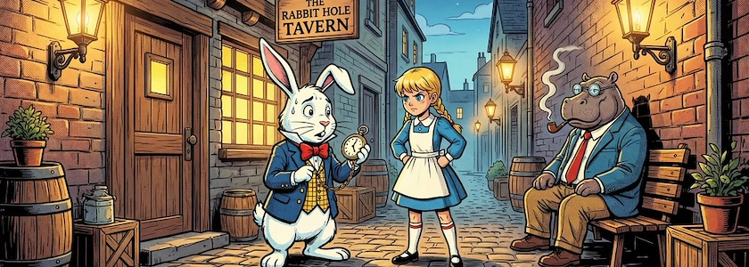

Daß ich im [letzten Beitrag](https://kantel.github.io/posts/2026022601_wunderland_1/) von heute morgen das [Twine](http://cognitiones.kantel-chaos-team.de/multimedia/spieleprogrammierung/twine2.html)-Storyformat [Chapbook](https://klembot.github.io/chapbook/guide/) so sträflich vernachlässigt habe, hat einen gewichtigen Grund: Chapbook spielt in meinen Überlegungen eine wichtige Brücke, um interaktive Geschichten und Spiele erst einmal in Twine zu entwickeln *(Rapid Prototyping)*, um sie dann in [Ren'Py](http://cognitiones.kantel-chaos-team.de/multimedia/spieleprogrammierung/renpy.html) oder [Tuesday&nbsp;JS](http://cognitiones.kantel-chaos-team.de/multimedia/spieleprogrammierung/tuesdayjs.html) als *Visual Novels* zu implementieren. Darum (und weil Chapbook auch noch relativ neu ist) wollte ich diesem Storyformat einen eigenen Beitrag spendieren:

<iframe class="if16_9" src="https://www.youtube.com/embed/IiigLlzdPtw?si=AodvZ8rbY1sRqLrw" title="YouTube video player" frameborder="0" allow="accelerometer; autoplay; clipboard-write; encrypted-media; gyroscope; picture-in-picture; web-share" referrerpolicy="strict-origin-when-cross-origin" allowfullscreen></iframe>

Der YouTuber *Noirnerd* ist ein bekannter und mittlerweile sehr erfahrener Chapbook-Nutzer. In seinem Video »[Tips for working with Twine and the Chapbook Format (Visual Novel)](https://www.youtube.com/watch?v=IiigLlzdPtw)« verrät er einige seiner Tricks, mit denen er »[Tammi's Tale](https://itch.io/jam/sunofes24/rate/2821303)« geschrieben hatte, eine *Visual Novel*, die in einer alternativen Zukunft nach dem Zusammenbruch der Sowjetunion spielt. Er hat sie für die [SuNoFes 2024](https://itch.io/jam/sunofes24) eingereicht, einer Game-Jam, die vom 1.&nbsp;Juli bis zum 3.&nbsp;September&nbsp;2024 stattfand.

<iframe class="if16_9" src="https://www.youtube.com/embed/dFK9CH7Lwug?si=R2DhiKTeHtKLudZj" title="YouTube video player" frameborder="0" allow="accelerometer; autoplay; clipboard-write; encrypted-media; gyroscope; picture-in-picture; web-share" referrerpolicy="strict-origin-when-cross-origin" allowfullscreen></iframe>

Schon vor drei Jahren veröffentlichte derselbe *Noirnerd* das Tutorial »[Make a Twine Game with Chapbook Part 1](https://www.youtube.com/watch?v=dFK9CH7Lwug)« als »kreatives Photoprojekt um Twine zu lernen«. Hier geht es in der Hauptsache darum, wie man Bilder in Chapbook nutzt. Der angekündigte zweite Teil ist leider nie erschienen.

<iframe class="if16_9" src="https://www.youtube.com/embed/GMfdoTIax94?si=5xTWlt_hTSszh7kI" title="YouTube video player" frameborder="0" allow="accelerometer; autoplay; clipboard-write; encrypted-media; gyroscope; picture-in-picture; web-share" referrerpolicy="strict-origin-when-cross-origin" allowfullscreen></iframe>

Das aktuelle Projekt von *Noirnerd* heißt »[Shift++](https://drnoir.itch.io/shift)« und ist eine dystopische *Visual Novel*, die in einer düsteren Zukunft des Jahres 2052 spielt, in der eine Künstliche Intelligenz nach der Weltherrschaft greift. Das [obige Video ist ein Vortrag](https://www.youtube.com/watch?v=GMfdoTIax94), den *Noirnerd* für die [Narrascope&nbsp;2026](https://narrascope.org/) aufgenommen hat.

*Noirnerd* ist als *[Drnoir](https://drnoir.itch.io/)* auf Itch.io zu finden. Dort gibt es noch mehr seiner surrealen und absurden, meist dunklen Geschichten und Spiele.

---

**Bild**: *[The Rabbit Hole Tavern](https://www.flickr.com/photos/schockwellenreiter/55087452912/)*, erstellt mit [OpenArt.ai](https://openart.ai/home). Prompt: »*@Rudi Rabbit is chatting with @Alice in an alley in an old-fashioned small town, outside a tavern. @Jo Hippo sits on a bench outside the tavern, smoking a pipe. @Rudi Rabbit is in a hurry and glances anxiously at his watch. It is a balmy summer evening and the scene is illuminated by a few vintage gas lamps. Colored classic American comic style.*« Modell: Character 2.0 with Nano Banana Pro.