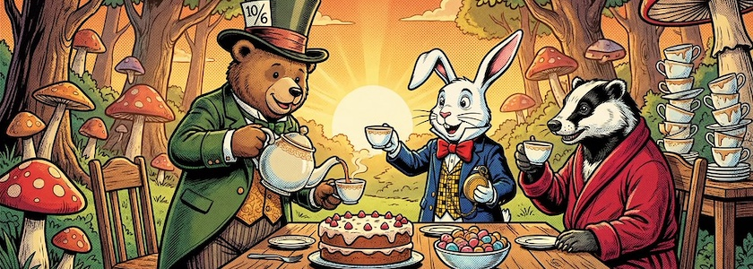

Nachdem ich in den [beiden](https://kantel.github.io/posts/2026022601_wunderland_1/) [vorherigen](https://kantel.github.io/posts/2026022602_wunderland_2/) Beiträgen betont hatte, daß nicht nur interaktive Geschichten und Spiele mit [Twine](http://cognitiones.kantel-chaos-team.de/multimedia/spieleprogrammierung/twine2.html), sondern auch *Visual Novels* mit [Ren'Py](http://cognitiones.kantel-chaos-team.de/multimedia/spieleprogrammierung/renpy.html) oder [Tuesday&nbsp;JS](http://cognitiones.kantel-chaos-team.de/multimedia/spieleprogrammierung/tuesdayjs.html) das Ziel meiner Ausflüge ins Wunderland sind, möchte ich Euch zum Abschluß des heutigen Tages noch zwei etwas andere, eher ungewöhnliche Video-Tutorials vorstellen, die in die Programmierung von Ren'Py einführen.

Es sind beides Tutorials für absolute Anfänger und sie setzen keinerlei Vorkenntnisse voraus:

<iframe class="if16_9" src="https://www.youtube.com/embed/CafsAqN3psQ?si=nrTnb61Ffo1h6Jh5" title="YouTube video player" frameborder="0" allow="accelerometer; autoplay; clipboard-write; encrypted-media; gyroscope; picture-in-picture; web-share" referrerpolicy="strict-origin-when-cross-origin" allowfullscreen></iframe>

Das Tutorial »[Introduction to making Visual Novel games in Ren'Py](https://www.youtube.com/watch?v=CafsAqN3psQ)« der YouTuberin *Cospigeon* ist auch optisch sehr gelungen. Allerdings vergisst sie manchmal, die Schriften im Editor größer zu stellen, so daß man hin und wieder sehr gute Augen braucht. Hervorzuheben ist, daß sie freie Bilder verwendet und zeigt, wie man diese einsetzt. Am Ende haben die Nutzerin oder der Nutzer einen guten Eindruck über die Möglichkeiten von Ren'Py gewonnen. 

<iframe class="if16_9" src="https://www.youtube.com/embed/FUwCgNhObho?si=WAK40NN53QByZqYn" title="YouTube video player" frameborder="0" allow="accelerometer; autoplay; clipboard-write; encrypted-media; gyroscope; picture-in-picture; web-share" referrerpolicy="strict-origin-when-cross-origin" allowfullscreen></iframe>

Ähnliche Ziele verfolgt das [obige Video](https://www.youtube.com/watch?v=FUwCgNhObho) des Kanals *Toadhoues Games*. Auch das richtet sich an blutige Anfängerinnen und Anfänger und die Tutorin *Alanna Linayre* erklärt alles haarklein. Allerdings liegt ihr Schwerpunkt mehr in der Entwicklung der Geschichte, als Assets werden die Bilder aus den mitgelieferten Beispiel-Games verbraten. Und daß sie uns am Ende das Schreibprogramm [Scrivener](https://en.wikipedia.org/wiki/Scrivener_(software)) verkaufen will -- geschenkt.

Der [Kanal von Toadouse Games](https://www.youtube.com/@toadhousegames) und auch deren [Website](https://toadhousegames.com/) sind durchaus einen Besuch wert. Toadhouse Games ist ein Indie-Studio für *Visual Novels* mit einer Botschaft: Sie entwickeln Spiele, die sich mit mentaler Gesundheit und Authentizität auseinandersetzen.

<iframe class="if16_9" src="https://www.youtube.com/embed/II9oEua22Ck?si=3CDLi6oA4TEsyUhf" title="YouTube video player" frameborder="0" allow="accelerometer; autoplay; clipboard-write; encrypted-media; gyroscope; picture-in-picture; web-share" referrerpolicy="strict-origin-when-cross-origin" allowfullscreen></iframe>

Eines ihrer Spiele heisst »[Call Me Cera](https://toadhousegames.com/call-me-cera)« und ist eine inspirierende und rührende Geschichte über ein junges Mädchen oder eine junge Frau, das oder die sich Freunde in der Welt der Erwachsenen suchen muss. Auch so etwas kann man mit *Visual Novels* erzählen.

---

**Bild**: *[Tea Party in Wonderland](https://www.flickr.com/photos/schockwellenreiter/55094229148/)*, erstellt mit [OpenArt.ai](https://openart.ai/home). Prompt: »*@Mad Teddy stands at a table in a clearing in the fairytale forest, pouring tea from a large teapot into a small cup. Beside him sit @Rudi Rabbit and @Dieter Dachs , raising their teacups in a toast. The table is set with a large cake and a bowl of sweets. Stacks of unwashed teacups are piled at the back of the table. The evening sun illuminates the scene. Colored classic American comic style. Language: German, no speech bubbles.*« Modell: Character 2.0 with Nano Banana Pro.