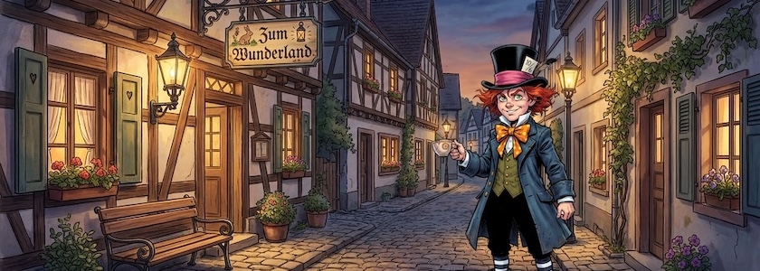
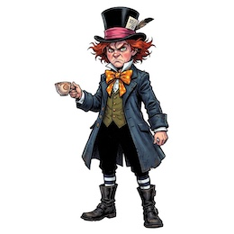
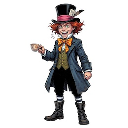

Im Rahmen meiner Überlegungen über meine Fahrten zurück ins Wunderland gestern ([Teil&nbsp;1](https://kantel.github.io/posts/2026022601_wunderland_1/), [Teil&nbsp;2](https://kantel.github.io/posts/2026022602_wunderland_2/) und [Teil&nbsp;3](https://kantel.github.io/posts/2026022603_wunderland_3/)) habe ich mich mal wieder mit dem Problem der KI-generierten, konsistenen Spielefiguren für *Visual Novels* beschäftigt. Denn während kleine Abweichungen in den Zeichnungen in interaktiven Geschichten und Spielen zum Beispiel in [Twine](http://cognitiones.kantel-chaos-team.de/multimedia/spieleprogrammierung/twine2.html) noch tolerierbar sind, nehmen *Visual Novel Engines* wie [Ren'Py](http://cognitiones.kantel-chaos-team.de/multimedia/spieleprogrammierung/renpy.html), [Tuesday&nbsp;JS](http://cognitiones.kantel-chaos-team.de/multimedia/spieleprogrammierung/tuesdayjs.html) oder [Monogatari](https://monogatari.io/) (mal [wieder neu im Rennen](https://kantel.github.io/posts/2024072301_monogatari/)) selbst kleinste Abweichungen übel.

Wie es der Zufall will, hatte ich dann heute ein wenig mit [Scenario](http://cognitiones.kantel-chaos-team.de/technikgeschichte/rechnerundnetze/scenario.html) gespielt (weil mein monatliches Budget auf [OpenArt](https://openart.ai/home) verbraucht war und erst Anfang des Monats wieder aufgefrischt wird), und da bin ich darüber gestolpert, daß man bei etlichen KI-Bildgeneratoren (in diesem speziellen Fall bei Nano Banana&nbsp;2) auch Referenzbilder mitgeben kann. Also habe ich erst einmal mit einem sehr ausführlichen Prompt[^1]

[^1]: Ich habe mir sehr viel Mühe mit diesem Prompt gegeben, damit der Hutmacher nicht wie *[Johnny Depp](https://de.wikipedia.org/wiki/Johnny_Depp)* aussieht.

>The Mad Hatter in his younger years with red, unruly hair and green eyes. He wears a black hat with a pink band, a dark blue coat, an olive green waistcoat, black breeches, dark blue and white striped stockings, black mid-calf boots, a white shirt with a stand-up collar, and a large orange bow tie with yellow poka-dots. Colored DC comic style. Language: German. No textboxes, no speech bubbles. No background.

ein [Referenzbild](https://www.flickr.com/photos/schockwellenreiter/55118837976/) erzeugt und dieses dann als Basis für weitere Experimente genommen. Einmal als Referenz vorhanden, habe ich in den weiteren Prompts immer nur `Mad Hatter angry`, `Mad Hatter neutral`, `Mad Hatter sad` und so weiter eingegeben. Herausgekommen ist eine Sammlung von Bildern, die im Bezug auf Konsistenz keine Wünsche mehr offen lassen *(wie immer führt ein Klick auf die daumengroßen Bildchen zu einer Seite mit Vergrößerungen)*:

&nbsp;&nbsp;  
&nbsp;&nbsp;  
&nbsp;

Von den Ergebnissen bin ich mehr als begeistert. Ich muss jetzt erst einmal noch ein wenig damit spielen und ein paar Figuren mehr aus meinem Wunderland-Kosmos erzeugen, und dann einen Test fahren, wie sich die Bilder tatsächlich in den von mir präferierten Engines bewähren. Aber ich bin sehr optimistisch.

Wenn Ihr auch mit den Bildern spielen wollt: Die Links führen zu Flickr und wenn Ihr von dort das Original herunterladet (`Foto -> Alle Größen -> Dieses Foto im Original herunterladen`), bekommt Ihr ein freigestelltes PNG in der Größe von $4096$x$4096$ Pixeln. Das dürfte für so ziemlich jede Anwendung ausreichend sein[^2].

[^2]: Die Bilder sind KI-generiert, also damit frei von Urheberrechten. Sicherheitshalber habe ich sie -- wie alle meine Bilder -- aber auch noch unter die [CC BY-SA 4.0](https://creativecommons.org/licenses/by-sa/4.0/deed.de) gestellt. Macht also damit, was Ihr wollt.

Ich habe übrigens bei einem ersten Versuch sparen wollen und die Freistellung mit Bordmitteln (Apples Vorschau) vorgenommen. Die kam jedoch mit dem wirren Haarschopfs des Hutmachers nicht zurecht, daher habe ich die Freistellung dann doch wieder Scenario überlassen. Das Ergebnis war die drei Credits auf jeden Fall wert.

---

**Bild**: *[The Mad Hatter in Wondertown](https://www.flickr.com/photos/schockwellenreiter/55118060067/)*, Collage erstellt mit [Scenario](http://cognitiones.kantel-chaos-team.de/technikgeschichte/rechnerundnetze/scenario.html). Prompt (Backgound Image): »*A deserted alley in a small town at dusk, lined with picturesque houses. On the left is a small inn with a sign reading "Zum Wunderland" (To Wonderland). A wooden bench stands in front of the inn, next to an old-fashioned gas lamp. Several more of these gas lamps illuminate the alleyway, giving it a pleasantly bright appearance. Some of the house windows are lit. German. No textboxes, no speech bubbles. Image suitable as background for a visual Novel.*« Modell: Nano Banana&nbsp;2.