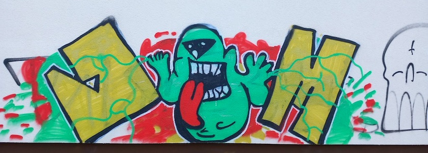

Auch wenn ich angesichts der beschissenen Nachrichten aus der Welt des Wahnsinns dieser nur noch die Zunge herausstrecken möchte (wie auf [obigem Graffiti](https://www.flickr.com/photos/schockwellenreiter/55123058433/) aus der Neuköllner Bürgerstraße), hat ein neuer Monat begonnen und daher ist es Zeit für die Zahlen des Vormonats, die manchmal hochtrabend auch *Mediadaten* genannt werden. Im Februar 2026 hatte der *Schockwellenreiter* laut seinem nicht immer zuverlässigen, aber dafür (hoffentlich!) DSGVO-konformen ~~Geißenpeter~~ [Neugiertool](https://www.goatcounter.com/) exakt **8.728&nbsp;Seitenaufrufe**. Auch wenn wie immer die Exaktheit dieser Ziffer eine Genauigkeit der Zahl nur vortäuscht, ist dies für den kurzen Februar ein hervorragendes Ergebnis. Und so freue ich mich über jede Besucherin und jeden Besucher und bedanke mich bei allen meinen Leserinnen und Lesern.

😎 &nbsp; *Bleibt mir gewogen!*

Auch zu den ~~Mediadaten~~ Zahlen des Februars&nbsp;2026 gehören natürlich die *Top Five*:

1. Auch wenn mittlerweile über zwei Jahre alt und daher schon etwas überholt, steht immer noch weit abgeschlagen an der Spitze der Beitrag »[Bildgeneratoren und Künstliche Intelligenz – ohne Zensoren](https://kantel.github.io/posts/2024011002_ki_ohne_zensor/)« vom 10.&nbsp;Januar&nbsp;2024.
2. An zweiter Stelle folgt der Klassiker »[All about Anytype – meine neue, digitale Rumpelkammer?](https://kantel.github.io/posts/2024081201_anytype/)« vom 13.&nbsp;August&nbsp;2024. Dieser Artikel hat in der letzten Woche sogar massiv an Beliebtheit zugelegt.
3. Darauf folgen die beiden Beiträge »[Zur Erinnerung an Wolfgang Lefèvre (1941–2025)](https://kantel.github.io/posts/2026011201_wolfgang_lefevre/) vom 12.&nbsp;Januar&nbsp;2026 und »[Ein Archiv vergisst nie: Über Wolfgang Lefèvre](https://kantel.github.io/posts/2026021901_ein_archiv_vergisst_nie/)« vom 19.&nbsp;Februar&nbsp;2026, die ich wegen der besseren Übersicht zusammen gewertet habe.
4. Und so rückt an vierter Stelle noch ein Beitrag aus der Wissenschaftsgeschichte: »[Eine kleine Geschichte der Wissenschaft](https://kantel.github.io/posts/2026020602_wissenschaftsgeschichte/)« vom 6.&nbsp;Februar&nbsp;2026.
5. Das Schlusslicht bildet -- passend zur Weltlage -- der [»Hurra macht das Sterben Spaß«-Song](https://kantel.github.io/posts/2026021701_hurra_macht_das_sterben_spass/) vom 17.&nbsp;Februar&nbsp;2026.

In diesem Sinne: Lasst Euch nicht verdrießen, auch wenn es schwer fällt.

---

**Photo** ([cc](https://creativecommons.org/licenses/by-sa/4.0/deed.de)) 2026: *[Jörg Kantel](http://cognitiones.kantel-chaos-team.de/cv.html)*