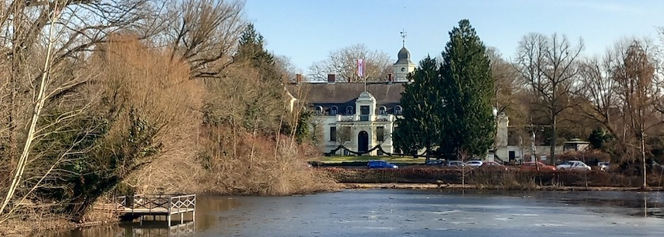
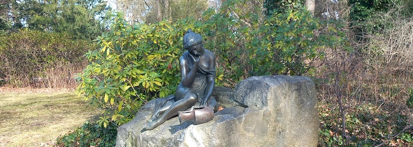
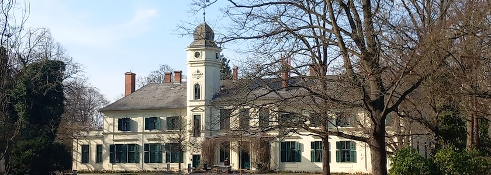
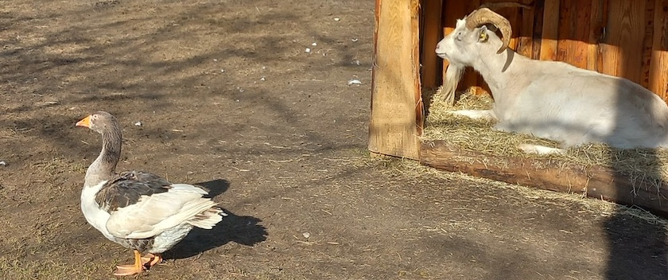
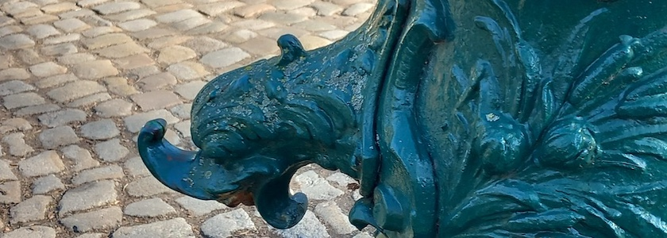
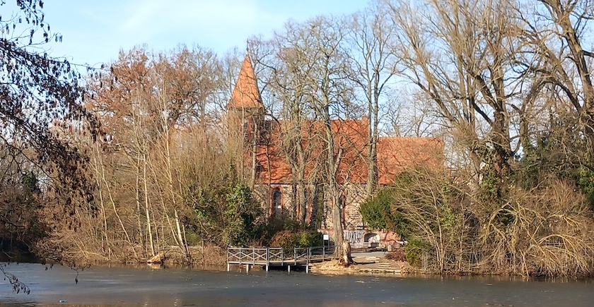

Am Wochenende hatte die liebste aller Freundinnen zusammen mit mir einen Spaziergang rund um das Schloß Britz mit Schloßpark, Gutshof und Dorfkirche unternommen, um das überraschende Vorfrühlingswetter zu genießen. Herausgekommen sind dabei unter anderem auch ein paar Photographien, die ich Euch nicht vorenthalten möchte:

Die Gewässer waren noch nicht ganz vom Eise befreit, aber die Sonne tat ihr Bestes.

---

**Photos** ([cc](https://creativecommons.org/licenses/by-sa/4.0/deed.de)) 2026: *[Jörg Kantel](http://cognitiones.kantel-chaos-team.de/cv.html)*