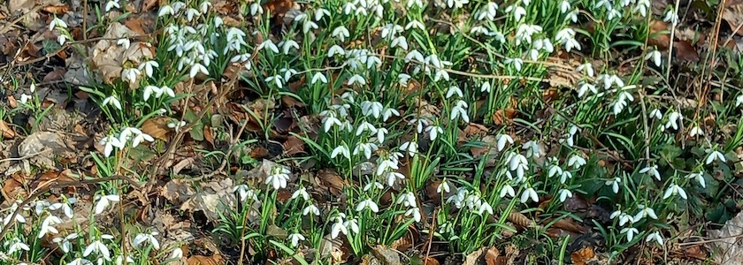
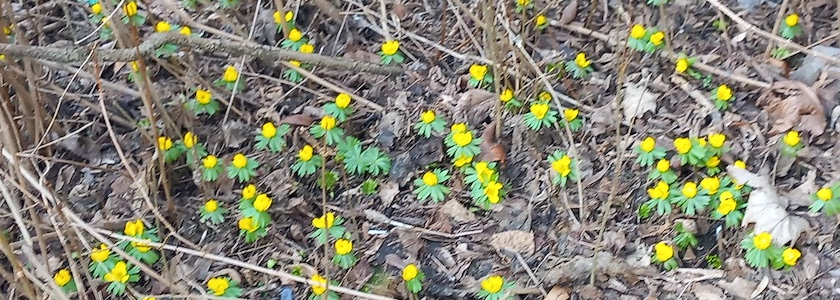
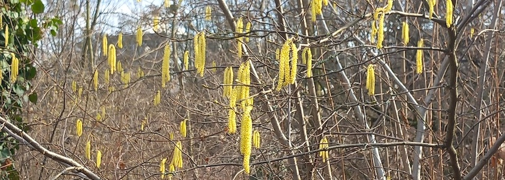
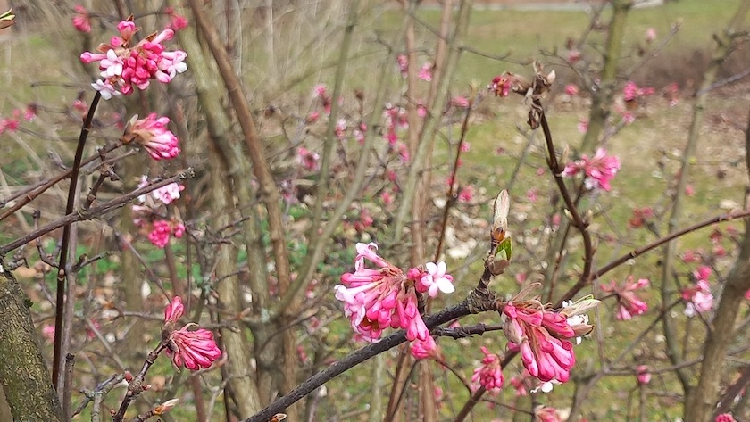

Die liebste aller Freundinnen und ich hatte uns am Wochenende natürlich nicht völlig [sinnlos durch Britz](https://kantel.github.io/posts/2026030201_hits_aus_britz/) treiben lassen, sondern wir waren auf der Suche nach dem Frühling.

Und wir haben ihn -- zumindest ansatzweise -- auch gefunden.

---

**Photos** ([cc](https://creativecommons.org/licenses/by-sa/4.0/deed.de)) 2026: *[Jörg Kantel](http://cognitiones.kantel-chaos-team.de/cv.html)*