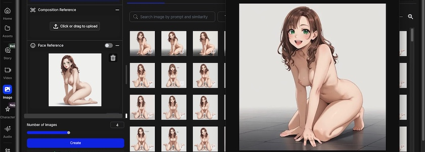
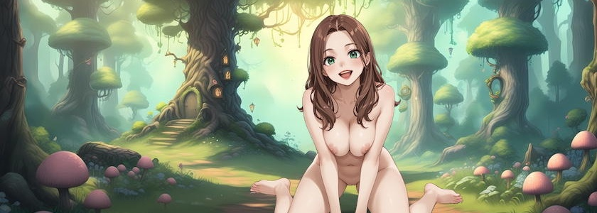

Meine bisherigen, mehr oder weniger erfolgreichen Versuche, eine Charakterkonsistenz von Bildern zu erzeugen, die mit Hilfe einer gekünstelten Intelligenzia generiert werden und für interaktive Geschichten und Spiele geeignet sind, kranken alle an einem gewichtigen Nachteil: Sowohl die [Methode via Referenzbildern](https://kantel.github.io/posts/2026022701_charakterkonsitenz/) bei [Scenario](http://cognitiones.kantel-chaos-team.de/technikgeschichte/rechnerundnetze/scenario.html), wie auch [Character 2.0](https://openart.ai/characters), das [neue](https://kantel.github.io/posts/2026012601_character_2_0/) [Spielzeug](https://kantel.github.io/posts/2026012701_jo_hippo_character_2_0/) von [OpenArt](https://openart.ai/home), funktionieren nur mit Generatoren, die mehr oder weniger kräftig zensieren.

Dabei hatte ich mir seinerzeit den Account auf OpenArt extra zugelegt, weil er versprach, auch NSFW- *(not save for work)* Inhalte zu generieren, und ein Modell dort -- nämlich [WAI-ANI-NSFW-PONYXL](https://openart.ai/gallery/openart-selections/WAI-ANI-NSFW-PONYXL)[^1] -- hatte dies auch explizit im Namen. Also habe ich OpenArt gebeten, mir ein paar Bilder mit diesem Modell zu generieren. Und die Ergebnisse zeigten, daß dieses Modell so ziemlich keine Wünsche offen lässt. Vielleicht schreibe ich auch einmal einen Beitrag darüber, aber die Bilder traue selbst ich mich dann nur mit dem obligatorischen schwarzen Zensurbalken über die primären Geschlechtsmerkmale zu veröffentlichen.

[^1]: Bei diesem Modell werkelt vermutlich *Stable Diffusion XL* (SDXL) im Hintergrund. Gelegentliche Fehler lassen das vermuten. Aber das Modell ist ziemlich stark optimiert, die Fehler treten wesentlich seltener als bei anderen SDXL-LoRAs auf.

Doch das ist nicht das Thema heute, sondern die Frage ist: Wie hält es WAI-ANI-NSFW-PONYXL mit der Konsistenz? Dafür habe ich mal wieder einen Prompt gebastelt und damit ein Referenzbild erzeugt[^2]:

[^2]: Ihr müsst dafür die `Previous version` von OpenArt nutzen, die aktuelle Nutzeroberfläche spielt nicht mehr (oder noch nicht?) mit WAI-ANI-NSFW-PONYXL. Ich hoffe, daß das bald gefixt wird.

>naked nymph, reddish-brown hair, green eyes, big boobs, nice butt, red lips, front view, full body, kneeling on the floor, monochrome white background. Colored manga style.

Wenn Ihr mit dem generierten Referenzbild zufrieden seid, dann klickt auf `Reuse Settings` und ladet bei `Image to Image`, `Style Reference`, `Pose Reference` und `Face Reference` jeweils Euer Bild hinein[^3]. Ihr könnt es innerhalb der OpenArt-UI jeweils per Drag&nbsp;&&nbsp;Drop in das entsprechende Feld hineinschieben.

[^3]: Nur `Composition Reference` habe ich ausgeschaltet gelassen. Das aber nur, weil ich nicht weiß, was sich dahinger verbirgt. Es scheint den Ergebnissen aber nicht geschadet zu haben.

Dann habe ich den Prompt zwischen *kneeling on the floor* und *monochrome white* nur noch um die entsprechende Action ergänzt, also zum Beispiel *talking*, *sad*, *happy*, *shy*, *embarrassed* und so weiter. Einige der Ergebnisse könnt Ihr hier bewundern *(wie immer führt ein Klick auf die daumengroßen Bildchen zu einer Seite mit Vergrößerungen)*:

&nbsp;&nbsp;  
&nbsp;&nbsp;

*Lilly talking*

&nbsp;&nbsp;

*Lilly cries*

&nbsp;&nbsp;

*Lilly shy*

&nbsp;&nbsp;

*Lilly angry*

&nbsp;&nbsp;

*Lilly sad*

&nbsp;&nbsp;

*Lilly embarrassed*

&nbsp;&nbsp;

*Lilly smiling*

Die Ergebnisse sind vielleicht nicht ganz so überragend, wie bei Scenarios Referenzbilder-Methode oder bei OpenArts neuer Wunderwaffe Character&nbsp;2.0, aber sie kommen schon ziemlich nahe heran. Und wenn man die Zensurmethoden von Google und Konsorten nicht mitmachen will oder kann, hat man sowieso keine andere Wahl.

Und selbst für solch kritische Anwendungen, die ziemlich anspruchsvolle konsistente Charaktere verlangen, wie zum Beispiel *Visual Novels* (egal ob mit [Ren'Py](http://cognitiones.kantel-chaos-team.de/multimedia/spieleprogrammierung/renpy.html), [Tuesday&nbsp;JS](http://cognitiones.kantel-chaos-team.de/multimedia/spieleprogrammierung/tuesdayjs.html) oder [Monogatari](https://monogatari.io/)), dürften die erzeugten Bilder mehr als ausreichend sein -- und für [Twine](http://cognitiones.kantel-chaos-team.de/multimedia/spieleprogrammierung/twine2.html) reichen sie auf jeden Fall. Zum Beweis werde ich meiner [kleinen Lilly](https://kantel.itch.io/little-lilly), die ich mal naiv mit einfachen Bildern in Ren'Py realisiert hatte, mit den heute vorgestellten Bildern eine Neufassung spendieren, dieses Mal vermutlich mit Monogatari oder Tuesday&nbsp;JS. Zur Einstimmung habe ich schon einmal oben ein [Mockup](https://www.flickr.com/photos/schockwellenreiter/55126753336/) realisiert.

Und da es durchaus passieren kann, daß OpenArt das verwendete Modell WAI-ANI-NSFW-PONYXL aus seinem Programm nimmt: Es gibt noch viele weitere Dienstleister, die das Modell anbieten, zum Beispiel [SeaArt.ai](https://www.seaart.ai/de/models/detail/24231feb2db47b663ff5b3123f01fab6) (auf deren Seiten es auch einen [User Guide](https://www.seaart.ai/de/articleDetail/cu2lprle878c73cjsq4g)[^4] dafür gibt) oder [TensorArt](https://tensor.art/de-DE/models/748846897155897012). Und besonders hart Gesottene können sich das Modell auch von [Hugging Face](https://huggingface.co/John6666/wai-ani-nsfw-ponyxl-v7-sdxl/tree/main) herunterladen und selber auf ihrem Desktop installieren.

[^4]: Hätte ich diesen vorher gelesen, wäre mein Prompt vermutlich viel professioneller ausgefallen.

