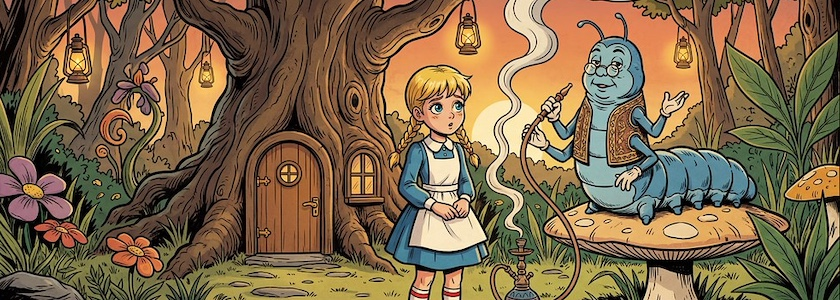
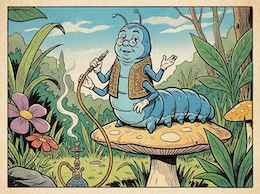

Google hat am Donnerstag das neue KI-Modell [Gemini Nano Banana 2](https://blog.google/innovation-and-ai/technology/ai/nano-banana-2/) zur Bildbearbeitung [veröffentlicht](https://www.googlewatchblog.de/2026/02/gemini-nano-banana-2-google-zeigt-beeindruckende-moeglichkeiten-des-ki-bildgenerator-prompts-galerie/), das mit der zweiten Generation große Fortschritte gegenüber dem Vorgänger gemacht hat. Die neue Generation ist nicht nur leistungsfähiger, sondern bietet auch mehr Funktionen und eine deutlich höhere Geschwindigkeit.

Wichtigste [technische Highlights des neuen Nano Banana 2](https://generativeai.pub/nano-banana-2-is-finally-here-344610eb3700) (€) sind:

- Die Basisarchitektur basiert auf dem[ Gemini 3.1 Flash](https://docs.cloud.google.com/vertex-ai/generative-ai/docs/models/gemini/3-1-flash-image)-Image-Modell.
- Unterstützt native 4K-Ausgabe, ähnlich wie das Pro-Modell.
- Es kann komplexe räumliche Anweisungen verarbeiten, wie zum Beispiel »ein rotes Auto zwischen zwei blauen Lastwagen«, mit denen das ursprüngliche Modell Schwierigkeiten gehabt hätte.
- Nutzt Google-Suchdaten, um aktuelle Ereignisse, reale Themen und korrekte Fakten in seinen Ausgaben darzustellen.
- 50 % günstiger als Nano Banana Pro.
- Unterstützt neue Seitenverhältnisse wie 1:4, 4:1, 1:8 und 8:1 bis hin zu 21:9.

Ein weiteres, bemerkenswertes neues Feature ist die Unterstützung von bis zu 14 Bildeingaben. Einige frühe Beispiele und Tests gibt es [hier](https://medium.com/kinomoto-mag/nano-banana-2-theres-a-new-banana-in-town-76a053813e71) (€).

Und Nano Banana 2 ist nicht nur bei Google verfügbar, sondern auch bei etlichen anderen Dienste-Providern, unter anderem auch bei den von mir genutzten Diensten [OpenArt](https://d9y9l.r.a.d.sendibm1.com/mk/mr/sh/WCPxRrNLV1LtxoQAh4OlwtZXt5goqcuF/k3IGczJ_RuYC) und [Scenario](https://mailchi.mp/scenario/turn-images-into-video-with-veo3-17244207?e=3946ac43c8).

Das musste ich natürlich sofort ausprobieren und so habe ich auf [OpenArt](https://openart.ai/home) das neue Nano&nbsp;Banana&nbsp;2 mit einem Ausflug in mein Wunderland-Universum getestet (siehe [Bannerbild](https://www.flickr.com/photos/schockwellenreiter/55127494300/) oben). Das [Referenzbild](https://www.flickr.com/photos/schockwellenreiter/55127089756/) der Raupe *@Kater Pillar* (Achtung: Wortspiel-Hölle!) wurde aber noch mit Nano Banana Pro erstellt, da OpenArts neues Spielzeug [Character&nbsp;2.0](https://openart.ai/characters) (noch?) nicht mit Nano&nbsp;Banana&nbsp;2 spielte. Das Ergebnis aber überzeugte: Die Raupe sieht genau so aus, wie ich sie mir vorstelle und ihre Proportionen im Verhältnis zu Alice stimmen auch mit meinen Vorstellungen überein.

So macht das Reisen ins Wunderland wieder Spaß. *Still travelling!*

---

**Bild**: *[Alice und die Raupe](https://www.flickr.com/photos/schockwellenreiter/55127494300/)*, erstellt mit [OpenArt.ai](https://openart.ai/home). Prompt: »*@Kater Pillar sits on a mushroom in the Enchanted Forest. @Alice  stands before him, looking at him questioningly. @Kater Pillar  is puffing from a large hookah, and the white smoke rises into the sky. Behind them stands a large tree with a door at its base and a small window beside it. Small lanterns hang from the trees of the Enchanted Forest. It is early evening, and the setting sun illuminates the scene.*«: Modell: Nano&nbsp;Banana&nbsp;2.