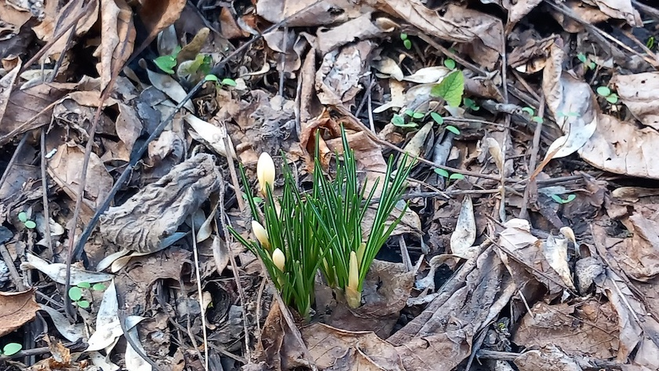

[Immer noch](https://kantel.github.io/posts/2026030202_fruehling/) auf der Suche nach dem Frühling in Neukölln, habe ich hier die ersten [Krokii](https://de.wikipedia.org/wiki/Krokusse) (wie wir Lateiner sagen&nbsp;🤓) in meinem schattigen Gärtchen entdeckt.

---

**Photo** ([cc](https://creativecommons.org/licenses/by-sa/4.0/deed.de)) 2026: *[Jörg Kantel](http://cognitiones.kantel-chaos-team.de/cv.html)*

