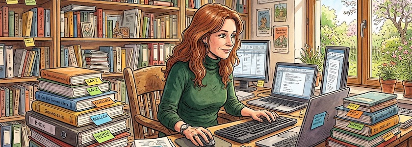

Mir gefällt die kompetente und unaufgeregte Art, mit der *[Nele Hirsch](https://de.wikipedia.org/wiki/Cornelia_Hirsch)* ihr [eBildungslabor](https://ebildungslabor.de/) betreibt, und darin die Themen zur Bildung im digitalen Wandel behandelt. Mir gefällt auch, daß sie zum Beispiel das Thema »Künstliche Intelligenz« nicht nur als Gefahr sieht (obwohl sie ihr durchaus bewusst ist), sondern auch als Chance begreift. Lediglich eines hatte bei mir immer ein Stirnrunzeln erzeugt: Wenn es um die Frage »Publizieren im Web« ging, kannte sie bisher nur eine Lösung -- ein selbstgehostetes [WordPress](http://cognitiones.kantel-chaos-team.de/webworking/cms/wordpress.html).

Ich gestehe, ich war vor etlichen Jahren (etwa von 2010 bis 2012) ebenfalls in die WordPress-Falle getappt, so daß diese Jahrgänge des *Schockwellenreiters* im Daten-Nirwana verschwunden sind (eventuell gibt es davon noch ein Backup auf Archive.org), aber seit Juli 2012 werden diese Seiten als [statische Seiten](http://cognitiones.kantel-chaos-team.de/webworking/staticsites/staticsites.html) herausgeschrieben (von 2012 bis Dezember 2022 -- also zehn Jahre lang -- mit [Ruby Frontier](http://cognitiones.kantel-chaos-team.de/webworking/staticsites/rubyfrontier.html), ab Dezember 2022 bis heute mit [Quarto](http://cognitiones.kantel-chaos-team.de/webworking/staticsites/quarto.html)). Seitdem habe ich zum einen das Gefühl, daß meine Seiten langfristig verfügbar sind und die Gewißheit, daß ich mich nicht länger mit Serverwartung, WordPress-Updates und den allgegenwärtigen (PHP-) Sicherheitslücken herumschlagen muss.

Heute war ich sehr überrascht, als *Nele Hirsch* einen *Cornerturn* vornahm (für solche Manöver war mir bisher eigentlich nur *[Dave Winer](https://de.wikipedia.org/wiki/Dave_Winer)* bekannt -- mit dessen Software hatte ich vor meinem Wechsel zu WordPress (also von 2000 bis 2010) diese Seiten betrieben), und zumindest für Gelegenheitspublisher das statische Website-Tool [Publii](http://cognitiones.kantel-chaos-team.de/webworking/staticsites/publii.html) vorschlug. Daß Publii das Tool ihrer Wahl ist, hat mich weniger überrascht, denn Publii ist als Desktop-CMS in der Bedienung sehr WordPress-ähnlich, aber daß sie überhaupt statische Seiten in Erwägung zog, schon.

Und *Nele Hirsch* wäre nicht *Nele Hirsch*, wenn dieser Vorschlag nicht von einem [ausführlichen Tutorial begleitet](https://ebildungslabor.de/blog/eine-eigene-website-ohne-wartungsaufwand/) wäre.

Ich selber hatte Publii im [August 2017 auch schon einmal auf dem Schirm](http://blog.schockwellenreiter.de/2017/08/2017080902.html) und danach [hin und wieder](http://blog.schockwellenreiter.de/2017/08/2017082203.html) etwas [damit](http://blog.schockwellenreiter.de/2017/08/2017082503.html) für Testzwecke [angestellt](http://blog.schockwellenreiter.de/2018/12/2018122402.html). Aber ich bin mit dem Teil wegen der fehlenden Markdown-Unterstützung nicht warmgeworden. Mittlerweile unterstützt Publii aber auch Markdown, vielleicht ist es an der Zeit, sich die Software doch mal wieder genauer anzuschauen.

Aber meine Überlegungen zu »[Publizieren im Netz und Überleben im Netz](http://blog.schockwellenreiter.de/2021/03/2021032201.html)« laufen inzwischen in eine ganz andere Richtung. Ich bin ein Spielkalb und ein Bastler und ich brauche etwas zum Basteln. Also nicht das klassische Klientel von *Nele Hirsch*. Sollte ich daher Quarto mal überdrüssig werden, schwebt mir als Alternative für statische Seiten [MkDocs (Material)](https://kantel.github.io/posts/2025062101_mkdocs/) vor, das mittlerweile nicht nur Projekte dokumentieren, sondern auch Blogs und Kritzelhefte kann.

Das es zum Sujet des letzten Beitrags *([Krokii](https://kantel.github.io/posts/2026030401_krokii/))* und dieses Beitrags *(Publii)* Wortähnlichkeiten gibt, ist kein weiterer Ausflug in die Wortspielhölle, sondern dem Zufall geschuldet (denn als ich den letzten Beitrag schrieb, kannte ich den Artikel von *Nele Hirsch* noch nicht). 

---

**Bild**: *[Frau am Schreibtisch](https://www.flickr.com/photos/schockwellenreiter/55128529026/)*, generiert mit [OpenArt.ai](https://openart.ai/home). Prompt: »*A middle-aged woman with long, reddish-brown hair and green eyes, wearing a dark green turtleneck sweater, sits at a desk in a study, using a computer keyboard and mouse. Many books are stacked on the desk, with sticky notes protruding from them. The shelves along the walls are also overflowing with books. Spring sunshine streams through a window in the background. Colored Franco-Belgian comic style. No speech bubbles, no textboxes. Language: German.*« Modell: Nano Banana&nbsp;2

