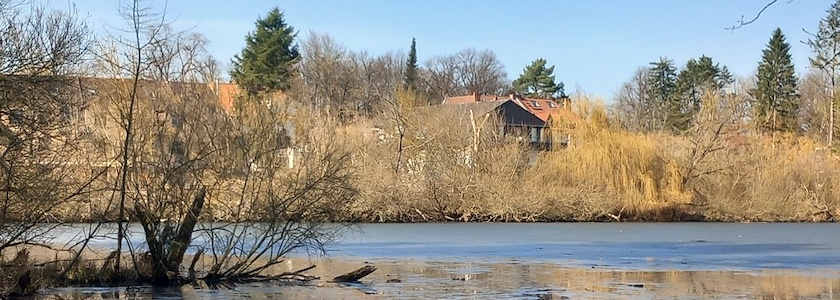
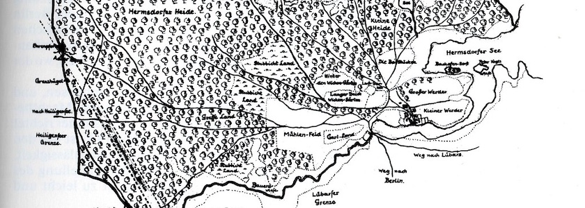

Der [Hermsdorfer See](https://de.wikipedia.org/wiki/Hermsdorfer_See) liegt im Berliner Bezirk Reinickendorf im [namensgebenden Ortsteil](https://de.wikipedia.org/wiki/Berlin-Hermsdorf) und ist Teil des [Tegeler Fließtals](https://de.wikipedia.org/wiki/Tegeler_Flie%C3%9F). Er grenzt im Süden an Waidmannslust und im Osten an Lübars. Er war ursprünglich viel größer, der nördliche größere Teil verlandete jedoch im Laufe der Jahrhunderte und ist heute ein Moor. Dieses Feuchtbiotop führte jedoch zu einer Entfaltung von Flora und Fauna und wurde damit schützenswert.

Heute führt ein etwa fünf Kilometer langer Rundwanderweg um den Hermsdorfer See und das Moor (früher Großer Hermsdorfer See). Er tangiert die Wohnsiedlungen, ehemalige Tongruben, Torfstiche und das Naturschutzgebiet Albtalweg. Zwischen dem großen See und dem kleinen See befanden sich die (Halb-) Inseln Großer Werder und Kleiner Werder. Die Karte der Hersmdorfer Feldmark von 1699 veranschaulicht die damalige Ausdehnung (Quelle: Koischwitz 1984, Seite 97):

Auch auf [dieser Seite](https://www.horsthartwig.de/ziegeleigeschichte_hermsdorfer_ziegel_geologie.htm) (nach unten scrollen) gibt es [eine Karte](https://www.horsthartwig.de/hermsdorf_technologie_geologie/schmettau_plan_hermsdorf_1787.jpg) von 1787, die die damalige Ausdehnung zeigt.

Die beiden Orte Hermsdorf und Lübars stritten sich bis in das beginnende 17.&nbsp;Jahrhundert aufgrund eines Lehens­briefes um den See. 1622 erfolgte ein Vergleich, der dem Hermsdorfer Gutsherrn *Sigismund von Goetze* das Besitztum zusprach. Die Lübarser Fischer holten sich aber weiterhin Fische aus dem Hermsdorfer See, so daß es ständig Beschwerden und Auseinandersetzungen gab. Erst Ende des 18.&nbsp;Jahrhunderts begann mit der Teilung des Sees ein friedlicheres Dasein.

Nach cirka 1850 wurden nicht nur Ziegel sondern auch der unter der Torfschicht des verlandeten Hermsdorfer Sees liegende Wiesenkalk abgebaut und gebrannt. Die Hermsdorfer Ziegel erlebten kurzfristig eine Blütezeit, auch beim 1861-1869 erbauten Berliner Roten Rathaus wurden sie verwendet. Doch schon ab 1880 mussten die Unternehmen nach einem Wassereinbruchs in der Tongrube und auf Druck der zunehmenden Konkurrenz der Ziegeleien und Zementfabriken in Rathenow, Rüdersdorf und Zehdenick schließen oder Konkurs anmelden. Heute erinnert nur noch der neben dem Hermsdorfer See liegende [Ziegeleisee](https://de.wikipedia.org/wiki/Ziegeleisee_(Berlin)) mit dem Freibad Lübars an die alte Herrlichkeit.

### Verwendete Quellen und Literatur

- Berlin.de: Das offizielle Hauptstadtportal: *[Hermsdorfer See](https://www.berlin.de/tourismus/seen/4761209-4299185-hermsdorfer-see.html)*, abgerufen am 10.&nbsp;März&nbsp;2026
- Horst Hartwig: *[HERMSDORFER Ziegelei - Ton & Zement - geologische Voraussetzungen](https://www.horsthartwig.de/ziegeleigeschichte_hermsdorfer_ziegel_geologie.htm). Tongruben von Hermsdorf - Geologie - Beschreibungen - Septarienton - Wiesenkalk - Torf*, Berlin 2018 (mit Karten)
- Humboldt-Universität zu Berlin, Fachgebiet Bodenkunde und Standortlehre: *[Ehemaliger Großer Hermsdorfer See am Tegeler Fließ](https://www.berliner-moorboeden.hu-berlin.de/content/moorgebiete/stbf-ehemaliger-grosser-hermsdorfer-see-tegeler-fliess.php)* im Projekt *[Berliner Moorböden im Klima­wandel](https://www.berliner-moorboeden.hu-berlin.de/content/project.php)*, Berlin 2011-2015
- Gerd Koischwitz: *Sechs Dörfer in Sumpf und Sand. Geschichte des Bezirkes Reinickendorf von Berlin*, Berlin (Verlag »Der Nord-Berliner«) 1984, Seiten 93ff.
- NABU Berlin: *[Rundwanderweg im Tegeler Fließtal](https://berlin.nabu.de/wir-ueber-uns/bezirksgruppen/reinickendorf/projekte/06666.html). Das Projekt »Naturerleben am Hermsdorfer See«*, abgerufen am 10.&nbsp;März&nbsp;2026
- Wikipedia: *[Berlin-Hermsdorf](https://de.wikipedia.org/wiki/Berlin-Hermsdorf)*, abgerufen am 10.&nbsp;März&nbsp;2026
- Wikipedia: *[Hermsdorfer See](https://de.wikipedia.org/wiki/Hermsdorfer_See)*, abgerufen am 10.&nbsp;März&nbsp;2026
- Wikipedia: *[Tegeler Fließ](https://de.wikipedia.org/wiki/Tegeler_Flie%C3%9F)*, abgerufen am 10.&nbsp;März&nbsp;2026
- Wikipedia: *[Ziegeleisee (Berlin)](https://de.wikipedia.org/wiki/Ziegeleisee_(Berlin))*, abgerufen am 10.&nbsp;März&nbsp;2026
- Michael Zaremba: *Reinickendorf im Wandel der Geschichte. »Laß’ hinter dir, was trüb und wild …«*, Berlin (be.bra-verlag) 1999, Seiten 57f.

---

**Photo** ([cc](https://creativecommons.org/licenses/by-sa/4.0/deed.de)) 2026: *[Jörg Kantel](http://cognitiones.kantel-chaos-team.de/cv.html)*