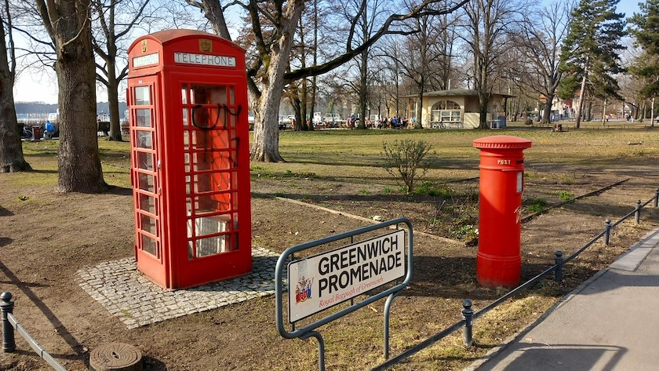
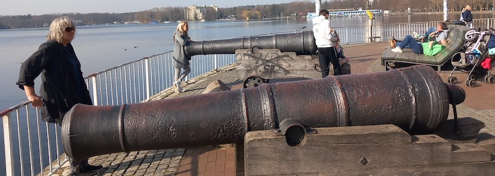
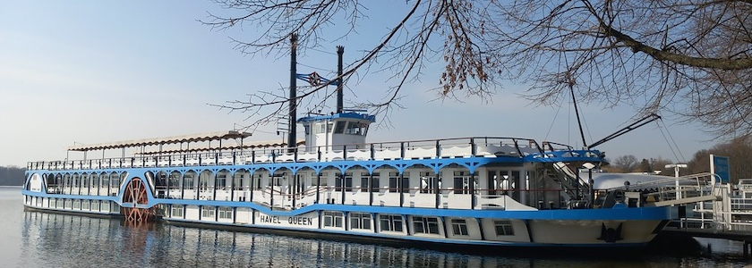

Die [Greenwichpromenade](https://de.wikipedia.org/wiki/Greenwichpromenade) ist eine Promenade am Ostufer des Tegeler Sees in Berlin-Tegel. War der Uferstreifen noch um 1900 nichts weiter als eine schmale Viehweide, entwickelte er sich nach dem Umbau zu einer Uferpromenade schnell zu einem der attraktivsten Berliner Ausflugsziele. Sie wurde 1966 anlässlich der Städtepartnerschaft mit dem Londoner Bezirk Greenwich in Greenwichpromenade umbenannt. Am Eingang zur Promenade auf der Höhe Alt-Tegel erinnert die von der Partnerstadt gespendete rote Telephonzelle sowie ein roter Briefkasten an diese Städtepartnerschaft.

Doch der Erhalt dieses Zeichens war nicht immer einfach. Wurde die Telephonzelle noch bis zum Jahresende 2017 als reguläre Telephonzelle von der Telekom betrieben, ließ das Bezirksamt Reinickendorf sie nach der Abschaltung im [Januar 2018 demontieren und auf dem Gelände des Grünflächenamts](https://www.tagesspiegel.de/berlin/in-berlin-verschwindet-die-nachste-englische-telefonzelle-3915640.html) gegenüber dem Reinickendorfer Rathauses einlagern. Dem Bezirk waren die jährlichen 5.000 Euro für die Pflege der Zelle wohl zu teuer.

Doch nach lautstarken Protesten aus der Bevökerung kehrte die Zelle nach [55 Tagen Exil](https://www.focus.de/regional/berlin/wahrzeichen-in-berlin-englische-telefonzelle-zurueck-an-der-greenwichpromenade-in-tegel_id_8574177.html) an ihren angestammten Platz an der Greenwichpromenade zurück. Für die Pflege erklärte sich der [Kiez-Verein »I love Tegel« zuständig](https://die-dorfzeitung.de/schoenheitskur-fuer-die-rote-telefonzelle-in-tegel-durch-ehrenamtliche/), der schon in den Jahre zuvor die Telephonzelle regelmäßig alle paar Jahre ([zuletzt 2015](https://www.kiezblatt.de/unsere-rote-telefonzelle/)) in frischem Rot neu getüncht hatte.

Zu dem Ensemle gehören neben der Londoner Telephonzelle ein ebenso [knallroter britischer Briefkasten](https://www.outdooractive.com/de/poi/berlin/greenwichpromenade/64159445/) und ein natürlich ebenfalls roter englischer Feuermelder. Letzterer ist allerdings oft kaum sichtbar, da er durch einen [Verkaufsstand für gebrannte Mandeln](https://www.inforadio.de/dossier/2020/reisen-um-die-ecke/tegel-greenwichpromenade-reisen-um-die-ecke.html) halb verdeckt wird.

Im Süden endet die Greenwichpromenade am Kanonenplatz. Hier gab es [früher das »Seebad Ostende« mit Badeanstalt und Gaststätte](https://www.berlin.de/ba-reinickendorf/ueber-den-bezirk/tourismus/artikel.82627.php). Heute stehen dort zwei gusseiserne Kanonen, ebenfalls ein Geschenk des Londoner Stadtbezirks. Sie stammen vermutlich aus Schottland und wurden zur Küstenverteidigung eingesetzt. Zwischen den Kanonen steht ein Findling, auf dem eine Gedenktafel über die Kanonen aufklärt.

Am nördlichen Ende der Promenade, an der [Sechserbrücke](https://kantel.github.io/posts/2025111001_sechserbruecke/), gab es ein zweites Freibad, wo noch bis 1936 gebadet wurde.

Bekannt ist die Promenade aber vor allen durch ihre sieben Schiffsanlegestellen, von denen in der Saison täglich zahlreiche Ausflugsschiffe zu Rundfahrten über den Tegeler See, die Havel und den Wannensee durch Berlin und Brandenburg starten.

### Verwendete Quellen und Literatur

- Bezirksamt Reinickendorf von Berlin: *[Die Greenwichpromenade](https://www.berlin.de/ba-reinickendorf/ueber-den-bezirk/tourismus/artikel.82627.php)*, abgerufen am 11.&nbsp;März&nbsp;2026
- Initiative »I Love Tegel«: *[Englische Telefonzelle soll als Wahrzeichen auf Tegeler Greenwichpromenade bleiben](https://www.focus.de/regional/berlin/i-love-tegel-aus-berlin-englische-telefonzelle-soll-als-wahrzeichen-auf-tegeler-greenwichpromenade-bleiben_id_8292041.html)*, Focus Online vom 12.&nbsp;Januar&nbsp;2018
- Initiative »I Love Tegel«: *[Englische Telefonzelle zurück an der Greenwichpromenade in Tegel](https://www.focus.de/regional/berlin/wahrzeichen-in-berlin-englische-telefonzelle-zurueck-an-der-greenwichpromenade-in-tegel_id_8574177.html)*, Focus Online vom 7.&nbsp;März&nbsp;2018
- Anna Pia Möller: *[In Berlin verschwindet die nächste englische Telefonzelle](https://www.tagesspiegel.de/berlin/in-berlin-verschwindet-die-nachste-englische-telefonzelle-3915640.html)*, Tagesspiegel vom 17.&nbsp;Januar&nbsp;2018
- n.n.: *[Unsere rote Telefonzelle](https://www.kiezblatt.de/unsere-rote-telefonzelle/)*, KiezBlatt.de vom 16.&nbsp;Juli&nbsp;2015
- n.n.: *[Schönheitskur für die rote Telefonzelle in Tegel durch Ehrenamtliche](https://die-dorfzeitung.de/schoenheitskur-fuer-die-rote-telefonzelle-in-tegel-durch-ehrenamtliche/)*, Die Dorfzeitung vom 2.&nbsp;Mai&nbsp;2018
- RBB24 Inforadio: *[Maritimes Flair an der Greenwichpromenade in Tegel](https://www.inforadio.de/dossier/2020/reisen-um-die-ecke/tegel-greenwichpromenade-reisen-um-die-ecke.html)*, Sendung vom 8.&nbsp;Juli&nbsp;2020
- Redaktion Berliner Abendblatt: *[Englische Telefonzelle soll wieder an die Promenade kommen](https://berliner-abendblatt.de/service/englische-telefonzelle-soll-wieder-an-die-promenade-kommen-id70325)*, Berliner Abendblatt vom 16.&nbsp;Januar&nbsp;2018
- Wikipedia: *[Greenwichpromenade](https://de.wikipedia.org/wiki/Greenwichpromenade)*, abgerufen am 11.&nbsp;März&nbsp;2026

---

**Photos** ([cc](https://creativecommons.org/licenses/by-sa/4.0/deed.de)) 2026: *[Jörg Kantel](http://cognitiones.kantel-chaos-team.de/cv.html)*