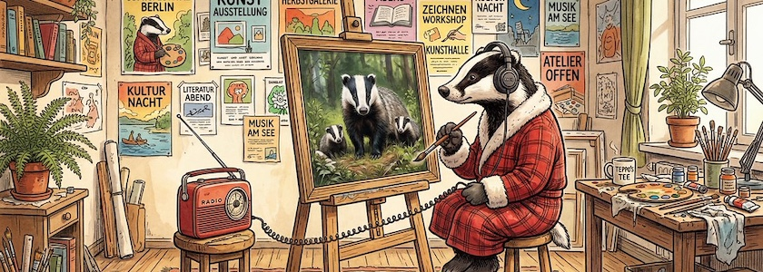

Das Team der »Verarbeitungsgrundlage« (so übersetzt Google Chrome die »Processing Foundation«) gibt bekannt, daß sie kürzlich von [P5.js](http://cognitiones.kantel-chaos-team.de/programmierung/creativecoding/processing/p5js.html), dem JavaScript-Ableger von [Processing (Java)](http://cognitiones.kantel-chaos-team.de/programmierung/creativecoding/processing/processing.html), gleich zwei (oder besser: drei) neue Versionen, nämlich [P5.js&nbsp;2.1](https://github.com/processing/p5.js/releases/tag/v2.1.1) (TypeScript-Integration) und von P5.js&nbsp;2.2 einmal die Version [P5.js&nbsp;2.2.1](https://github.com/processing/p5.js/releases/tag/v2.2.1) (mit einer einfacheren und flacheren API für `p5.strands`) und die Version [P5.js&nbsp;2.2.2](https://github.com/processing/p5.js/releases/tag/v2.2.2) (mit weiteren Leistungsverbesserungen und der Unterstützung für `millis()` innerhalb von `p5.strands`) [freigegeben](https://medium.com/@ProcessingOrg/p5-js-2-1-and-2-2-expanding-graphics-avenues-with-p5-strands-improvements-and-webgpu-9771d40c8b1d) hätten.

Diese Versionen bauen auf dem [Meilenstein-Release von p5.js 2.0 im letzten Jahr](https://kantel.github.io/posts/2025050602_p5js_2_0/) auf, das die Weichen für die Zukunft der Bibliothek stellte. Seitdem konzentrieren sich die Versionen 2.1 und 2.2 auf die Stabilisierung und Erweiterung dieser Grundlagen. Die Funktionen und Aktualisierungen aller 2.x-Versionen basieren seit 2023 auf dem Feedback der Community. Dies ist auch ein Hinweis darauf, daß P5.js 2.x im Juli 2026 zur Standardversion im [P5.js-Webeditor](https://editor.p5js.org/) wird.

Ziel des Übergangs zu Version 2.x ist die langfristige Nachhaltigkeit, um sicherzustellen, daß P5.js sich weiterentwickeln kann, ohne unüberschaubare, technische Schulden anzuhäufen. Hier könnt Ihr mehr über einige der wichtigsten Änderungen erfahren:

- Ein [Interview](https://timrodenbroeker.de/kit-kuksenok-on-p5-js-2-0/) mit *Kit Kuksenok* und *Tim Rodenbröker* anlässlich der Veröffentlichung von P5.js&nbsp;2.0 (das aber so abgesichert ist, daß ich es nicht angezeigt bekomme, egal wie häufig ich auf die blauen »Accept«-Knöpfe klicke -- vielleicht sollte *Tim* mal lernen, wie man allgemein zugängliche Webseiten erstellt&nbsp;😎).
- Ein [Video-Tutorial](https://www.youtube.com/watch?v=E2OE-FaMkag), wie man Shader mit `p5.strands` in P5.js&nbsp;2.0 verwendet.
- Ein [einstündiger Coding-Train-Livestream](https://www.youtube.com/watch?v=1KqQeqZ3R9Y) mit *Kit Kuksenok* über variable Schriftarten, asynchrones Laden, Text-zu-Konturen-Umwandlung und 3D-Textextrusion in P5.js&nbsp;2.0.

Eine wichtige, neue Erweiterung ist der benutzerfreundlichere Shader `p5.strands`, eine neue Shader-Programmierschnittstelle (API), mit der sich komplexe, leistungsstarke Graphiken mit vertrautem JavaScript-Code erstellen lassen. Strands übersetzt diesen Code im Hintergrund in die [OpenGL Shading Language](https://de.wikipedia.org/wiki/OpenGL_Shading_Language) *(GLSL)*, wodurch Skripte deutlich schneller ausgeführt werden als vergleichbare, reine JavaScript-Implementierungen.

Das klingt alles sehr interessant. Ich glaube, ich sollte mich auch (mal wieder und mal näher) mit P5.js beschäftigen. Und das nicht nur, weil JavaScript das nächste, große Ding ist. *Still digging!*

---

**Bild**: *[Der Dachs als Künstler](https://www.flickr.com/photos/schockwellenreiter/55151373345/)*, generiert mit [OpenArt.ai](https://openart.ai/home). Prompt: »*A badger in a red dressing gown in front of an easel listens to music on a portable radio in a creative room with many posters on the wall. The canvas on the easel displays a photorealistic image. Colored Franco-Belgian comic style. Language: German. No speech bubbles, no textboxes, no headlines.*« Modell: Nano Banana&nbsp;2
