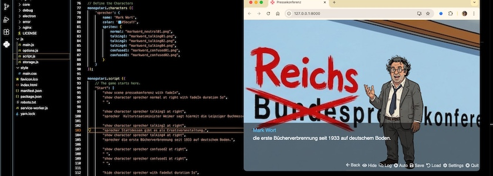
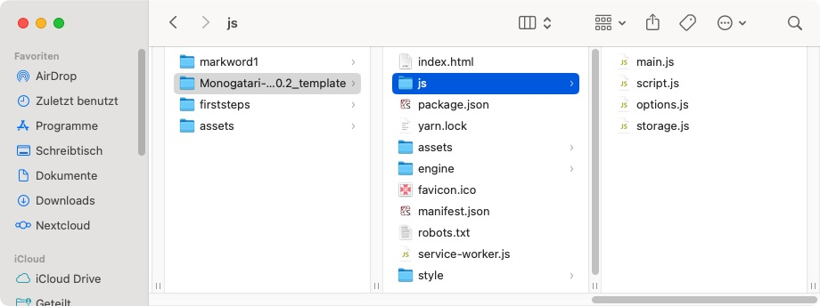
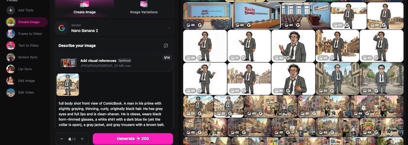
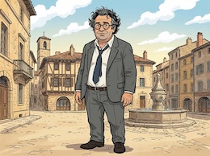

Meine kleine Satire »[Reichspressekonferenz](https://kantel.github.io/posts/2026031201_reichspressekonferenz/)« scheint ja gut bei meinen Leserinnen und Lesern angekommen zu sein. Daher denke ich mir, daß es nur gerecht ist, Euch zu zeigen, womit und wie ich diese kleine, (beinahe) interaktive Geschichte erstellt habe.

### Monogatari

Die freie (MIT-Lizenz) Engine, die hinter all dem werkelt, heißt **[Monogatari](https://monogatari.io/)** ([Quellcode](https://github.com/Monogatari/Monogatari/) auf GitHub). Diese kleine *Visual Novel Engine* wurde laut Eigenwerbung für das moderne Web entwickelt, um die Erstellung und Verbreitung interaktiver Geschichten, die prakatisch überall spielbar sind, einfacher zu machen. Die Ergebnisse sind *out of the box* responsiv. Per Default sind sie in jedem modernen Browser spielbar, jedoch können via [Electron](http://cognitiones.kantel-chaos-team.de/webworking/frameworks/electron.html) auch Desktop Apps für Windows, Linux oder macOS und via [Cordova](https://cordova.apache.org/) mobile Apps für Android une iOS erstellt werden.

Monogatari ist eine HTML-, CSS- und JavaScript-Engine, daher kann mir ihr alles angestellt werden, was im Web möglich ist (wenn man sich in HTML, CSS und JavaScript auskennt). Um damit zu starten, lädt man sich erst einmal das *Boilerplate* (entweder die Version 2.0.2 Stable (empfohlen) oder für *Thrill Seekers only* die neueste Version 2.6.0) herunter. Man erhält folgende Struktur:

Für Eure Versuche kopiert Ihr das komplette Verzeichnis und benennt es passend zu Eurer interativen Geschichte um (ich habe es `markword1` genannt). Das Template lasst Ihr als Vorlage für weitere Spiele unangetastet und arbeitet nur noch in Eurer Kopie.

Wichtig für den Anfang ist nur die Datei `script.js` im Verzeichnis `js` und die Datei `main.css` im Verzeichnis `style`. Erstere enthält das Skript für Eure interaktive Geschichte und letztere die CSS-Styles, die in Eurer Geschichte vom Default abweichen. Dann benötigt Ihr erst einmal nur noch das Verzeichnis `characters` und das Verzeichnis `scenes` im Verzeichnis `assets`. Hier kommen die Bilder Eurer Akteure und Eure Hintergrundbilder hinein.

Und der Datei `index.html` könnt Ihr einen entsprechenden Titel verpassen und falls Ihr weitere JavaScript-Dateien für Eure *Visual Novel* benötigt, müsst Ihr sie hier natürlich auch aufführen. Das Verzeichnis `engine` lasst Ihr am besten unangetastet, denn das ist -- wie der Name schon sagt -- die eigentliche Engine und in ihr sollten nur Leute herumfuhrwerken, die sehr Seltsames vorhaben und/oder genau wissen, was sie tun.

Um nun die Geschichte zu erstellen, habe ich mein Verzeichnis `markword1` in [Visual Studio Code](http://cognitiones.kantel-chaos-team.de/produktivitaet/visualstudiocode.html) geöffnet, weil ich da die `Go Live`-Erweiterung, die einen lolalen Webserver startet, schon installiert habe. Ihr könnt aber auch jeden anderen Editor oder jede andere IDE nutzen, Ihr müsst dann zum Testen nur die `index.html` mit einem lokalen Webserver Eures Vertrauens aufrufen. (Getested habe ich dies mit [MAMP](http://cognitiones.kantel-chaos-team.de/webworking/mamp.html) und mit [TinyHost](https://kantel.github.io/posts/2026020502_tinyhost/) und dem kleinen, schlanken Texteditor [Geany](http://cognitiones.kantel-chaos-team.de/produktivitaet/geany.html).)

Doch nun zum eigentlichen Skript. In der Datei `script.js`, die viele leere Default-Belegungen enthält, habe ich erst einmal zwei Abschnitte mit Leben gefüllt:

~~~javascript
// Define the backgrounds for each scene.
monogatari.assets ('scenes', {
	"pressekonferenz": "pressekonferenz.jpg",
});

// Define the Characters
monogatari.characters ({
	'sprecher': {
		name: 'Mark Wort',
		color: '#5bcaff',
		sprites: {
			normal: "markword_neutral01.png",
			talking1: "markword_talking01.png",
			talking2: "markword_talking02.png",
			talking4: "markword_talking04.png",
			confused1: "markword_confused01.png",
			confused2: "markword_confused02.png",
		}
	}
});
~~~

Wie Ihr leicht erkennen könnt, sind das alles JSON-Deklarationen, die von der Engine mit Leben gefüllt werden. Die Bilder, auf die hier verwiesen wird, habe ich mit [OpenArt](https://openart.ai/home) erstellt, doch darüber weiter unten mehr.

Direkt darauf folgt der Abschnitt `monogatari.scrip`, der die eigentliche Spielelogik enthält. Das darin enthaltene Beispielskript habe ich komplett gelöscht und durch diese Zeilen ersetzt:

~~~javascript
monogatari.script ({
	// The game starts here.
	"Start": [
		"show scene pressekonferenz with fadeIn",
		"show character sprecher normal at right with fadeIn duration 5s",
		" ",

		"show character sprecher talking1 at right",
		"sprecher  Kulturstaatsminister Weimer sagt hiermit die Leipziger Buchmesse ab.",

		"show character sprecher talking2 at right",
		"sprecher Stattdessen gibt es als Ersatzveranstaltung…",
		"show character sprecher talking4 at right",
		"sprecher die erste Bücherverbrennung seit 1933 auf deutschem Boden.",

		"show character sprecher confused2 at right",
		" ",
		"show character sprecher confused1 at right",
		" ",

		"hide character sprecher with fadeOut duration 5s",
		
	],
});
~~~

Wichtig dabei ist eigentlich nur das Label `"Start":`, weil von hier per Default das Programm startet, alles andere ist mehr oder weniger selbsterklärend. Und wenn nicht hilft ein Blick in die [Dokumentation](https://developers.monogatari.io/documentation), die sehr ausführlich ist.

Dann habe ich noch die Datei `options.js` angefasst, die einige Voreinstellungen vornimmt. Mir kam es nur darauf an, den Startscreen auszuschalten, bei solch einer kurzen Geschichte erschien er mir ein *overkill*. Das habe ich in der Datei in `monogatari.settings({})` mit

~~~javascript
// Turn main menu on/off; Default: true *
	'ShowMainScreen': false,
~~~

erledigt. Bei der Gelegenheit habe ich in der gleichen Datei ebenfalls in `monogatari.settings({})` mit

~~~javascript
	// The name of your game, this will be used to store all the data so once
	// you've released a game using one name, it shouldn't change. Please use the
	// Version Setting to indicate a new release of your game!
	'Name': 'Leipziger Buchmesse 2026',
~~~

der Geschichte auch noch einen Namen gegeben.

Die letzte Änderung habe ich noch in der Datei `main.css` vorgenommen. Hier kommen alle CSS-Änderungen hinein, damit man nicht in der Engine-eigenen `monogatari.css` herumfummeln muss.

Mir gefielen die Abstände in der Textbox nicht, sie klebten mir zu sehr an den Rändern. Daher habe ich ihnen mit

~~~css
/* Text Box styling */
[data-component="text-box"] {
	padding-top: 0.5em;
	padding-left: 1em;
	padding-right: 1em;
	padding-bottom: 0.5em;
}
~~~

etwas Luft verschafft.

### OpenArt und die Bilder

Eine *Visual Novel*, und sei sie noch so kurz wie mein Beispielprogramm, benötigt Bilder. Das sagt einem schon der Name.

Da mir leider kein Griffel in die Wiege gelegt wurde, habe ich diese mit OpenArt, eine der beiden gekünstellten Intelligenzien meines Vertrauens, generiert. Das [Hintergrundbild](https://www.flickr.com/photos/schockwellenreiter/55143780863/) war sehr schnell mit diesem Prompt erstellt:

>An empty room of a press conference. On the light blue wall, the text "Bundespressekonferenz" is written. Someone has crossed out the "Bundes" and painted "Reichs" over it with a red brush. Colored Franco-Belgian comic style. Language: German. No speech bubbles, no textboxes, no headlines. Suitable as background for a Visual Novel.

Als Modell habe ich das [brandneue Nano&nbsp;Banana&nbsp;2](https://kantel.github.io/posts/2026030302_nano_banana_2/) verwendet.

Schwieriger war die Erstellung der Figur des Sprechers. Denn da die brandneue GUI von OpenArt im Bildeditor keine Option zum Freistellen mehr besitzt (zumindest habe ich keine gefunden), bin ich zur alten Version gewechselt. Dort habe ich erst einmal wie [hier beschrieben](https://kantel.github.io/posts/2026012701_jo_hippo_character_2_0/) in *Character&nbsp;2.0* und Nano&nbsp;Banana&nbsp;Pro mit dem Prompt

>full body shot front view of ComicBook. A man in his prime with slightly graying, thinning, curly, originally black hair. He has gray eyes and full lips and is clean-shaven. He is obese, wears black horn-rimmed glasses, a white shirt with a dark blue tie (yet the collar is open), a gray jacket, and gray trousers with a brown belt. His shoes are dark brown. He nevertheless appears slightly unkempt. The background is white. Colored Franco-Belgian comic style. No speech-bubbles, no textboxes, no headlines. face to viewer, background is a suitable beautiful scene.

ein [Referenzbild](https://www.flickr.com/photos/schockwellenreiter/55143708199/) erzeugt, dessen Protagonisten ich »@Mark Word« genannt habe, und davon dann zum Beispiel mit `@Mark Word talking, white background` oder `@Mark Word confused, white background` oder präziser mit `@Mark Word talking, full body shot front view, left hand at chest level, white background` Variationen  mit Nano&nbsp;Banana&nbsp;2 erzeugt. Diese habe ich dann im alten Bildeditor von OpenArt freigestellt.

Mit dem Ergebnis bin ich sehr zufrieden, die Figur ist nämlich wirklich konsistent und für eine *Visual Novel* ideal geeignet. Und auch Monogatari scheint für die Erstellung kleiner, visueller Satiren und interaktiver Karikaturen wegen der (obwohl sie per Default alle Assets vor dem eigentlichen Start vorlädt) kurzen Ladezeiten ein ideales Werkzeug. Ich werde die kleine Engine sicher noch tiefer erkunden. *Still digging!*