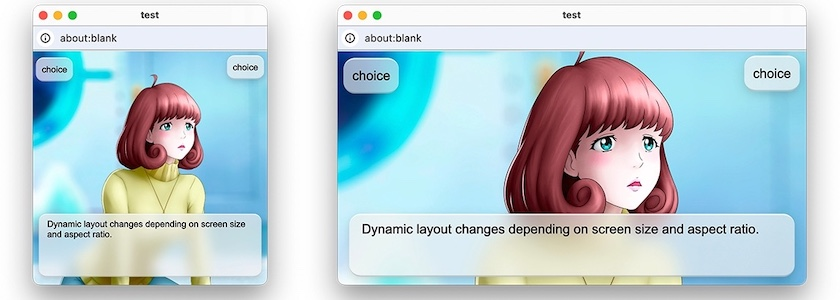

Die Beschäftigung mit [Monogatari](https://monogatari.io/) in den letzten Tagen hat mich daran erinnert, daß ich doch mal nachschauen sollte, was meine heimliche Liebe unter den *Visual Novel Engines* macht, [Tuesday&nbsp;JS](http://cognitiones.kantel-chaos-team.de/multimedia/spieleprogrammierung/tuesdayjs.html), die freie (Apache-2.0-Lizenz) JavaScript-basierten Engine für interaktive Geschichten, die mir allein schon deswegen so sympathisch ist, weil ihre Oberfläche mich immer ein wenig an [Twine](http://cognitiones.kantel-chaos-team.de/multimedia/spieleprogrammierung/twine2.html) erinnert.

Und es kam wie es kommen mußte: Wieder war ein Update unbemerkt an mir vorbeigerauscht. Denn schon am 1.&nbsp;Februar dieses Jahres wurde [Tuesday&nbsp;JS Release&nbsp;59](https://github.com/Kirilllive/tuesday-js/releases/tag/59.0.0) veröffentlicht. Und dieses Release bringt etliche erwähnenswerte Neuerungen:

1. Ihr könnt nun festlegen, ob der gesamte Text in einem Dialogfeld angezeigt wird, wenn ihr vor Abschluss der Textanimation auf »Weiter« klickt. Diese Funktion ist für neue Projekte standardmäßig aktiviert.
2. Der neue Anzeigemodus »Dynamisch« positioniert und skaliert die Benutzeroberflächenelemente entsprechend dem Seitenverhältnis und der Fenstergröße. Der Vorteil dieses Modus: Text und Schaltflächen werden sowohl bei einer Auflösung von $640$x$480$ als auch von $1920$x$1080$ identisch dargestellt.
3. Die Syntaxhervorhebung für HTML-Markup und CSS-Stile wurde hinzugefügt.

Außerdem wurden Benutzeroberflächenelemente und Symbole aktualisiert, um ihre Darstellung auf verschiedenen Bildschirmen mit unterschiedlichen Pixeldichten (dpi) und neuen Trends im UI-Design zu optimieren. Neue SVG-Rendering-Funktionen in Browsern haben diese Verbesserung ermöglicht.

Außerdem wollte ich noch auf die Tutorials hinweisen, die einmal zeigen, wie man mit dem NWJS-Tools [Web2Executable](https://github.com/nwutils/Web2Executable) aus Tuesday&nbsp;JS-Spielen [Desktop Apps für Windows, macOS und Linux](https://kirill-live.itch.io/tuesday-js/devlog/241616/creation-html-desctop-app-for-windows-macos-and-linux) erzeugt oder wie man mit Hilfe von [Cordova](https://cordova.apache.org/) eine [Tuesday&nbsp;JS-App für Android](https://kirill-live.itch.io/tuesday-js/devlog/214852/creation-html-apk-for-android) erstellt.

Wenn ich mich momentan nicht gerade auf Monogatari auf der *Visual Novel*-Seite und Twine für meinen Ausflug ins Wunderland versteift hätte, müsste ich eigentlich dringend wieder etwas mit Tuesday&nbsp;JS anstellen. Es liegt da ja noch eine Geschichte um *Hercule Poirot* auf Halde… *So viel zu spielen, so wenig Zeit!*