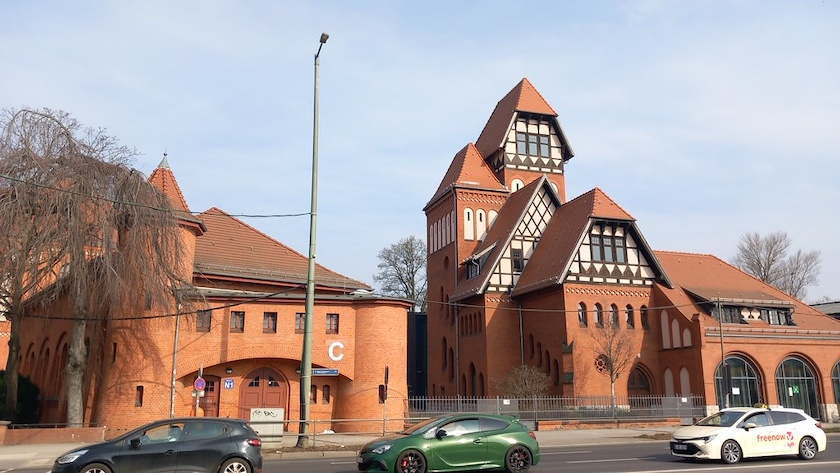

1878 entstand Niederschöneweide als selbstständige Landgemeinde. Doch trotz der rasanten industriellen Entwicklung in den sogenannten Gründerjahren besaß die Gemeinde keine eigene Feuerwehr, den Brandschutz mußten die Fabriken und Werke selber vornehmen. Erst 1907 reichte der Gemeindevorstand über den zuständigen Amstvorstand des Kreises Teltow einen Bauantrag für eine gemeindeeigene Feuerwache ein. Der verantwortliche Architekt war *Karl Alfred Herrmann* aus Wilmersdorf. Die Genehmigung wurde 1908 erteilt und der Bau auch in diesem Jahr fertiggestellt. Die Übernahme des Gebäudes durch die »Freiwillige Ortsfeuerwehr Niederschöneweide« erfolgte im November dieses Jahres. Mit der Neuorganisation nach der Eingemeindung 1920 nach Groß-Berlin übernahm die Berliner Berufsfeuerwehr die Wache.

Die Feuerwache sollte in feuertechnischer Hinsicht das Modernste liefern und war mit einer damals hochmodernen Polizei-Telegraphen-Anlage ausgestattet. Zur Straßenseite verschlossen drei halbrunde Holztore die Wagenhalle. Der den Bau bestimmende, fünfgeschossige Steige- oder Schlauchtrockenturm besitzt eine Frontbreite von fünf Metern. Der Gebäudekomplex befand sich an der Frontseite an der Grünauer Straße (heute: Michael-Brückner-Straße) in direkter Nachbarschaft zur Turnhalle der bereist existierenden Schule. Die betont malerisch gehaltene Gebäudegruppe lehnt sich an Formen der Spätgotik und der Renaissance an. Es sind Ziegelbauten, teilweise verputzt, mit aufgesetzten Fachwerkgeschossen unter steilen Satteldächern.

Im zweiten Weltkrieg wurde das Gebüude nur leicht beschädigt und konnte daher schon 1946 seine Funktion wieder wahrnehmen. Doch als 1976 eine neue, moderne Feuerwache in Johannisthal in Betrieb ging, verlor das Gebäude seine Funktion als Berufswache und wurde von der Freiwilligen Feuerwehr und der Volkspolizei übernommen.

1987, zum 100-jährigen Bestehen der Landgemeinde Niederschöneweide, wurde der komplette Gebäudekomplex unter Denkmalschutz gestellt.

Nach der Wiedervereinigung 1990 stand das Gebäude einige Jahre leer und machte einen vernachlässigten Eindruck, weil das Geld für eine denkmalgerechte Sanierung und den Umbau fehlte. Doch seit 1994 wurden Teile des Gebäudes unter dem Dach des Vereins »Alte Feuerwache Treptow e.V.« von diversen kulturellen und sozialen Vereinen genutzt.

Als 2010 durch Beschluß der BVV Treptow der Gebäudekomplex nebst einem zu errichtenden Neubau als Standort für die neue Treptower Mittelpunkbibliothek vorgesehen wurde, war das Ende des Kulturhauses besiegelt. Die Eröffnung dieser Bibliothek erfolge 2014 oder 2015 (da sind sich meine Quellen nicht ganz einig). Architekten des Neubaus waren *Rebecca Chestnutt* und  *Robert Niess*. Die Grundform des dreigeschossigen Neubaus gleicht einer Spirale, welche den Turm der Alten Feuerwache als Dreh- und Angelpunkt nutzt. So soll im Neubau die Tradition des Denkmals fortleben.

### Literatur und Quellen

Obwohl die Alte Feuerwache als (inoffizielles) Wahrzeichen von Niederschöneweide gilt, ist die Quellenlage recht dünn. Auch unser aller Datenkrake spuckt fast gar nichts aus. Alle Informationen zur Alten Feuerwache, die ich genutzt habe, verdanke ich dem (auch sonst sehr lesenswerten) Buch von *Georg Türke*. Alle anderen aufgezählten (und hoffentlich unabhängigen) Quellen dienten nur dazu, die Eckdaten zu verifizieren.

- Sabine Möller: *Spaziergänge in Treptow*, Berlin (Haude & Spener) 1998, S.&nbsp;53ff.
- Regina Richter, Frauke Rother, Anke Scharnhorst: *Hier können Familien Kaffee kochen. Treptow im Wandel der Geschichte*, Berlin (be.bra verlag)&nbsp;1996, S.&nbsp;88ff.
- Dana Schultze, Karin Manke: *Streifzüge durch Treptow*, Berlin (Stapp Verlag)&nbsp;1996, S.&nbsp;51ff.
- Stadtbibliothek Treptow-Köpenick: *[Wissenswertes zur Geschichte des Hauses](https://www.berlin.de/stadtbibliothek-treptow-koepenick/bibliotheken/mittelpunktbibliothek-treptow/artikel.476274.php)*, Berlin.de, abgerufen am 18.&nbsp;März&nbsp;2026
- Georg Türke: *Niederschöneweide im Wandel der Geschichte. Beiträge zur Vergangenheit und Gegenwart eines Berliner Ortsteils*, herausgegeben vom Förderverein Museum Treptow e.V., Berlin (Hendrik Bäßler Verlag)&nbsp;2014, S.&nbsp;117ff.

---

**Photo** ([cc](https://creativecommons.org/licenses/by-sa/4.0/deed.de)) 2026: *[Jörg Kantel](http://cognitiones.kantel-chaos-team.de/cv.html)*