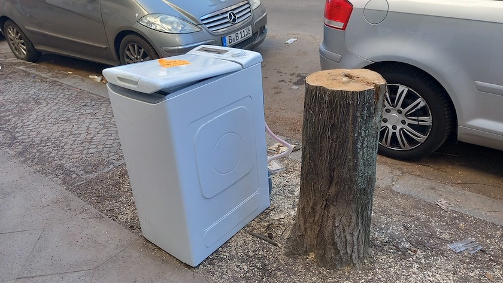
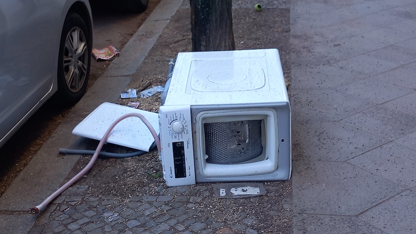
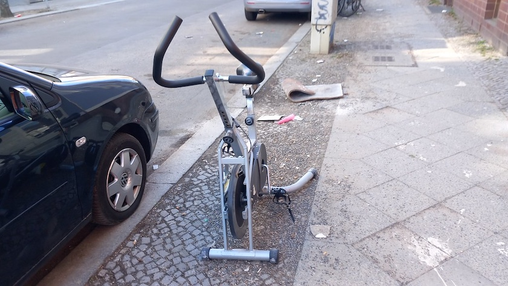
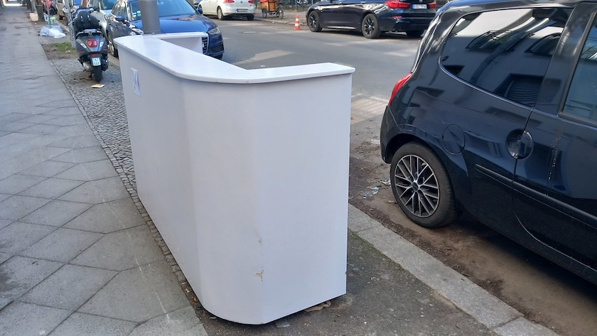

Pappt man einen Zettel »Zu verschenken« darauf, wird der Müll wie aus Zauberhand plötzlich zu Nicht-Müll.

Doch Tage später ist der Zettel weg und der Jetzt-wieder-Müll umgeworfen und immer noch da! (Übrigens bis heute.)

Die Bürgerstraße ist auch ein beliebter Ort für Freiluft-Fitness…

und für *Public Drinking*. Wer sich also diese formschöne Hausbar in sein Wohnzimmer stellen möchte, kann sie in der Bürgerstraße abholen. Denn Ihr wisst schon, der aufgeklebte Zettel »Zu verschenken« negiert die Eigenschaft dieses Möbelstücks, Müll zu sein.

---

**Photos** ([cc](https://creativecommons.org/licenses/by-sa/4.0/deed.de)) 2026: *[Jörg Kantel](http://cognitiones.kantel-chaos-team.de/cv.html)*