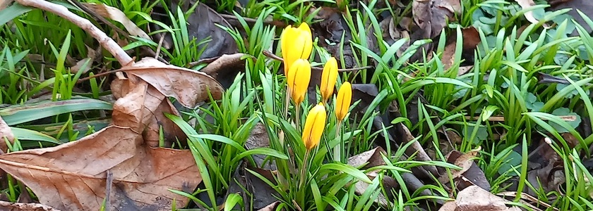

Obwohl kaum Sonne in mein Schattengärtchen dringt, hat die Zahl der Krokii und die Leuchtkraft ihrer Farben kräftig zugenommen. Das zeigt: Der Frühling ist nicht mehr weit! Und die Sonne wird auch bald wieder hoch genug stehen, daß ich auf der Terrasse im Garten sitzen und mich von ihren Strahlen bescheinen lassen kann.

---

**Photo** ([cc](https://creativecommons.org/licenses/by-sa/4.0/deed.de)) 2026: *[Jörg Kantel](http://cognitiones.kantel-chaos-team.de/cv.html)*