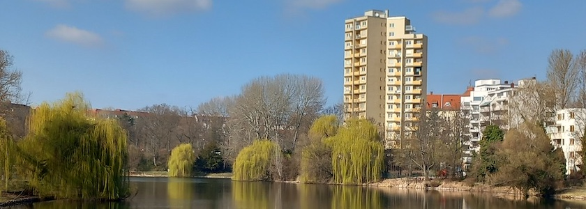
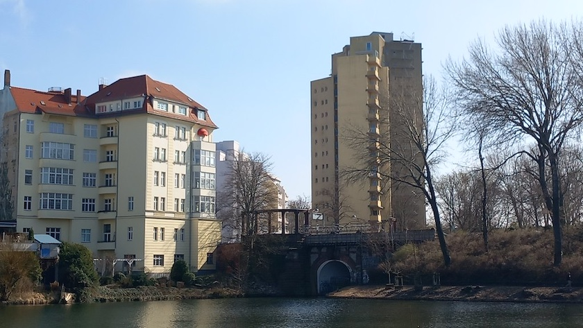
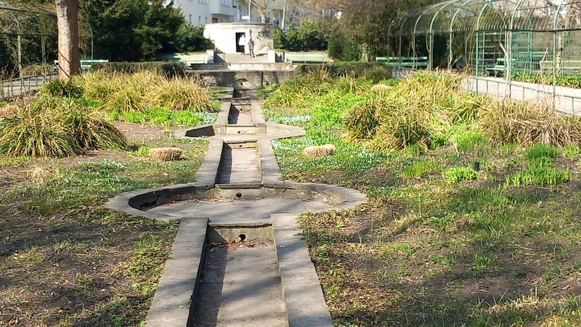
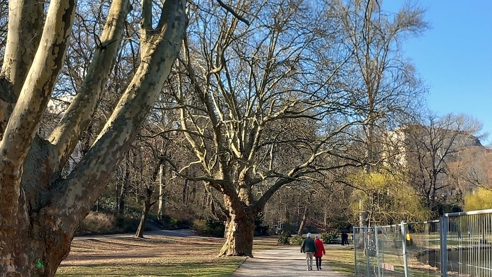
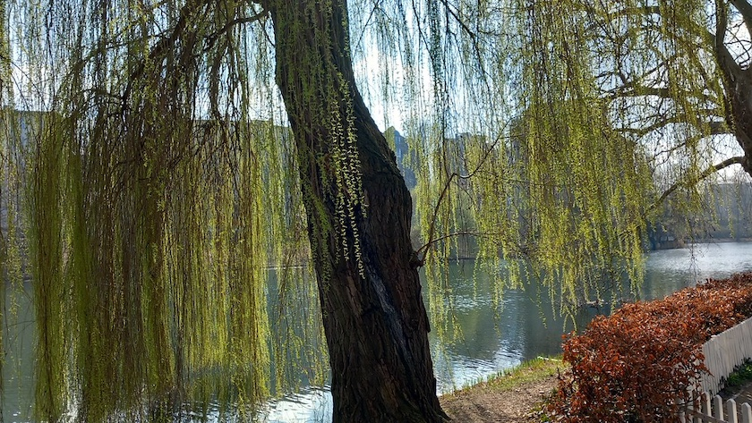
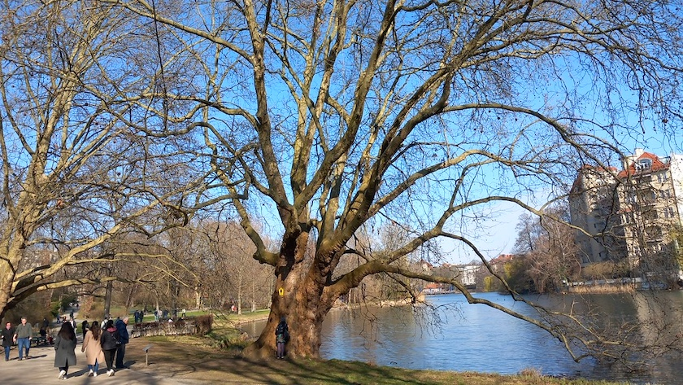
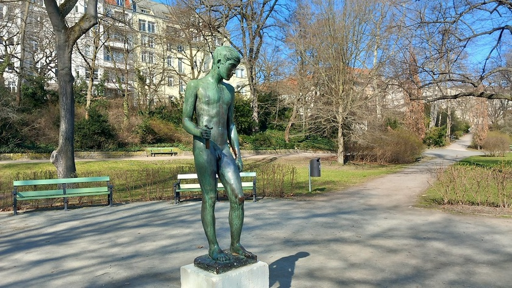
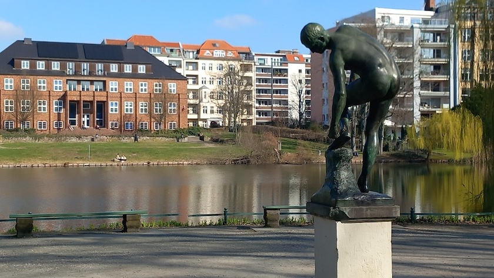
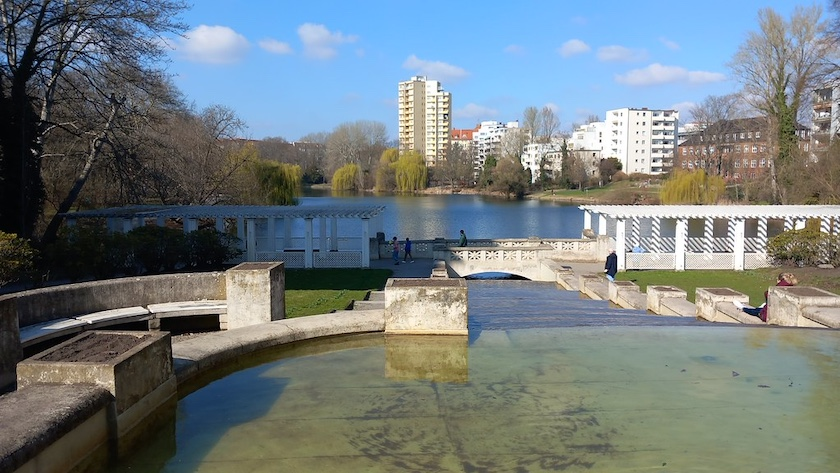

Der Lietzensee ist der nördlichste See der Berliner Grunewaldseen, die in der vorletzten Eiszeit in einer Nebenrinne der Havel entstanden waren. In den 1820er Jahren erwarb *General von Witzleben* das Gelände rund um den Lietzensee und ließ auf der Westseite einen großen Park nebst Landhaus anlegen. Dennoch blieb sein Naturzustand noch lange Zeit weitgehend erhalten, bis er gegen Ende des Jahrhunderts nahezu verlandet, völlig verschilft und nur noch knapp 20 cm tief war und auf zwei Meter Tiefe ausgebaggert werden musste. Der folgenden Eutrophierung (übermäßige Nährstoffbelastung) wurde hier – vermutlich weltweit zum ersten Mal – mit einer künstlichen Sanierung durch Nährstoffdrosselung entgegengewirkt.

1904 wurde der See durch die zwecks Verlängerung der Kantstraße notwendige Dammaufschüttung zweigeteilt. Ein Kanal unter der Lietzenseebrücke verbindet die beiden Teile. Die Buntsandsteinbrücke wurde im gleichen Jahr 1904 durch die »Terrain-Aktiengesellschaft Park Witzleben« errichtet. So steht es auch auf einer Sandsteintafel oben am Brückengeländer. Erst 1956 wurden die beiden Parkteile für Fußgänger durch einen Durchgang unter der Lietzenseebrücke wieder verbunden.

1906 wurde der Park von *Toebelmann* und *Brettschneider* umgestaltet. 1910 kaufte schließlich die Stadt Charlottenburg den Lietzensee samt Park. Die Entwürfe zum Lietzenseepark stammten von 1912, dem Jahr, in dem *Erwin Barth* zum Gartendirektor von Charlottenburg ernannt worden war. Doch weitere Arbeiten verhinderte der Ausbruch des Ersten Weltkrieges. Erst danach wurden unter Leitung von *Barth* von 1918 bis 1920 als Arbeitsbeschaffungsmaßnahme neue Grünflächen um den Lietzensee im Jugendstil angelegt.

Die kleine Kaskade am Nordwestufer des Sees mit Rundbecken und Fontäne, eingerahmt von Laubengängen schufen *Erwin Barth* und *Heinrich Seeling* 1912, zeitgleich mit der großen Kaskade am südlichen Ende des Parks. Sie ist zur Zeit außer Betrieb, da der Bezirk die notwendigen Sanierungskosten von mehr als einer Millionen Euro (geschätzte Summe 2022) nicht aufbringen kann.

Das eigentlich recht schmale Gelände erscheint geradezu weitläufig durch die Art, wie *Barth* seine in Jugendstilformen geschwungenen und oft symmetrich angelegten Wege angeordnet hat, sie in runden oder halbkreisförmigen Plätzen zusammenkommen und in sanften Bögen wieder auseinandergehen ließ.

Unter Berücksichtigung der Geländesituation und des alten Baumbestandes mit Robinien, Pappeln, Platanen, Birken und Ahorn legte *Barth* eine Uferpromenade um den See an, schuf ausgedehnte Rasenflächen, sonnige und schattige Ruheplätze und einen Kinderspielplatz.

Diese stattliche Ahornblättrige Platane am Lietzenseepark wurde im Jahr 1807 gepflanzt. 

Der Weg führt nun weiter am See entlang nach Süden, vorbei an dem »Speerträger« von *Bernhard Bleeker* (1940, Aufstellung in der Nachkriegszeit). Der Speer ist ihm im Lauf der Jahre verlorengegangen.

1962 bekam die Stadt einen »Sandalenlösenden Knaben« aus dem Nachlass des Bildhauers *Fritz Röll* geschenkt. Das 1909 mit dem Großen Staatspreis ausgezeichnete Werk wurde hier aufgestellt. Gegenüber, hinter dem Kuno-Fischer-Platz auf der anderen Seeseite, steht das Knappschafts-Berufsgenossenschaftshaus. 1929/30 wurde das Gebäude von *Rudolf Hartmann* als Verwaltungsgebäude der Knappschafts-Berufsgenossenschaft als leicht expressionistischer Klinkerbau hier am Ufer des Lietzensees erbaut.

Den Höhepunkt des Spaziergangs bildet die am Südeingang des Parks von *Erwin Barth* beeindruckend gestaltete, große Kaskade aus weißem Beton (1912), deren Wasser in mehreren terrrassenförmigen Stufen bis zum See abfällt. Sie verleiht diesem Teil des Lietzenseeparks eine fast südländisch anmutenende Aura. 2006 wurde die Kaskadenanlage von der Stiftung Denkmalschutz Berlin aufwändig restauriert. Ebenso wurden die angrenzenden Grünflächen gartendenkmalpflegerisch überarbeitet und teilweise wie die Kaskadenanlage in historischer Anlehnung an den Gartenarchitekten *Erwin Barth* wiederhergestellt. Die von *Barth* 1912 konzipierten Hohlwege wurden neu angelegt, die Rasentreppen, in Anpassung an die Wasserstufen, und die Treppenanlagen neu modelliert sowie die Wegebeläge teilweise saniert.

1992 diente die große Kaskade als Drehort in *Otto Waalkes* Film »Otto – Der Liebesfilm«.

### Literatur und Quellen

- Bezirksamt Charlottenburg-Wilmersdorf: *[Grünanlagen - Historische Pläne vom Lietzenseepark](https://www.berlin.de/ba-charlottenburg-wilmersdorf/verwaltung/aemter/strassen-und-gruenflaechen/gruenflaechen/gartendenkmale/artikel.196691.php)*, Berlin.de, aufgerufen am 23.&nbsp;März&nbsp;2026
- Bezirksamt Charlottenburg-Wilmersdorf: *[Lietzensee](https://www.berlin.de/ba-charlottenburg-wilmersdorf/ueber-den-bezirk/freiflaechen/gewaesser/artikel.111005.php)*, Berlin.de, aufgerufen am 23.&nbsp;März&nbsp;2026
- Bezirksamt Charlottenburg-Wilmersdorf: *[Lietzenseepark](https://www.berlin.de/ba-charlottenburg-wilmersdorf/ueber-den-bezirk/freiflaechen/parks/artikel.177405.php)*, Berlin.de, aufgerufen am 23.&nbsp;März&nbsp;2026
- Bürger für den Lietzensee: *[Der Lietzensee und sein historischer Park](https://lietzenseepark.de/archiv/2-inhalte/1-der-lietzensee-und-sein-historischer-park.html)*, 31.&nbsp;Oktober&nbsp;2016
- Bürger für den Lietzensee: *[Ein historisches Gartendenkmal](https://kulturerbenetz.berlin/mitglieder/buerger-fuer-den-lietzensee/)*, KulturerbeNetz.Berlin, 14.&nbsp;April&nbsp;2019
- Cay Dobberke: *[Gewässersanierung in Berlin: Der Lietzensee soll von Blaualgen befreit werden und nicht mehr stinken](https://www.tagesspiegel.de/berlin/bezirke/gewassersanierung-in-berlin-der-lietzensee-soll-von-blaualgen-befreit-werden-und-nicht-mehr-stinken-10379746.html)*, Tagesspiegel, 28.&nbsp;August&nbsp;2023
- Benedikt Kendler: *[Der Lietzensee in Charlottenburg: Architektur, Marzipan und Suppen](https://www.tip-berlin.de/stadtleben/lietzensee-charlottenburg-tipps-sehenswertes/)*, tipBerlin, 5.&nbsp;Oktober&nbsp;2020
- Lennart Koch: *[Warum ein Tag am Lietzensee glücklich macht](https://www.tip-berlin.de/ausfluege/parks/warum-ein-tag-am-lietzensee-gluecklich-macht/)*, tipBerlin, 13.&nbsp;Juni&nbsp;2025
- Dr. Dietmar Land: *[Parkpflegewerk Lietzenseepark – Lietzensee – Der See](https://www.berlin.de/ba-charlottenburg-wilmersdorf/verwaltung/aemter/umwelt-und-naturschutz/naturschutz/freiraumplanung/see-pdf.pdf)*, Berlin, Oktober&nbsp;2014-Oktober&nbsp;2015, PDF, 44&nbsp;Seiten
- Heike Schmitt-Schmelz (Bezirksamt Charlottenburg-Wilmersdorf): *[245. Kiezspaziergang - Um den Lietzensee, auf den Spuren Erwin Barths](https://www.berlin.de/ba-charlottenburg-wilmersdorf/ueber-den-bezirk/spazieren-und-wandern/kiezspaziergaenge/artikel.1344081.php)*, Berlin.de, 8.&nbsp;Juli&nbsp;2023 
- Wikipedia: *[Lietzensee](https://de.wikipedia.org/wiki/Lietzensee)*, aufgerufen am 23.&nbsp;März&nbsp;2026
- Wikipedia: *[Otto – Der Liebesfilm](https://de.wikipedia.org/wiki/Otto_%E2%80%93_Der_Liebesfilm)*, aufgerufen am 23.&nbsp;März&nbsp;2026

---

**Photos** ([cc](https://creativecommons.org/licenses/by-sa/4.0/deed.de)) 2026: *[Jörg Kantel](http://cognitiones.kantel-chaos-team.de/cv.html)*