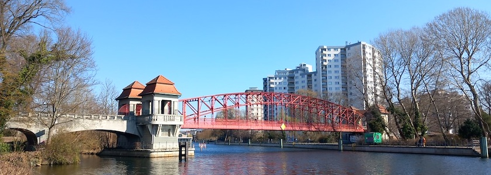
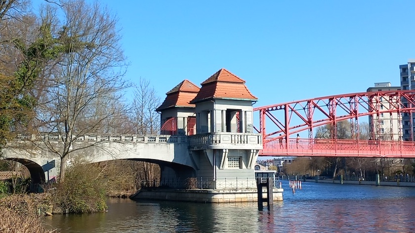
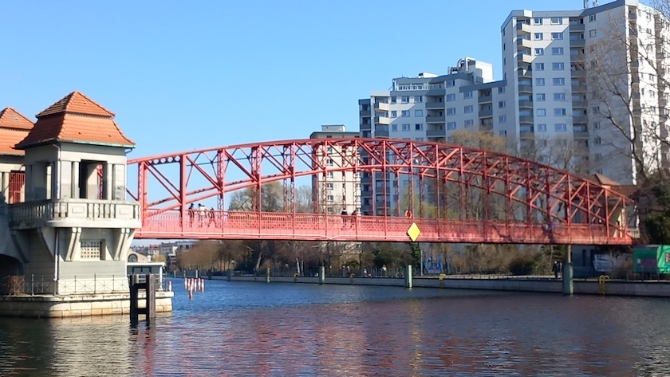
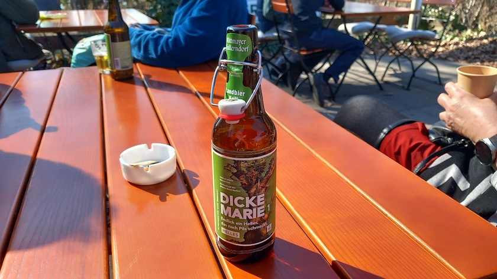

Vergangenen Sonntag haben die allerliebste aller Freundinnen und ich das wunderbare Frühlingswetter ausgenutzt und einen Spaziergang am Tegeler See unternommen, nur dieses Mal nicht -- wie im November letzten Jahres -- von der »[Dicken Marie](https://kantel.github.io/posts/2025111002_dicke_marie/)« zur »[Sechserbrücke](https://kantel.github.io/posts/2025111001_sechserbruecke/)« (und zurück), sondern in umgekehrter Reihenfolge von der »Sechserbrücke« zur »Dicken Marie« (und zurück).

Dabei habe ich wieder ein paar Photos geschossen, die ich Euch einmal nicht vorenthalten möchte, die aber auch in meinem (geplanten) Projekt »[Atlas Curiosa](https://kantel.github.io/#category=Atlas%20Curiosa)« Verwendung finden könnten:

Und dann waren wir noch auf den [Tegeler Wies'n](https://tegeler-wiesn.de/), einem netten Biergarten mit Havelblick.

Dort konnten wir feststellen, daß die »Dicke Marie« sogar ihr eigenes Bier besitzt. *Prost!*

---

**Photos** ([cc](https://creativecommons.org/licenses/by-sa/4.0/deed.de)) 2026: *[Jörg Kantel](http://cognitiones.kantel-chaos-team.de/cv.html)*