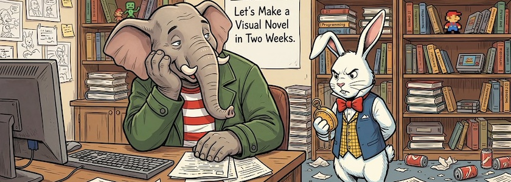

Unser aller Datenkrake ist natürlich nicht verborgen geblieben, daß mein Interesse in den letzten Wochen verstärkt auf interaktive Geschichten und *Visual Novels* lag und hat mich dementsprechend mit Vorschlägen zu einschlägigen Video-Tutorials zugeballert. Einige davon klangen so interessant, daß ich sie hier veröffentlichen musste, in der Hauptsache, damit ich sie nicht vergesse, aber auch weil sie die eine oder den anderen von Euch da draußen eventuell ebenfalls interessieren:

<iframe class="if16_9" src="https://www.youtube.com/embed/VtzizfHTBL0?si=Y0__lpdiLZmUEvoA" title="YouTube video player" frameborder="0" allow="accelerometer; autoplay; clipboard-write; encrypted-media; gyroscope; picture-in-picture; web-share" referrerpolicy="strict-origin-when-cross-origin" allowfullscreen></iframe>

*[Citrus Con](https://www.citruscon.com/)* ist eine Spieleschmiede, die sich dem Publizieren von expliziten *Visual Novels* mit homosexuellen und queeren Inhalten verschrieben hat. Doch das Tutorial »[How to Make a Visual Novel in Two Weeks](https://www.youtube.com/watch?v=VtzizfHTBL0)«, das die Initialzündung für diesen Beitrag gab, zeigt bewusst keine NSFW-Inhalte (was bei dem prüden YouTube auch schwierig wäre), sondern ist eine kenntnisreiche Einführung in die Werkzeuge und Methoden, um *Visual Novels* zu erstellen.

Es ist das einzige Video in diesem Blogpost, das ich vorab gesehen habe, alle folgenden sind für mich und für Euch Wundertüten.

<iframe class="if16_9" src="https://www.youtube.com/embed/BukXyvrStCc?si=H4m4Ng1WGEa-jJcg" title="YouTube video player" frameborder="0" allow="accelerometer; autoplay; clipboard-write; encrypted-media; gyroscope; picture-in-picture; web-share" referrerpolicy="strict-origin-when-cross-origin" allowfullscreen></iframe>

Der Kanal »Let's Make A Game« wird ja -- vor allem wegen seiner Qualität und [Twine](http://cognitiones.kantel-chaos-team.de/multimedia/spieleprogrammierung/twine2.html)/[SugarCube](https://www.motoslave.net/sugarcube/2/docs/)-Kompetenz -- regelmäßig in diesem ~~Blog~~ Kritzelheft erwähnt. Vor wenigen Tagen hat er ein neues Projekt angefangen, »[Coding a dungeon crawl in 25 days](https://www.youtube.com/playlist?list=PLyTbPwKro2ZShJLlgeROd5IGWSbJwT7sF)«. Stand heute besteht die Playlist aus sieben Videos, aber die 25&nbsp;Tage sind ja auch noch nicht vorbei. Mit weiteren Video-Tutorials ist also zu rechnen.

<iframe class="if16_9" src="https://www.youtube.com/embed/3Lx1gpj6ilU?si=Ol2_xAksIu2Cqpa4" title="YouTube video player" frameborder="0" allow="accelerometer; autoplay; clipboard-write; encrypted-media; gyroscope; picture-in-picture; web-share" referrerpolicy="strict-origin-when-cross-origin" allowfullscreen></iframe>

Den Kanal *Game Developer Training* hatte ich mit Sicherheit schon mindestens einmal auf diesen Seiten, auf die Playlist »[The ultimate Ren'Py Masterclass](https://www.youtube.com/playlist?list=PLKdE0Vv4UA5-W0yyEdLFDVnmIrFa45g_Y)« (sechs Video-Tutorials), die Mitte Januar dieses Jahres das letzte Mal aktualisiert wurde, kann ich mich allerdings nicht erinnern. Aber wenn doch: Im Fernsehen wird ja auch immer alles wiederholt.

<iframe class="if16_9" src="https://www.youtube.com/embed/gua0HUd0qyU?si=q79uDQ3GWspYW7Vc" title="YouTube video player" frameborder="0" allow="accelerometer; autoplay; clipboard-write; encrypted-media; gyroscope; picture-in-picture; web-share" referrerpolicy="strict-origin-when-cross-origin" allowfullscreen></iframe>

Das gleiche gilt für die Playlist »[Let's Code 6](https://www.youtube.com/playlist?list=PLKdE0Vv4UA5-4ZieGxewfPgKHa1nlmZWX)« desselben Kanals, die in stolzen 27&nbsp;Videos in die Erstellung von *Visual Novels* in [Ren'Py](http://cognitiones.kantel-chaos-team.de/multimedia/spieleprogrammierung/renpy.html) und/mit Python einführt.

<iframe class="if16_9" src="https://www.youtube.com/embed/S2edlQjqEI4?si=JfiO4Er3wMmUhkfR" title="YouTube video player" frameborder="0" allow="accelerometer; autoplay; clipboard-write; encrypted-media; gyroscope; picture-in-picture; web-share" referrerpolicy="strict-origin-when-cross-origin" allowfullscreen></iframe>

Der Kanal *Coding With B and E* spielt in der gleichen Liga wie das oben erwähnte *Game Developer Training*. Ich bin mir fast sicher, daß ich die Reihe »[Intermediate Ren'Py](https://www.youtube.com/playlist?list=PL8gnyyQEz5CEmWEpXKt0dSDWvwz85oosL)« (15&nbsp;Video-Tutorials) auf diesen Seiten schon einmal hatte, aber sie ist einfach eine gute Ergänzung zu »Let's Code&nbsp;6«, und daher habe ich sie hier noch einmal aufgeführt.

<iframe class="if16_9" src="https://www.youtube.com/embed/wifXLDdLvhA?si=firDn0laO9ZN2OSL" title="YouTube video player" frameborder="0" allow="accelerometer; autoplay; clipboard-write; encrypted-media; gyroscope; picture-in-picture; web-share" referrerpolicy="strict-origin-when-cross-origin" allowfullscreen></iframe>

Die YouTuberin *Aclypse* ist eine besonders schnelle. Statt in zwei&nbsp;Wochen, wie oben im ersten Video-Tutorial, hat sie ihre [*Visual Novel* in zehn Tagen](https://www.youtube.com/watch?v=wifXLDdLvhA) erstellt. Diese bemerkenswerte Leistung&nbsp;🤓 rundet die Beiträge auf dieser Seite doch nett ab.

Und ich weiß nun, was ich mir in den nächsten Tagen reinziehen kann, wenn in der Glotze nichts Vernünftiges läuft. *Still digging!*

---

**Bild**: *[How to Make a Visual Novel in Two Weeks](https://www.flickr.com/photos/schockwellenreiter/55166601661/)*, generiert mit [OpenArt.ai](https://openart.ai/home). Prompt: »*@Qumbo sits at a desk in an office, a dreamy expression on his face. A poster is pinned to the wall in the background, reading: "Coding Challenge: Let's Make a Visual Novel in Two Weeks." Next to him stands @Rudi Rabbit, impatiently checking his pocket watch. To the right and left of the poster are overflowing bookshelves filled with IT literature and gaming trinkets. Colored Franco-Belgian comic style. No textboxes, no speech-bubbles.*« Modell: Nano&nbsp;Banana&nbsp;2.