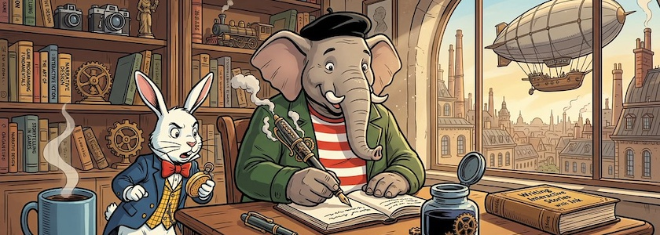
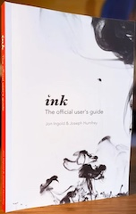

Neben den [gestern vorgestellten Tutorials](https://kantel.github.io/posts/2026032402_vis_nov_tutorials/) zu interaktiven Geschichten und *Visual Novels* spülte mir unser aller Datenkrake auch Material zu [Ink und Inky](http://cognitiones.kantel-chaos-team.de/multimedia/spieleprogrammierung/inkle.html) in meinen Feedreader. Langjährige Leser des *Schockwellenreiters* erinnern sich: **[Ink](https://www.inklestudios.com/ink/)** ist eine freie (MIT-Lizenz) Skriptsprache für interaktive Fiktion. Im Gegensatz zum verwandten [Twine](http://cognitiones.kantel-chaos-team.de/multimedia/spieleprogrammierung/twine2.html) ist es nicht auf eine HTML-Ausgabe festgelegt, sondern sondern das *native* Datenformat ist `JSON` und damit können Ink-Skripte nicht nur nach HTML exportiert werden, sondern eigentlich nach allem, was mit `JSON` etwas anfangen kann. Von Hause aus bringt Ink ein Plug-in für [Unity](http://cognitiones.kantel-chaos-team.de/multimedia/spieleprogrammierung/unity.html) mit. Denn Ink wurde von der Spieleschmiede [Inkle](https://www.inklestudios.com/) entwickelt, die ihre eigenen Spiele, wie zum Beispiel »[80 Days](https://www.inklestudios.com/80days/)« oder »[Sorcery!](https://www.inklestudios.com/sorcery/)«, in Ink schreibt und in Unity veröffentlicht.

[Inky](https://github.com/inkle/inky) wiederum steht ebenfalls unter der MIT-Lizenz und ist ein freier, plattformübergreifender (Windows, Linux, Mac) Editor für Ink. Es ist eine Electron-Anwendung und sieht ungefähr so aus wie viele Markdown-Editoren: Links der Quelltext und rechts das herausgeschriebene Spiel, das man in Inky sogar spielen kann. Über beide hatte ich zuerst im [August&nbsp;2018 im *Schockwellenreiter* berichtet](http://blog.schockwellenreiter.de/2018/08/2018082402.html), aber auch danach [standen sie immer mal wieder](https://kantel.github.io/#category=Ink) auf meiner Agenda.

<iframe class="if16_9" src="https://www.youtube.com/embed/1rDc8q3kunU?si=5k8YH3NdajULljBv" title="YouTube video player" frameborder="0" allow="accelerometer; autoplay; clipboard-write; encrypted-media; gyroscope; picture-in-picture; web-share" referrerpolicy="strict-origin-when-cross-origin" allowfullscreen></iframe>

Als nun das Video »[Ink - Programming Language for Game Narratives - Godot | Unity | Unreal | More](https://www.youtube.com/watch?v=1rDc8q3kunU)« in meinen Feedreader spülte, das unter anderem auch einen Export nach Godot propagierte, dachte ich mir: Moment nochmal, auch die *Visual Novel*-Engines [Monogatari](https://monogatari.io/) und [Tuesday&nbsp;JS](http://cognitiones.kantel-chaos-team.de/multimedia/spieleprogrammierung/tuesdayjs.html) basieren auf `JSON`, es müßte also möglich sein, sie mit Ink zu verheiraten.

<iframe class="if16_9" src="https://www.youtube.com/embed/OtTezJZTuy4?si=6IGaTxB_nppN7-SY" title="YouTube video player" frameborder="0" allow="accelerometer; autoplay; clipboard-write; encrypted-media; gyroscope; picture-in-picture; web-share" referrerpolicy="strict-origin-when-cross-origin" allowfullscreen></iframe>

Zur Vorbereitung möchte ich mir erst einmal die Playlist »[Godot & Ink](https://www.youtube.com/playlist?list=PLtepyzbiiwBrHoTloHJ2B-DWQxgrseuMB)« mit ihren acht Videos anschauen, um ein Gefühl für die Möglichkeiten zu bekommen, die ein Export nach `JSON` bietet.

### Tutorials zu Ink

Und da es lange her ist, daß ich etwas mit Ink angestellt hatte -- auch wenn mein [Ausflug mit Ink ins Wunderland](http://blog.schockwellenreiter.de/gems/Home_Sweet_Home/) immer noch online ist --, bedürfen meine Kenntnisse der Skriptsprache von Ink dringend einer Auffrischung. Also habe ich mir ein paar Tutorials herausgesucht: 

- Der ultimative Guide zu Ink ist nach wie vor der »[Offizielle User's Guide](https://inklestudios.myshopify.com/products/ink-official-users-guide)«, den Ihr als Totes Holz oder als Ebook (ePub) direkt bei Inkle erwerben könnt.
- Auf den Seiten von Ink gibt es das »[Ink Tutorial for Beginners](https://www.inklestudios.com/ink/web-tutorial/)« und die Anleitung »[Writing with Ink](https://github.com/inkle/ink/blob/master/Documentation/WritingWithInk.md)«.
- Auf Medium.com findet ihr die »[Introduction to Ink](https://medium.com/game-writing-guide/introduction-to-ink-3e6c224865f8)« von *Jon Ingold*, einem der Mitbegründer von [Inkle](https://inklestudios.myshopify.com/).
- In »[Publishing an Ink story to the web](https://melissakoven.com/publishing-an-ink-story-to-the-web/)« zeigt Euch *Melissa Kove* ausführlich, wie Ihr Eure Ink-Spiele online bekommt.
- »[Creating Playable Stories with Ink and Inky](https://pressbooks.library.torontomu.ca/playablestoriesink/)« ist ein Buch von *Jeremy Andriano*, das Ihr komplett online und für umme lesen könnt.
- Ein Klassiker ist »[Learning Ink Script](https://www.edmcrae.com/article/learning-ink-script-tutorial-one)« von *Edwin McRae*, von dem acht Tutorials online zu lesen sind (unten auf den Seiten findet Ihr jeweils den Link zur nächsten Folge).

Dann gibt es natürlich noch einige Videos und Playlisten:

<iframe class="if16_9" src="https://www.youtube.com/embed/iY9PrNQik_I?si=rHp8OoermLH37OFT" title="YouTube video player" frameborder="0" allow="accelerometer; autoplay; clipboard-write; encrypted-media; gyroscope; picture-in-picture; web-share" referrerpolicy="strict-origin-when-cross-origin" allowfullscreen></iframe>

»[Teach Me How To Ink](https://www.youtube.com/playlist?list=PLuSvdAg-FtpxCQ0SN-Da0-55woO_TkB0g)« -- diese vierteilige Playlist des Users *hoverboard* ist trotz oder wegen ihres Alters von sechs bis acht Jahren ein Klassiker.

<iframe class="if16_9" src="https://www.youtube.com/embed/KSRpcftVyKg?si=WmOALHUhLLW8bprZ" title="YouTube video player" frameborder="0" allow="accelerometer; autoplay; clipboard-write; encrypted-media; gyroscope; picture-in-picture; web-share" referrerpolicy="strict-origin-when-cross-origin" allowfullscreen></iframe>

Das Tutorial »[Learn Ink in 15 Minutes](https://www.youtube.com/watch?v=KSRpcftVyKg)« ist ein Kurzeinstieg für diejenigen, die schnell ein Ergebnis sehen möchten.

<iframe class="if16_9" src="https://www.youtube.com/embed/WEu7MaasdEo?si=O8lLDiEUZUawkMU_" title="YouTube video player" frameborder="0" allow="accelerometer; autoplay; clipboard-write; encrypted-media; gyroscope; picture-in-picture; web-share" referrerpolicy="strict-origin-when-cross-origin" allowfullscreen></iframe>

In dem Tutorial »[Inky: Create Web Comics and Interactive Stories](https://www.youtube.com/watch?v=WEu7MaasdEo) des *Cutscene Artist* nervt zwar der KI-generierte Sprecher, aber da mich das Thema interessiert, habe ich darüber hinweggesehen.

**War sonst noch was?** Ach ja, für Visual Studio Code gibt es den [Ink Language Support](https://marketplace.visualstudio.com/items?itemName=rageave.inkle-vscode) für diejenigen, die lieber mit ihrem gewohnten Editor statt mit Inky arbeiten.

So, jetzt habe ich erst einmal wieder zu tun. Ich habe keine Ahnung, ob oder wann ich das alles schaffe. So viel zu spielen, so wenig Zeit. *Still digging!*

---

**Bild**: *[Writing Interactive Stories with Ink](https://www.flickr.com/photos/schockwellenreiter/55168249914/)*, generiert mit [OpenArt.ai](https://openart.ai/home). Prompt: »*@Qumbo sits behind an old-fashioned desk, an open notebook in front of him, which he writes in with an old-fashioned, monstrous fountain pen. Next to the notebook is a huge, open inkwell. Beside the desk stands @Rudi Rabbit, glancing impatiently and frantically at his pocket watch. On the desk, to the right, lies a thick book titled "Writing Interactive Stories with Ink," and to the left, a steaming, large coffee mug. Shelves line the walls, crammed with books on game programming, game design, and writing interactive stories. A fair amount of knick-knacks are crammed in between. The afternoon sun streams into the room through a large window. The window reveals a steampunk city, with a zeppelin gliding high in the sky. Colored Franco-Belgian comic style. No textboxes, no speech-bubbles.*« Modell: Nano&nbsp;Banana&nbsp;2.