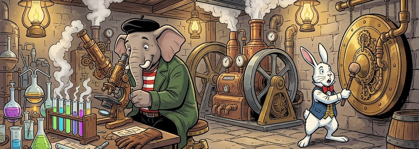
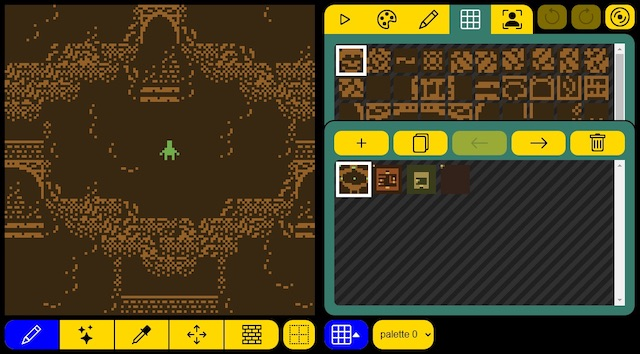

Mir ist noch eine Playlist untergekommen, die vier Programme abdeckt, die sich für die Erstellung interaktiver Geschichten und Spiele anbieten (obwohl: zu GameMaker kann ich nichts sagen, damit habe ich noch nie etwas angestellt). Sie sind Teil der Vorlesung »Introduction to Video Game Design«, die im Herbst 2025 am *[Borough of Manhattan Community College](https://en.wikipedia.org/wiki/Borough_of_Manhattan_Community_College)* gehalten wurde.

<iframe class="if16_9" src="https://www.youtube.com/embed/AQaCBtC9DOw?si=51_BsjPEsrcs2idP" title="YouTube video player" frameborder="0" allow="accelerometer; autoplay; clipboard-write; encrypted-media; gyroscope; picture-in-picture; web-share" referrerpolicy="strict-origin-when-cross-origin" allowfullscreen></iframe>

Die [Playlist besteht aus 27 Videos](https://www.youtube.com/playlist?list=PLSqAxglrKGAyvFeU0EwcUMBE8wBMeAIKE), die wie folgt aufgeteilt sind:

- Das erste Video ist eine kurze Einführung in OpenLab, die Arbeitsumgebung der Studentinnen und Studenten.
- Die Videos 2 bis 5 der Serie behandeln [Twine](http://cognitiones.kantel-chaos-team.de/multimedia/spieleprogrammierung/twine2.html) (Open Source).
- Die Videos 6 bis 11 führen in [Bitsy](http://cognitiones.kantel-chaos-team.de/multimedia/spieleprogrammierung/bitsy.html) (Open Source) ein, der minimalistischen Engine, die so etwas wie meine heimliche Liebe ist (denn in der Beschränkung liegt die Kraft).
- Die Videos 12 bis 18 behandeln [GameMaker](https://de.wikipedia.org/wiki/Game_Maker) (kommerziell), eine Engine mit einer bewegten Geschichte, die aber dennoch gerade im Indie-Bereich recht beliebt ist.
- Und die letzten Videos (12 - 27) behandeln [Godot](https://de.wikipedia.org/wiki/Game_Maker) (Open Source), die Game Engine, die schon ewig auf der [Liste der Programme, mit der ich gerne einmal etwas anfangen wollte](https://kantel.github.io/#category=Godot), steht.

**War sonst noch was?** Ach ja, weil dieser Beitrag Bitsy behandelt und der [letzte Beitrag](https://kantel.github.io/posts/2026032501_ink_und_inky/) über [Ink](http://cognitiones.kantel-chaos-team.de/multimedia/spieleprogrammierung/inkle.html) war: Es gibt da auch noch [Binski](https://smwhr.github.io/binksi/), ein Superset von [Bipsi](https://kool.tools/bipsi/) (das wiederum eine Art Bitsy-Klon ist, der eine Palette von sieben Farben je Raum ermöglicht). Binksi will Bitsy/Bipsi mit Ink zusammenbringen. Damit sollen die narrativen Möglichkeiten der (vor allen Dingen graphisch) minimalistischen Engines Bitsy/Bipsi erweitert werden.

Binski klingt -- vor allem mit diesem [Binski Visual Novel Template](https://princessinternetcafe.itch.io/tiny-binksi-visual-novel-template) -- so interessant, daß es schon zweimal auf [diesen Seiten](https://kantel.github.io/posts/2023102201_binski/) [Erwähnung](https://kantel.github.io/posts/2024091201_godot_und_inky/) fand (auch im Zusammenhang mir Godot). Es gibt also auch für mich noch viel zu entdecken im Universum der interaktiven Geschichten und Spiele. *Still digging!*

---

**Bild**: *[Steampunk Laboratorium](https://www.flickr.com/photos/schockwellenreiter/55168360381/)*, generiert mit [OpenArt.ai](https://openart.ai/home). Prompt: »*@Qumbo sits in a steampunk-style laboratory in front of a large microscope. Next to him on the lab table are test tubes in racks filled with neon-colored, steaming liquids. @Rudi Rabbit stands to the side, striking a giant gong hanging on the wall with a mallet. In the background, strange, large machines belch out clouds of steam. The scene is illuminated by antique gas lanterns hanging from the ceiling. Colored Franco-Belgian comic style. No textboxes, no speech-bubbles.*« Modell: Nano&nbsp;Banana&nbsp;2.