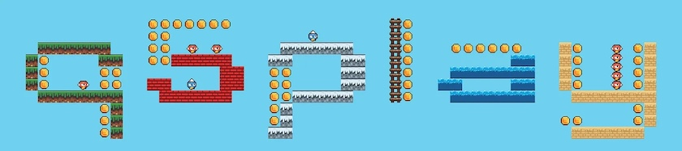
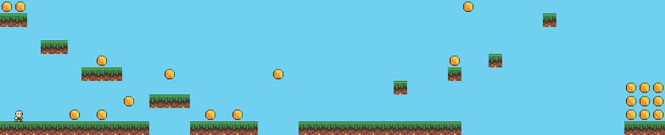

Das [Warten hat ein Ende](https://kantel.github.io/posts/2026030501_warten_auf_q5play/): Denn nach fünfzehn Monaten Entwicklungszeit ist die Version 4.0 von [Q5.play](https://q5play.org/home/), der auf [Q5.js](https://q5js.org/home/), der »rasend schnellen Alternative« zu [P5.js](http://cognitiones.kantel-chaos-team.de/programmierung/creativecoding/processing/p5js.html), aufsetzenden JavaScript-Spieleengine, [endlich freigegeben](https://q5js.substack.com/p/q5play-v40-released) worden.

Die wichtigsten Neuerungen hat *Quinton Ashley*, der Entwickler von Q5.js und Q5.play in seinem Artikel »[Was ist neu in Q5.play?](https://q5js.substack.com/p/whats-new-in-q5play)« sowie im [Q5.play-Wiki](https://github.com/q5play/q5play/wiki/What%27s-new-in-q5play%3F) veröffentlicht.

Außerdem hat er zur Feier der Veröffentlichung einen lustigen Jump'n'Run-Level aus dem Namen »q5play« programmiert, den Ihr [hier spielen](https://codevre.com/q5-sandbox?project=bTC7gjpSpkTgfyD7VRiZdh3iJFw2_20260319040650347_k7tx) oder Euch auch im Quellcode anschauen könnt.

Eine einfachere und leichter zu spielende Demo hat *Quinton Ashley* ebenfalls erstellt und [hier veröffentlicht](https://codevre.com/q5-editor?project=bTC7gjpSpkTgfyD7VRiZdh3iJFw2_20260321164542571_sqfa). Sie besteht gerade einmal aus 64 Zeilen Code.

Auch wenn das alles auf den ersten Blick einen überzeugenden Eindruck macht, bin ich mir noch nicht sicher, ob Q5.play Teil meines Werkzeugkastens werden wird. Denn erstens habe ich mit P5.js noch lange nicht abgeschlossen, und zum zweiten ist der wichtigere Grund, daß Q5.play wie auch Q5.js zwar kostenlos zu nutzen sind, aber keine [wirklich freie Software](https://github.com/q5play/q5play/blob/main/LICENSE.md) zu sein scheinen (das kann aber auch ein Mißverständnis sein, das auf meinen bescheidenen Englischkenntnissen beruht). Ich werde mich bemühen, hier mehr herauszubekommen. *Still digging!*

---

**Bild**: *[Qumbo und Rudi Rabbit auf dem Montmartre](https://www.flickr.com/photos/schockwellenreiter/55130579320/)*, generiert mit [OpenArt.ai](https://openart.ai/home). Prompt: »*@Qumbo stands at an easel on a busy street corner in Paris-Montmartre, painting. In one hand he holds a brush, in the other a colorful palette. Beside him stands @Rudi Rabbit, impatiently pointing at his watch. In the background, a large poster proclaims in bold, colorful letters, “Q5.play is coming soon.” Passersby hurry past, oblivious to their presence. The street is bustling with buses and cars. It is late afternoon, and the spring sun illuminates the scene. Colored Franco-Belgian comic style. No textboxes, no speech-bubbles.*« Modell: Nano Banana 2