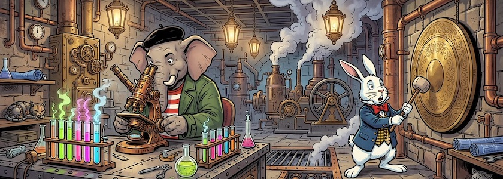

Knapp eine Woche, nachdem ich die Playlist der Vorlesung »Introduction to Video Game Design« [vorgestellt hatte](https://kantel.github.io/posts/2026032502_narrative_game_lab/), die im Herbst 2025 am *[Borough of Manhattan Community College](https://en.wikipedia.org/wiki/Borough_of_Manhattan_Community_College)* gehalten wurde, kam mir heute eine Aktualisierung unter:

<iframe class="if16_9" src="https://www.youtube.com/embed/8uFSmuOYagg?si=Fis87oOcupmqrcPc" title="YouTube video player" frameborder="0" allow="accelerometer; autoplay; clipboard-write; encrypted-media; gyroscope; picture-in-picture; web-share" referrerpolicy="strict-origin-when-cross-origin" allowfullscreen></iframe>

*Robert Owens* hielt die Vorlesung unter [dem gleichen Titel im Frühjahr 2026](https://www.youtube.com/playlist?list=PLSqAxglrKGAxrXsmdby1EQmntoJnPggJI) noch einmal, jedoch mit einigen Änderungen. Die beiden Open-Source-Engines [Twine](http://cognitiones.kantel-chaos-team.de/multimedia/spieleprogrammierung/twine2.html) und [Bitsy](http://cognitiones.kantel-chaos-team.de/multimedia/spieleprogrammierung/bitsy.html) sind geblieben, doch statt des proprietären [GameMaker](https://de.wikipedia.org/wiki/Game_Maker) fand das ebenfalls freie (MIT-Lizenz) [microStudio](http://cognitiones.kantel-chaos-team.de/multimedia/spieleprogrammierung/microstudio.html), das je abenfalls auf [diesen Seiten schon ausführlich behandelt](https://kantel.github.io/index.html#category=microStudio) wurde, Aufnahme in den Vorlesungskanon.

Diese aktualisierte Auswahl an (freien Game) Engines gefällt mir sehr, ich würde allerdings noch die kleine (Python 3-) Retrogame-Engine oder Fantasy-Konsole [Pyxel](http://cognitiones.kantel-chaos-team.de/multimedia/spieleprogrammierung/pyxel.html) in diesen Kanon mit aufnehmen.

Die Playlist besteht aktuell aus 25 Video-Tutorials (letzte Aktualisierung gestern) und falls es keine großen Änderungen mehr gibt, ist [Godot](https://de.wikipedia.org/wiki/Game_Maker) für diese Vorlesung ebenfalls gestrichen.

<iframe class="if16_9" src="https://www.youtube.com/embed/VnkQM9aG6dU?si=601oo6xYHt2e_xcl" title="YouTube video player" frameborder="0" allow="accelerometer; autoplay; clipboard-write; encrypted-media; gyroscope; picture-in-picture; web-share" referrerpolicy="strict-origin-when-cross-origin" allowfullscreen></iframe>

Diese freie Engine wird dafür in seiner [Vorlesung MMP 271 – Spring 2026](https://www.youtube.com/playlist?list=PLSqAxglrKGAxeQTolEDXqasiRY4ZhzqxN) (ebenfalls aktuell 25 Videos, letzte Aktualisierung vor einer Woche) erwähnt, die sich mit dem Design von 3D-Spielen befasst. Neben Godot wird auch die Erstellung von 3D-Assets mit dem ebenfalls freien 3D-Programm [Blender](http://cognitiones.kantel-chaos-team.de/multimedia/computergraphik/3d/blender.html) behandelt, mit dem ich ja seit Jahren schon etwas anstellen wollte, was aber immer hinten herungergefallen war. 

<iframe class="if16_9" src="https://www.youtube.com/embed/wY3Nu-xqSnY?si=HSisOkblXkueD9hY" title="YouTube video player" frameborder="0" allow="accelerometer; autoplay; clipboard-write; encrypted-media; gyroscope; picture-in-picture; web-share" referrerpolicy="strict-origin-when-cross-origin" allowfullscreen></iframe>

Etwas älter -- aus dem Frühjahr letzten Jahres -- ist die [Vorlesung MMP 210](https://www.youtube.com/playlist?list=PLSqAxglrKGAynzv67doNGkaF_Tn31KPur) (25 Videos), die die Spieleprogrammierung mit [P5.js](http://cognitiones.kantel-chaos-team.de/programmierung/creativecoding/processing/p5js.html) behandelt. Diese *Creative Coding Engine* sollte in diesem Zusammenhang unbedingt ebenfalls Erwähnung finden. Daher habe ich auch diese Playlist mit aufgenommen.

<iframe class="if16_9" src="https://www.youtube.com/embed/d0GgzjCFWq0?si=jXV7tSDXuU57ayrz" title="YouTube video player" frameborder="0" allow="accelerometer; autoplay; clipboard-write; encrypted-media; gyroscope; picture-in-picture; web-share" referrerpolicy="strict-origin-when-cross-origin" allowfullscreen></iframe>

**War sonst noch was?** Ach ja, vor etwa zwei Wochen erwähnte ich auf diesen Seiten, daß [P5.js&nbsp;2.1 und 2.2 freigegeben](https://kantel.github.io/posts/2026031601_p5js_21_und_22/) wurden, die auf den [Meilenstein-Release von p5.js 2.0 im letzten Jahr](https://kantel.github.io/posts/2025050602_p5js_2_0/) aufbauten. Zu P5.js&nbsp;2.x hat nun *Daniel Shiffman* ein neues Video herausgegeben: »[What the font?!?!](https://www.youtube.com/watch?v=d0GgzjCFWq0&t=61s)« In diesem Video zeigt er, wie man mit variablen Schriftarten arbeitet, Text mit `textModel()` in 3D-Modelle umwandelt, Konturen mit `textContours()` extrahiert und den Detailgrad der Typographie mit `sampleFactor` und `simplifyThreshold` steuert.

Wirklich neu in P5.js 2.x ist aber die Art, wie man Daten lädt. Daher möchte ich noch einmal an *Daniel Shiffmans* Tutorial »[How to Load Data with p5.js (2.0)](https://www.youtube.com/watch?v=25omXt_OjD4)« erinnern. Und wer einen kompletten Überblick vermisst, für den ist »[What's new in p5.js 2!](https://www.youtube.com/watch?v=0Ad5Frf8NBM)« genau das richtige Video.

---

**Bild**: *[Steampunk Laboratorium](https://www.flickr.com/photos/schockwellenreiter/55167457257/)*, generiert mit [OpenArt.ai](https://openart.ai/home). Prompt: »*@Qumbo sits in a steampunk-style laboratory in front of a large microscope. Next to him on the lab table are test tubes in racks filled with neon-colored, steaming liquids. @Rudi Rabbit stands to the side, striking a giant gong hanging on the wall with a mallet. In the background, strange, large machines belch out clouds of steam. The scene is illuminated by antique gas lanterns hanging from the ceiling. Colored Franco-Belgian comic style. No textboxes, no speech-bubbles.*« Modell: Nano Banana 2