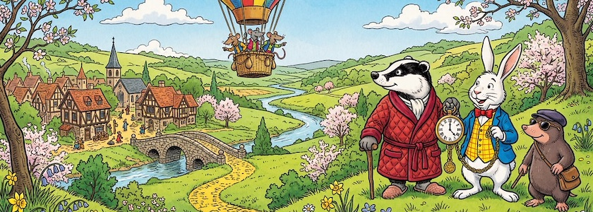

Auch wenn meine Figuren bei dem strahlenden Sonnenschein viel lieber einen Frühlingsausflug unternehmen, ist es Zeit für die Zahlen, die hochtrabend manches Mal auch *Mediadaten* genannt werden: Im März&nbsp;2026 hatte der *Schockwellenreiter* laut seinem nicht immer zuverlässigen, aber dafür (hoffentlich!) DSGVO-konformen ~~Geißenpeter~~ [Neugiertool](https://www.goatcounter.com/) exakt **9.691&nbsp;Seitenaufrufe**. Auch wenn die Exaktheit dieser Ziffer eine Genauigkeit der Zahl nur vortäuscht, ist dies wieder ein hervorragendes Ergebnis. Und so freue ich mich über jede Besucherin und jeden Besucher und bedanke mich bei allen meinen Leserinnen und Lesern.

😎 &nbsp; *Bleibt mir gewogen!*

Auch die *Top Five* des Vormonats sind wieder sehr interessant, auch wenn die ersten beiden Plätze keine Überraschung bergen:

1. Denn an der Spitze steht immer noch unangefochten der über zwei Jahre alte und daher schon etwas überholte Klassiker »[Bildgeneratoren und Künstliche Intelligenz – ohne Zensoren](https://kantel.github.io/posts/2024011002_ki_ohne_zensor/)« vom 10.&nbsp;Januar&nbsp;2024.
2. An zweiter Stelle folgt -- nicht mehr so weit abgeschlagen -- der auch schon etwas ältere Beitrag »[All about Anytype – meine neue, digitale Rumpelkammer?](https://kantel.github.io/posts/2024081201_anytype/)« vom 13. August 2024. Wie schon im Februar dieses Jahres hat dieser Artikel auch im März noch einmal massiv an Beliebtheit zugelegt.
3. Dann folgen meine Versuche mit einem (nackten) konsitenten Charakter: »[Not Save For Work: Konsistente Charaktere in OpenArt.ai (ohne Zensur)](https://kantel.github.io/posts/2026030301_not_save_for_work/)« vom 3.&nbsp;März dieses Jahres. Nacktheit zieht halt immer. Daher hat dieser Beitrag vielleicht das Zeug für einen neuen Klassiker und kann die überholte Nummer&nbsp;1 irgendwann einmal ablösen.
4. Für mich überraschend landete der Blogpost »[Die Hölle friert zu: Nele Hirsch empfiehlt Publii](https://kantel.github.io/posts/2026030402_publii/)« vom 4.&nbsp;März ebenfalls unter die *Top Five*. Manchmal setzt sich auch Qualität durch.
5. *Last but not least* landete meine satirische »[Reichspressekonferenz mit Monogatari](https://kantel.github.io/posts/2026031201_reichspressekonferenz/)« vom 12.&nbsp;März dieses Jahres auf Platz fünf.

Ich bin mit diesen Zahlen mehr als zufrieden und hoffe, daß ich bei Euch da draußen auch im April und ohne Aprilscherze (versprochen!) punkten kann. *Still digging!*

---

**Bild**: *[Frühlingsausflug](https://www.flickr.com/photos/schockwellenreiter/55182019180/)*, generiert mit [Scenario](http://cognitiones.kantel-chaos-team.de/technikgeschichte/rechnerundnetze/scenario.html). Prompt: »*A badger in a red dressing gown, a white rabbit in a yellow checkered vest, a blue jacket and a red bow tie and carrying a giant pocket watch with a chain, and a mole wearing sunglasses stand on a hill, gazing down into a green valley dotted with vintage buildings and a small town. A path paved with yellow stones winds through the valley. A narrow river winds through the valley; the path crosses it at a stone arched bridge outside the town. A colorful tethered balloon floats in the sky, carrying a wickerwork gondola manned by rats in colorful vests. It's spring. Colored Franco-Belgian comic style. No speech bubbles, no textboxes.*« Modell: Nano Banana 2