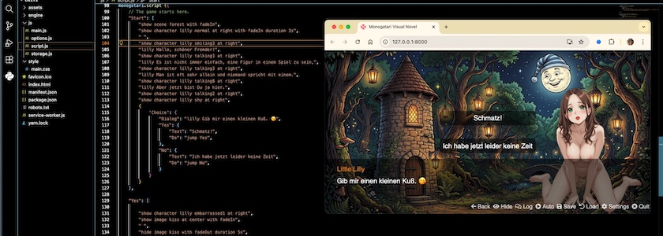

Da der momentane Schwerpunkt in diesem ~~Blog~~ Kritzelheft ja die Erstellung interaktiver Geschichten und Spiele ist, habe ich [meine Experimente](https://kantel.github.io/posts/2026031701_making_of_reichspressekonferenz/) mit [Monogatari](https://monogatari.io/) fortgesetzt, der gar nicht mal so kleinen, freien (MIT-Lizenz) Engine für *Visual Novels* und Artverwandtes, die laut Eigenwerbung für das moderne Web entwickelt wurde, um die Erstellung und Verbreitung interaktiver Geschichten, die prakatisch überall spielbar sind, einfacher zu machen. Im Gegensatz zu meinem ersten, naiven Versuch »[Reichspressekonferenz](https://kantel.github.io/posts/2026031201_reichspressekonferenz/)«, der ja eher eine animierte Karikatur denn eine interaktive Geschichte war, habe ich dieses Mal auch eine »Choice« eingebaut, die die Geschichte zu zwei verschiedenen Enden führt.

Dafür habe ich mein [Ren'Py](http://cognitiones.kantel-chaos-team.de/multimedia/spieleprogrammierung/renpy.html)-Experiment mit der kleinen Waldnymphe Lilly, das ich [vor zwei Jahren verbrochen](https://kantel.github.io/posts/2024022501_little_lilly/) und auch auf [Itch.io hochgeladen](https://kantel.itch.io/little-lilly) hatte, wieder hervorgekramt und mit den hier mit OpenArt [generierten Bildchen](https://kantel.github.io/posts/2026030301_not_save_for_work/) ein wenig aufgepeppt:

<iframe src="lilly2/index.html" width="840" height="360"></iframe>

Bei der Erstellung der Geschichte bin ich wieder genau so vorgegangen, wie bei der »Reichspressekonferenz«. Zuerst habe ich in der Datei `script.js` mit ihren vielen leeren Default-Belegungen Monogatari mit den Assets bekannt gemacht:

~~~javascript
// Define the images used in the game.
monogatari.assets ('images', {
	"kiss": "kiss.png",
});

// Define the backgrounds for each scene.
monogatari.assets ('scenes', {
	"forest": "forest1.jpg",
});

// Define the Characters
monogatari.characters ({
	"lilly": {
		name: "Little Lilly",
		color: "#f57e07",
		sprites: {
			normal: "lilly_neutral.png",
			smiling3: "lilly_smiling03.png",
			talking1: "lilly_talking01.png",
			talking2: "lilly_talking02.png",
			talking3: "lilly_talking03.png",
			talking8: "lilly_talking08.png",
			embarrassed1: "lilly_embarrassed01.png",
			cries1: "lilly_cries01.png",
			angry1: "lilly_angry01.png",
			angry4: "lilly_angry04.png",
			happy4: "lilly_happy04.png",
			shy: "lilly_shy02.png",
		}
	}
});
~~~

Dabei ist darauf zu achten, daß die Assets in den korrekten Verzeichnissen untergebracht sind, das Bild `kiss.png` liegt im Verzeichnis `assets/images/`, das Hintergrundbild `forest1.jpg`, das ich mit [Scenario generiert](https://www.flickr.com/photos/schockwellenreiter/55155749237/) habe, in dem Verzeichnis `assets/scenes` und die Bilder von Lilly liegen in dem Verzeichnis `assets/characters`. Aber das ist in der JSON-Datei ja auch angegeben, wo Monogatari die Assets erwartet.

Der Abschnitt `monogatari.script`, der das eigentliche Spiel enthält, wurde um die Labels `"Yes"` und `"No"` erweitert, die als Sprungziele aus der `Choice` dienen und zu den beiden unterschiedlichen Enden des kleinen Experiments führen:

~~~javascript
monogatari.script ({
	// The game starts here.
	"Start": [
		"show scene forest with fadeIn",
		"show character lilly normal at right with fadeIn duration 3s",
		" ",
		"show character lilly smiling3 at right",
		"lilly Hallo, schöner Fremder!",
		"show character lilly talking1 at right",
		"lilly Es ist nicht immer einfach, eine Figur in einem Spiel zu sein,",
		"show character lilly talking3 at right",
		"lilly Man ist oft sehr allein und niemand spricht mit einem.",
		"show character lilly talking8 at right",
		"lilly Aber jetzt bist Du ja hier.",
		"show character lilly talking2 at right",
		"show character lilly shy at right",
		{
			"Choice": {
				"Dialog": "lilly Gib mir einen kleinen Kuß. 😘",
				"Yes": {
					"Text": "Schmatz!",
					"Do": "jump Yes",
				},
				"No": {
					"Text": "Ich habe jetzt leider keine Zeit",
					"Do": "jump No",
				}
			}
		}
	],

	"Yes": [
	
		"show character lilly embarrassed1 at right",
		"show image kiss at center with fadeIn",
		" ",
		"hide image kiss with fadeOut duration 5s",
		" ",
		"lilly Oooh!",
		"show character lilly happy4 at right",
		"lilly Das ist der Beginn einer wunderbaren Freundschaft.",
		"hide character lilly with fadeOut duration 2s",
		" ",
		"Fortsetzung folgt (vielleicht).",
    	],

	"No": [
		"show character lilly cries1 at right",
		"lilly Ich sagte es doch, niemand liebt eine Spielefigur",
		"show character lilly angry1 at right",
		"lilly Du bist auch nicht besser als die anderen Kerle!",
		"show character lilly angry4 at right",
		"lilly Scher Dich zum Teufel!",
		"hide character lilly with fadeOut duration 2s",
		" ",
		"Ein böses Ende hat keine Fortsetzung.",
    ]
});
~~~

In der Datei `option.js` habe ich in `monogatari.settings({})` mit

~~~javascript
// Turn main menu on/off; Default: true *
    'ShowMainScreen': false,
~~~

wieder den Startscreen ausgeschaltet, da ich ihn für dieses kleine Spielchen immer noch als *Overkill* betrachte.

Und in der Datei `main.css` habe ich auch dieses Mal mit

~~~css
/* Text Box styling */
[data-component="text-box"] {
    padding-top: 0.5em;
    padding-left: 1em;
    padding-right: 1em;
    padding-bottom: 0.5em;
}
~~~

den Rändern der Textbox etwas mehr Luft verschafft.

Im Vergleich zu der Ren'Py-Version kann ich sagen, daß Monogatari tatsächlich etwas schneller lädt, aber ob die neuen, Bilder von Lilly gegenüber den mit [Scenario](http://cognitiones.kantel-chaos-team.de/technikgeschichte/rechnerundnetze/scenario.html) generierten Bildern der Ren'Py-Version wirklich ein Fortschritt in Bezug auf die Charakterkonsistenz sind, glaube ich nicht. Echte Charakterkonsistenz scheint momentan tatsächlich nur mit Scenarios [Methode via Referenzbildern](https://kantel.github.io/posts/2026022701_charakterkonsitenz/) oder mit [Chracter&nbsp;2.0](https://openart.ai/characters), der [neuen Wunderwaffe](https://kantel.github.io/posts/2026012701_jo_hippo_character_2_0/) von [OpenArt](https://openart.ai/home), möglich. Aber beide zensieren ganz gewaltig, so daß mit ihnen eine nackte Waldnymphe jenseits des Möglichen liegt. Das kann man jedoch nicht Monogatari anlasten. Die Engine macht in meinen bisherigen Versuchen einen guten Eindruck. Schauen wir mal, was weitere Experimente, die sicher folgen werden, noch bringen. *Still digging!*