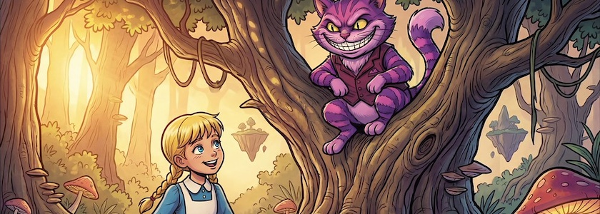
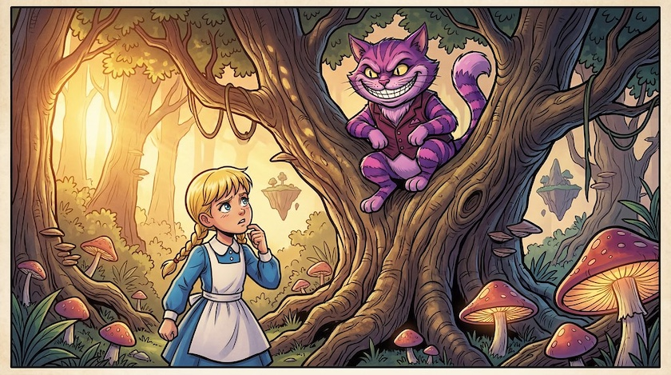
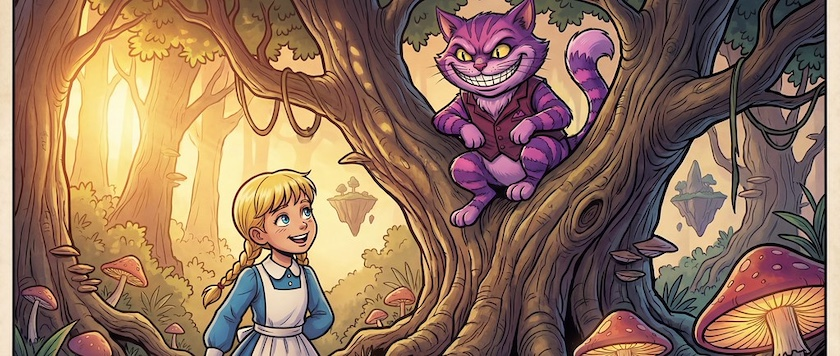

Als ich kürzlich mit [einer der gekünstelten Intelligenzias meines Vertrauens](https://openart.ai/home) eine Reihe von Bildern für das Projekt meiner [Reise zurück ins Wunderland](https://kantel.github.io/posts/2026011502_renpy_8_5_2_twine_2_11_1/) generierte, schaute auf vielen der erzeugten Bilder die kleine Alice für meinen Geschmack zu ernst. Das lag wohl in der Hauptsache daran, daß sie auch in dem [nach dieser Methode](https://kantel.github.io/posts/2026012701_jo_hippo_character_2_0/) erzeugten [Referenzbild](https://www.flickr.com/photos/schockwellenreiter/55081935623/) nicht gerade fröhlich in die Weltgeschichte schaute.

Mein erster Ansatz, dieses zu korrigieren, war der klassische: Ich ließ von OpenArt mit dem gleichen Prompt

>The @Grinsekatze sits in the fork of a large tree, grinning broadly at a confused looking @Alice , who is standing at the base of the trunk. It is late afternoon, and the sunlight shines golden from the left through the foliage of the Enchanted Forest in the background. Close Up. Colored Franco-Belgian comic style. No speech-bubbles, no textboxes, no headlines.

einfach eine weitere Reihe von Bildern erzeugen, bis eines erschien, auf dem Alice lächelte und das meinen Ansprüchen genügte. Ich iterierte also. Das war ein zeitraubendes und teures Vorgehen und auch sonst unbefriedigend, weil das obige Bild mit der skeptischen Alice mir eigentlich gefiel -- nur lächeln sollte sie.

Auf die eigentlich naheliegende Lösung kam ich aber erst durch die Lektüre des Artikels »[How I cut my AI image revision time by 80% using Nano Banana&nbsp;2](https://medium.com/@timothyfajardo/how-i-cut-my-ai-image-revision-time-by-80-using-nano-banana-2-6a30705a98f6)« von *Tim Fajardo*. Denn Nano Banana&nbsp;2 besitzt ein *semantisches Verständnis von Bearbeitungen*. Statt in einem Bildbearbeitungsprogramm (egal ob mit oder ohne KI, ich habe sie sowieso nie beherrscht) mit manuellen Masken oder Bereichsauswahl, beschreibt man die gewünschten Änderungen einfach in Sprache. Das Modell ermittelt dann, welche Elemente geändert werden müssen, während der Rest erhalten bleibt. Es vergleicht die Eingabe nicht mit einem neuen Bild, sondern liest die Anweisung, identifiziert das betroffene Element, führt die Änderung durch und schützt alles andere. Also habe ich das obige Bild mit der skeptisch in die Welt schauenden Alice als Referenzbild (@image1) genommen und darauf folgenden Prompt losgelassen (zur Sicherheit habe ich die Referenz zu @Alice auch noch einmal mitgegeben):

>Let @Alice smile. Keep everything else in @image1 exactly the same – composition, lighting, background, and character details.

Und schon beim ersten Versuch lächelte (oder besser: lachte) Alice, während alles andere exakt gleich blieb (die unterschiedlichen Bildausschnitte sind der Tatsache geschuldet, daß ich dem neuen Bild versehentlich das Seitenverhältnis $21:9$ zugewiesen hatte, während das Originalbild mit der skeptisch schauenden Alice ein Seitenverhältnis von $16:9$ aufwies).

Das öffnet natürlich viele, neue Möglichkeiten gerade im Bereich interaktiver Geschichten und Spiele. Man könnte zum Beispiel Charaktere -- auch in unterschiedlichen Posen -- umpositionieren, während der Hintergrund gleichbleibt. Oder einen häufig auftretenden, eigentlich harmlosen Fehler beheben: Manches Mal »vergisst« auch Nano Banana&nbsp;2 zum Beispiel ein Einstecktuch in der Brusttasche der Figur, das im Referenzbild aber vorhanden war. All dies sollte sich mit einfachen Prompts korrigieren lassen.

Ich fange für meine [Ausflüge ins Wunderland](https://kantel.github.io/posts/2026022602_wunderland_2/) mit [Twine](http://cognitiones.kantel-chaos-team.de/multimedia/spieleprogrammierung/twine2.html) und [Chapbook](https://klembot.github.io/chapbook/guide/) schon wieder an zu träumen. *Still digging!*

