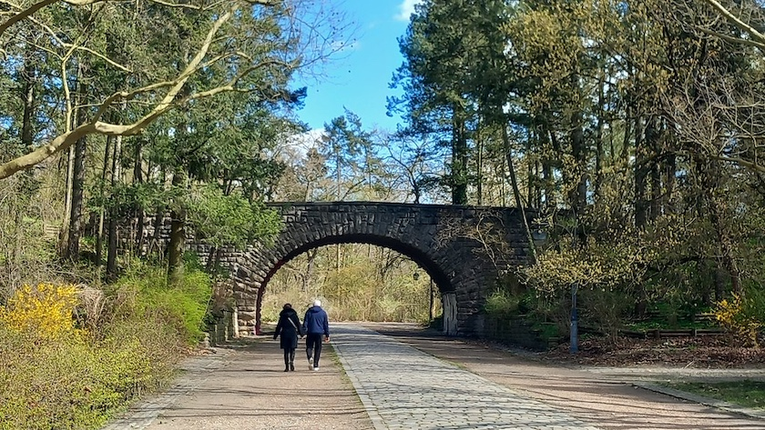
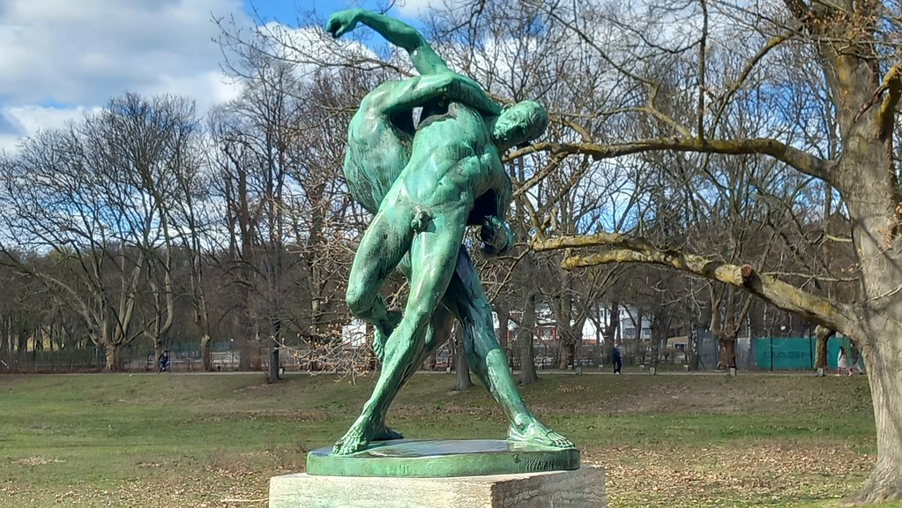
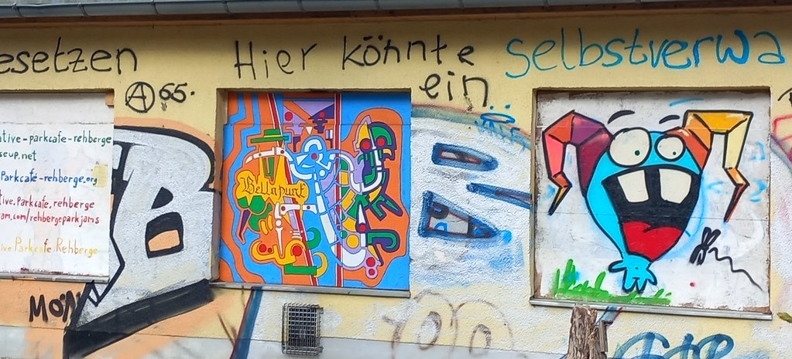
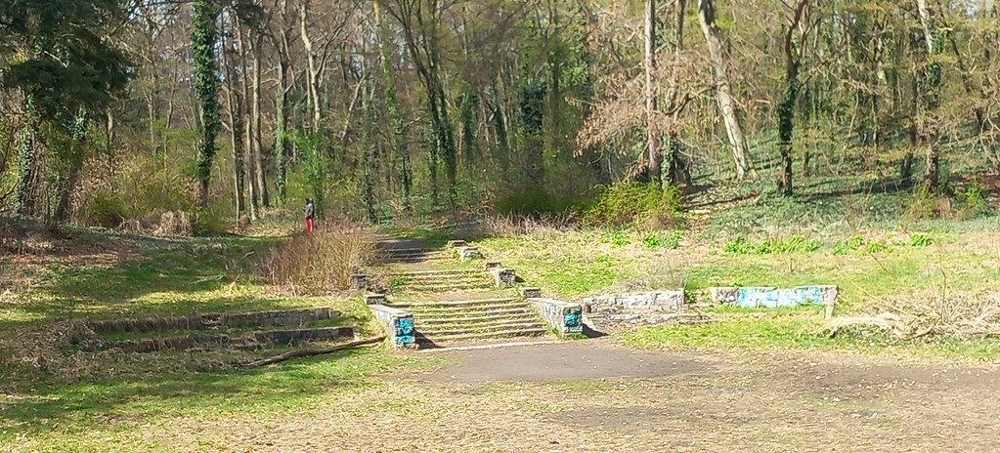
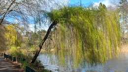
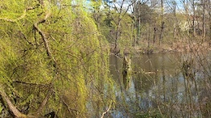
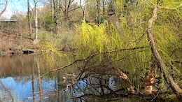

Am Ostermontag hatten die liebste aller Freundinnen und ich das zwar kühle, aber angenehm sonnige Wetter für einen Spaziergang durch den Weddinger Volkspark Rehberge genutzt. Der Park entstand in einer eiszeitlichen Landschaft aus Flugsanddünen und einer eiszeitlichen Rinne, dem Langen Fenn. Schon im 19.&nbsp;Jahrhundert nutzte die Berliner Verwaltung das Gelände zur Arbeitsbeschaffung und ließ die in den Rehbergen vorkommenden Sümpfe durch vormalige Arbeitslose trockenlegen. Diese sogenannten [Rehberger](https://de.wikipedia.org/wiki/Rehberger_(Berlin)) kamen dann im Zuge der Märzrevolution von 1848 zu einem kurzen Ruhm.

Jedoch erst ab 1926 wurde aus der Sandwüste der Rehberge mit Hilfe eines unter dem Druck der großen Arbeitslosigkeit beschlossenen Notstandsprogramms der heutige Volkspark Rehberge. Die Planung lag in den Händen der Gartenbaudirektoren *Rudolf Germer* (1884-1938) und *Erwin Barth* (1880-1933). 1.200&nbsp;Erwerbslose fanden hier für mehrere Jahre Arbeit. Der Park sollte die bereits vorhandene Landschaft aufgreifen und für Menschen besser nutzbar machen. Dazu gehörte auch die Einrichtung zahlreicher Sport- und Spielanlagen. Der Park sollte insbesondere für die Arbeiterschaft da sein, die nach Aussagen der Planer viel zu selten öffentliche Parks und Plätze aufsuchte. Es entstand ein Park, der die vorhandenen Naturräume nutzte und integrierte, statt das Gelände nach historischen Vorbildern der Gartenkunst zu gestalten. So tragen die großen Sicheldünen, die der Wind einst modellierte, zur Schönheit des Parks bei. Die hufeisenförmige Dünenkette umschließt die Sportanlagen mit dem Stadion Rehberge und der vier Hektar großen Wiese im Zentrum des Parks.

Am Rande der großen Spielwiese steht als *point de vue* die Ringerskulptur von *Wilhelm Haverkamp* aus dem Jahre 1906. Ursprünglich befand sie sich an zentraler Stelle im Schillerpark, musste dort aber 1941 einem neu errichteten Schillerdenkmal weichen. Die Skulptur aus Bronze zeigt überlebensgroß den Kampf zweier nackter Ringer. Sie ist eine Reminiszenz an das Herkuläus-Antäus-Motiv. 

Am Eingang der Großen Spielwiese stehen zwei ehemalige Umkleiden in symmetrischer Anordnung. Die nördliche der beiden wurde 1929 von *Friedrich Hellweg* im Stil der Neuen Sachlichkeit erbaut. 1950 erfolgte der Umbau zur Gaststätte, heute steht es leer. Die Initiative Parkcafé Rehberge will aus dem früheren Lokal einen selbstverwalteten Nachbarschaftsort mit solidarischem Café, Veranstaltungsraum für Kunst und Kultur und einem selbstorganisierten Jugendraum schaffen.

Der Tanzring liegt nördlich des Dünengürtels. Der 1929 angelegte Ring inmitten einer Kulisse aus Douglasien sollte ursprünglich für »gymnastische Übungen und Volkstänze« dienen. Der Ring liegt vertieft und hat eine Tribüne. Diese wurde nach dem Krieg 1951 mit 410 Sitzplätzen wieder hergestellt und 1979 vereinfacht erneuert. Heute ist die Anlage zerfallen und kaum noch zu erkennen.

&nbsp;&nbsp;

»Das lange Fenn« (von mittelniederdeutsch »*venne*« für Moor- und Sumpfland) im Osten der Rehberge wurde zu einer Kette kleiner Seen gestaltet:
Den größeren Möwensee, den kleineren Sperlingssee und den mit dem Sperlingssee verbundenen Entenpfuhl. Der 1,7 Hektar große, etwa 300 Meter lange Möwensee besitzt eine mittlere Tiefe von 1,5 Metern. Alle drei Seen werden von Umweltgutachtern als »naturnah« beschrieben. Die beiden kleineren Seen sind stark verschlammt und weisen Verlandungstendenzen auf.

### Quellen und Literatur

- Initiative Parkcafé Rehberge: *[Über uns](https://parkcafe-rehberge.org/de/about)*, aufgerufen am 7.&nbsp;April&nbsp;2026
- Gerhild H. M. Komander: *[Die Rehberge](https://www.diegeschichteberlins.de/geschichteberlins/berlin-abc/stichworteot/612-rehberge.html)*, Berlin (Verein für die Geschichte Berlins e.V.), Juli&nbsp;2003
- Wikipedia: *[Volkspark Rehberge](https://de.wikipedia.org/wiki/Volkspark_Rehberge)*, aufgerufen am 7.&nbsp;April&nbsp;2026

---

**Photos** ([cc](https://creativecommons.org/licenses/by-sa/4.0/deed.de)) 2026: *[Jörg Kantel](http://cognitiones.kantel-chaos-team.de/cv.html)*