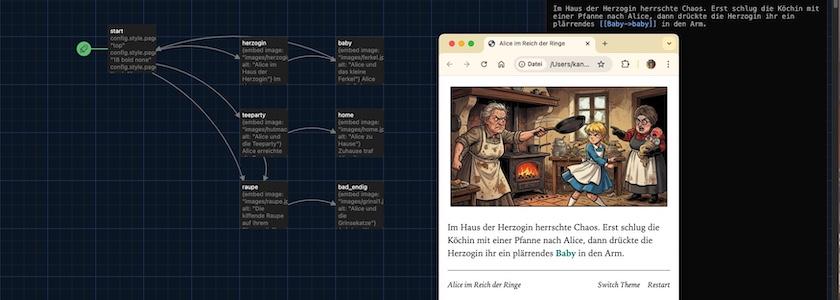
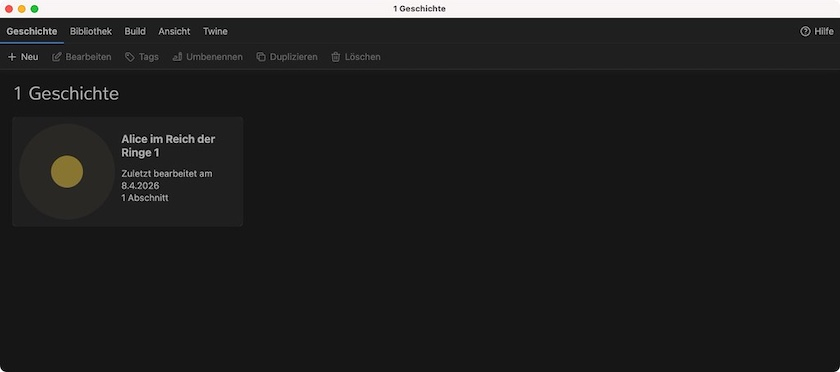
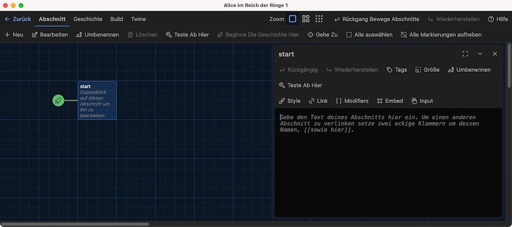
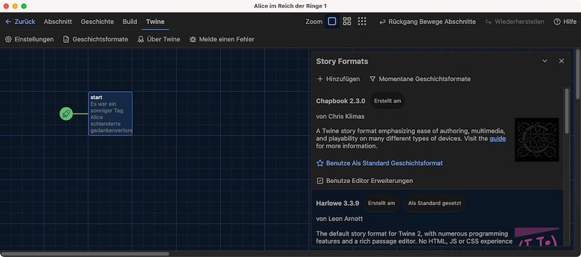
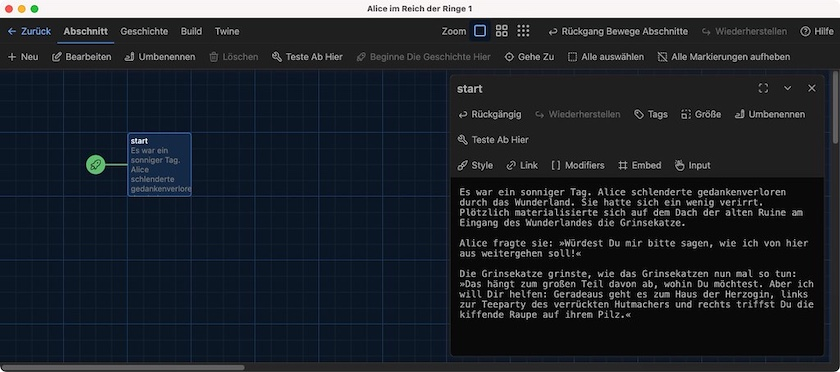
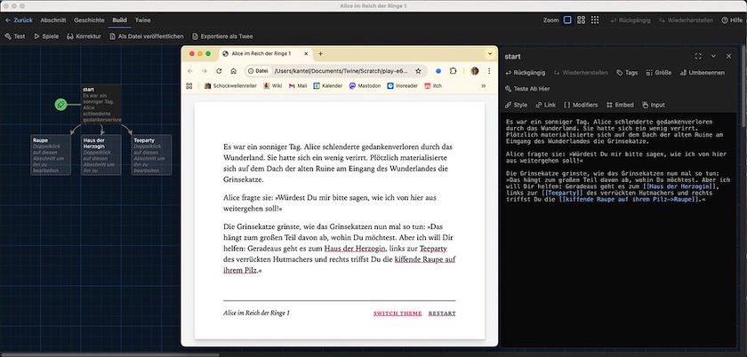
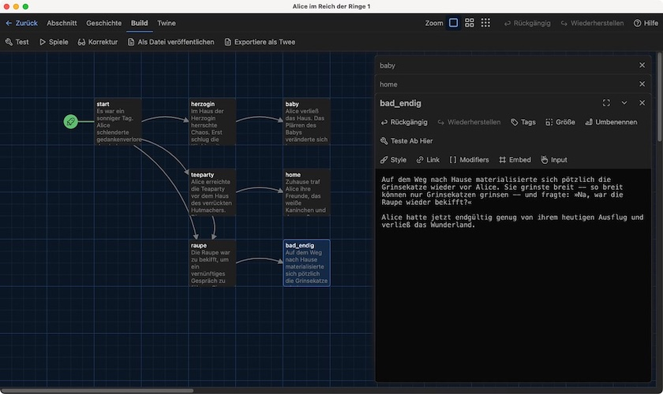
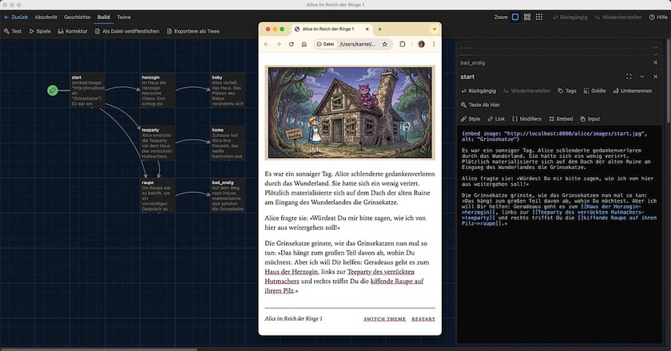

Ich möchte eine lang gehegte und lang angekündigte Idee realisieren und meine Reise ins Wunderland mit [Twine](http://cognitiones.kantel-chaos-team.de/multimedia/spieleprogrammierung/twine2.html) und dem Storyformat [Chapbook](https://klembot.github.io/chapbook/guide/), die ich im August&nbsp;2023 schon einmal ([Teil 0.0](https://kantel.github.io/posts/2023082703_chapbook_wunderland_0/), [Teil 0.1](https://kantel.github.io/posts/2023082801_chapbook_wunderland_1/), [Teil 0.2](https://kantel.github.io/posts/2023083101_chapbook_mit_stil/)) unternommen hatte, wieder aufnehmen und daraus ein Tutorial basteln. Grund für dieses Reloading ist zum einen, daß ich mittlerweile mehr über das Storyformat Chapbook gelernt habe und es in der akutellen Version auch ein paar Neuerungen gibt, aber zum anderen auch, daß ich dieses Tutorial nun mit Bildern aufpeppen kann, die von einer gekünstelten Intelligenz meines Vertrauens (in diesem Fall Nano Banana&nbsp;2) generiert wurden. Denn seit Sommer&nbsp;2023 hat die bildgenerierende Künstliche Intelligenz -- damals noch in den Kinderschuhen -- gewaltige Fortschritte erzielt.

Das Tutorial geht davon aus, daß Ihr entweder Twine auf Eurem Desktop-Rechner installiert habt oder wißt, wie die Online-Version von Twine zu bedienen ist (die Bedienung ist in beiden Fällen gleich). Da die Online-Version Eure Ergebnisse jedoch nur im Browser-Cache vorrätig hält, empfiehlt sich ein regelmäßiges Abspeichern entweder als HTML- (`Build > Als Datei veröffentlichen`) oder als Twee-Datei (`Build > Exportiere als Twee`), damit Eure Ergebnisse nicht versehentlich im Daten-Nirwana verschwinden.

Als erstes legt Ihr auf dem Startbildschirm von Twine unter `Geschichte > Neu` eine neue Geschichte an. Ich habe sie »Alice im Reich der Ringe« genannt, aber das könnt Ihr nach Belieben verändern (`Geschichte > Umbenennen`).

Mit einem Doppelklick öffnet Ihr die Geschichte und seht die erste Passage. Passagen sind die einzelnen Abschnitte Eurer Geschichte, auf die Ihr verlinken könnt und in denen Ihr Eure (nichtlineare) Geschichte erzählt. Ich habe die (bisher erste und einzige Start-) Passage »start« genannt und die kleine, grüne Rakete zeigt an, daß hier Eure Geschichte beginnt. Falls sie nicht vorhanden ist, unter `Abschnitt` auf `Beginne die Geschichte hier` klicken.

Ein Doppelklick auf die Passage öffnet ein Editorfenster, indem Ihr den Text dieser Passage eintragen oder editieren könnt. Falls Ihr das Storyformat der Geschichte noch nicht auf Chapbook umgestellt habt, sieht das Editorfenster unter Umständen noch leicht anders aus.

Die Storyformate könnt Ihr unter `Twine > Geschichtsformate` umstellen. Der Default zur Zeit ist [Harlowe 3.3.x](https://twine2.neocities.org/), für dieses Tutorial stellt aber bitte Chapbook 2.3.0 (oder größer) ein. Wenn das Storyformat einmal festgelegt ist, seid ihr für diese Geschichte daran gebunden, da die verschiendenen Storyformate bis auf wenige Befehle eine komplett unterschiedliche Syntax aufweisen. Bei einer nachträglichen Änderung des Storyformats müsst Ihr also sämtliche bisher erstellten Passagen ändern.

Jetzt könnt Ihr aber endlich mit der Geschichte beginnen. Öffnet daher mit einem Doppelklick die Startpassage und gebt folgenden Text ein:

~~~markdown
Es war ein sonniger Tag. Alice schlenderte gedankenverloren durch das Wunderland. Sie 
hatte sich ein wenig verirrt. Plötzlich materialisierte sich auf dem Dach der alten 
Ruine am Eingang des Wunderlandes die Grinsekatze.

Alice fragte sie: »Würdest Du mir bitte sagen, wie ich von hier aus weitergehen soll!«

Die Grinsekatze grinste, wie das Grinsekatzen nun mal so tun: »Das hängt zum großen Teil 
davon ab, wohin Du möchtest. Aber ich will Dir helfen: Geradeaus geht es zum Haus der 
Herzogin, links zur Teeparty des verrückten Hutmachers und rechts triffst Du die kiffende 
Raupe auf ihrem Pilz.«
~~~

Wegen der besseren Lesbarkeit habe ich den Text umgebrochen. Chapbook folgt in Formatierungsfragen im Großen und Ganzen der Markdown-Syntax, daher werden einfache Zeilenumbrüche ignoriert, während doppelte Zeilenumbrüche einen neuen Absatz erzeugen.

### Wir wollen Links

Ihr könnt die Geschichte oben natürlich endlos weiterspinnen bis hin zu einem Roman. Aber dazu benötigt ihr Twine nicht, dafür reicht eine ordinäre Schreibmaschhine. Aber wenn Ihr den letzten Absatz in der obigen Passage nehmt und ihn wie folgt abändert,

~~~markdown
Die Grinsekatze grinste, wie das Grinsekatzen nun mal so tun: »Das hängt zum großen Teil 
davon ab, wohin Du möchtest. Aber ich will Dir helfen: Geradeaus geht es zum [[Haus der 
Herzogin]], links zur [[Teeparty]] des verrückten Hutmachers und rechts triffst Du die
[[kiffende Raupe auf ihrem Pilz->Raupe]].«
~~~

und danach auch noch auf `Build > Spiele` klickt, um das Spiel in einem Browserfenster zu öffnen, dann erhaltet Ihr dieses:

Im Browserfenster erscheint eine spielbare Version von Alice mit rot unterstrichenen, klickbaren Links (die momentan aber noch auf leere Passagen verweisen) und im Twine-Fenster sind wie von Geisterhand drei neue Passagen entstanden, mit den Titeln »Haus der Herzogin«, »Teeparty« und »Raupe«.

Dieser Absatz zeigt schon die wichtigste Funktionsweise von Twine: Wie werden Links (zu anderen Passagen) erstellt? Der einfachste Weg ist, das Linkziel zwischen zwei eckigen Klammerpaaren (`[[]]`) zu schreiben, so wie in `[[Haus der Herzogin]]` oder `[[Teeparty]]`. Hier sind Linktext und Linkziel identisch, das heißt, der Link `Haus der Herzogin` führt auch zur Passage `Haus der Herzogin` und der Link `Teeparty` führt zur Passage `Teeparty`.

Doch in den meisten Fällen unterscheiden sich Linktext und Linkziel. Hierfür gibt es in Twine die Pfeilnotation: `Linktext->Linkziel`, wie zum Beispiel in `[[kiffende Raupe auf ihrem Pilz->Raupe]]`. Hier verlinkt der komplette Text `kiffende Raupe auf ihrem Pilz` auf eine Passage mit Namen `Raupe`. Dabei ist zu beachten, daß Leerzeichen zählen. Daher sollte zumindest nach der Pfeilspitze kein Leerzeichen stehen, denn Twine sucht sonst das Linkziel ` Raupe` mit vorangestelltem Leerzeichen und das bringt nicht nur Twine, sondern – wie man in vielen Online-Tutorien sehen kann – auch Euch durcheinander. Wenn Ihr aber rechts und links von den Pfeilen keine Leerzeichen zulaßt, seid Ihr immer auf der sicheren Seite.

Es gibt noch eine zweite Schreibweise mit rückwärtsgerichtetem Pfeil, die Linkkziel und Linktext umkehrt: `[[Linkziel<-Linktext]]`, also – um bei unserem Beispiel zu bleiben – `[[Raupe<-kiffende Raupe auf ihrem Pilz]]`. Mir hat sich der Sinn dieser vermutlich aus historischen Quellen gespeisten Schreibweise nie erschlossen und ich habe sie auch noch nie nutzen müssen.

Um die Verwirrung komplett zu machen, gibt es auch noch eine dritte Schreibweise mit einem vertikalen Trennstrich (`|`) in der Mitte: `[[Linktext|Linkziel]]`, also `[[kiffende Raupe auf ihrem Pilz|Raupe]]`. Hier weiß ich zumindest den Grund, die Schreibweise stammt aus Twine 1.x und ich habe sie aus reiner Gewohnheit auch lange noch verwendet. Hier gilt übrigens das gleiche wie bei den Pfeilen: Keine Leerzeichen rechts und/oder links vom vertikalen Strich. Und selbst ich als Gewohnheitstier habe mich von dieser Schreibweise verabschiedet. Wer daher neu in Twine ist, sollte keinen Grund haben, auf dieser veralteten Konvention zu beharren.

Um eine einheitliche Schreibweise zu realisieren (ich bevorzuge die mit dem rechtsgerichteten Pfeil `->`), habe ich den Text des letzten Absatzes der Start-Passage noch einmal leicht verändert:

~~~markdown
Die Grinsekatze grinste, wie das Grinsekatzen nun mal so tun: »Das hängt zum großen Teil 
davon ab, wohin Du möchtest. Aber ich will Dir helfen: Geradeaus geht es zum [[Haus der 
Herzogin->herzogin]], links zur [[Teeparty des verrückten Hutmachers->teeparty]] und 
rechts triffst Du die [[kiffende Raupe auf ihrem Pilz->raupe]].«
~~~

Wenn Ihr – nachdem Ihr die Startpassage mit dem Text gefüttert habt – auf das Twine-Fenster schaut, werdet Ihr feststellen, daß Twine die Passagen `herzogin`, `teeparty` und `raupe` für Euch schon angelegt und mit Pfeilen versehen hat. Die Pfeile zeigen von der Startpassage jeweils auf die verlinkte Passage und -- sollte es von da einen Rücklink geben -- als Doppelpfeil auch wieder zurück.

Ihr könnt die Passagen in dem Fenster beliebig mit der Maus hin- und herschieben und so ein wenig Struktur in Eure Geschichten bekommen.

Natürlich wollen auch diese Passagen mit Text gefüttert werden. Ich fange mit der `herzogin` an:

~~~markdown
Im Haus der Herzogin herrschte Chaos. Erst schlug die Köchin mit einer Pfanne nach Alice, 
dann drückte die Herzogin ihr ein plärrendes [[Baby->baby]] in den Arm.
~~~

Auch die `teeparty`

~~~markdown
Alice erreichte die Teaparty vor dem Haus des verrückten Hutmachers. Dieser deklamierte 
gerade ein langes, dafür um so langweiligeres Gedicht.

Alice hatte sehr schnell genug davon, also überlegte sie, ob sie doch die 
[[Raupe->raupe]] aufzusuchen oder gleich [[nach Hause gehen->home]] sollte.
~~~

und die `raupe` bekommen einen Text:

~~~markdown
Die Raupe war zu bekifft, um ein vernünftiges Gespräch zu führen. Sie murmelte nur 
immerzu etwas vom »Reich der Ringe« und daß Alice dieses dringend besuchen müsste. 
Sie sagte noch: »Komm morgen wieder, dann erzähle ich Dir mehr«.

Alice beschloß, daß sie für heute genug habe und [[ging nach Hause->bad_endig]].
~~~

Wenn Ihr jetzt wieder auf Euer Twine-Fenster schaut, werdet Ihr drei weitere, neue, aber noch leere Passagen finden, die Twine für Euch angelegt und mit Pfeilen versehen hat: `baby`, `home` und `bad_ending`. Ihr könnt sie zur besseren Übersicht erst einmal anordnen, wie im Screenshot oben und dann ebenfalls mit Text füllen.

Die Passage `baby`:

~~~markdown
Alice verließ das Haus. Das Plärren des Babys veränderte sich langsam zu einem Grunzen 
und Quieken. Als Alice nachsah, merkte sie, daß sie ein kleines Ferkelchen im Arm hielt.

Erschreckt setzte Alice das Ferkelchen ab. Es lief davon. Und Alice ging verwirrt 
zurück an den {restart link, label: "Start"}.
~~~

Die Passage `home`:

~~~markdown
Zuhause traf Alice ihre Freunde, das weiße Kaninchen und den großen Elephanten, 
mit mit denen sie noch gemütlich ein Kännchen Kaffee trank. So wurde es doch noch 
ein gelungengener Nachmittag.
~~~

und *last but not least* die Passage `bad_ending`:

~~~markdown
Auf dem Weg nach Hause materialisierte sich pötzlich die Grinsekatze wieder vor Alice. 
Sie grinste breit – so breit können nur Grinsekatzen grinsen – und fragte: »Na, 
war die Raupe wieder bekifft?«

Alice hatte jetzt endgültig genug von ihrem heutigen Ausflug und verließ das Wunderland.
~~~

Diese Passagen enthalten nichts Neues bis auf den `{restart link, label: "Irgendein Text"}` in der Passage `baby`. Das ist ein Chapbook-eigenes Feature, zwischen den geschweiften Klammern steht ein sogenanntes `insert`, eine Art Makro. Inserts sind ein wichtiges Sprachfeature von Chapbook, ich werde in späteren Tutorials noch ausführlich darauf zurückkommen. Für den Moment müßt Ihr nur wissen, daß dies ein Link auf die Startpassage ist (wobei `label` den Linktext bezeichnet), der das Spiel auf seine Startwerte zurücksetzt. Sollte Euere Alice im Spiel also Erfahrungspunkte gesammelt haben, werden diese wieder auf den Startwert zurückgesetzt. Da es momentan aber noch keine Variablen wie zum Beispiel Erfahrungspunkte im Spiel gibt, wird einfach nur die Liste der besuchten Passagen geleert. Daher wäre es momentan auch kein Beinbruch, zum Beispiel den `restart link` durch den einfachen Link `[[Noch einmal spielen->Start]]` zu ersetzen. Twine würde dies dann auch mit einem Pfeil von Home auf Start honorieren.

Dies ist eigentlich alles, was Ihr über Twine und Chapbook wissen müßt. Mit diesem einfachen Linkmechanismus (der übrigens in dieser Form in fast allen Storyformaten existiert) könnt Ihr Eure eigene interaktive und verzweigte Geschichte im Stil der »Choose Your Own Adventure Books« *(CYOA)* schreiben. Denn das ist der Kern von Twine, alles andere ist im Grunde genommen nur Kosmetik. Aber da Kosmetik vieles doch erst schön macht, werde ich Euch nun noch ein wenig Kosmetik zeigen.

### Wir wollen Bilder

>Alice fing an sich zu langweilen; sie saß schon lange bei ihrer Schwester am Ufer und hatte nichts zu tun. Das Buch, das ihre Schwester las, gefiel ihr nicht; denn es waren weder Bilder noch Gespräche darin. »Und was nützen Bücher,« dachte Alice, »ohne Bilder und Gespräche?«

Die Geschichte ist bisher ja recht schön erzählt, aber sie besitzt ein großes Manko: Denn was sind Geschichten ohne Bilder?

Doch das Verhältnis von Twine zu Bildern (und anderen Mulitmediadateien wie Musik, Sound oder Filmen) war von Anfang an ein schwieriges. Denn Twine war ursprünglich entworfen, um textbasierte, interaktive Abenteuer zu erzählen. Bilder waren da nicht vorgesehen. Doch das Publikum wollte -- wie Alice -- Bilder und so haben sich zwei mehr oder weniger inkompatible Lösungen gefunden:

#### Lösung 1: Bilder online einbinden

Der erste Ansatz ist, die Multimediadateien online auf einem Server abzulegen, und sie dann per HTTP(S) einzubinden. Der Vorteil dieser Lösung ist, daß die Bilder – eine Online-Anbindung vorausgesetzt – immer von Twine gefunden werden, egal ob die Twine Story **in** Twine (im Test-Modus) aufgerufen wird, oder ob sie *standalone* läuft. Jedoch hat diese Methode auch zwei gewichtige Nachteile. Der erste Nachteil: Es ist **Euer** Server, auf dem die Daten liegen, Ihr zahlt für die Bandbreite. Und zweitens: Ihr müßt zwingend online sein, auch wenn Ihr Euer Spiel entwickelt. Ein Schreiben oder Spielen am Strand ist damit in der Regel nicht möglich.

Außerdem hat sich hier noch eine böse Unsitte entwickelt, die man leider häufig auch Twine-Tutorials findet. Dort wird dann einfach mit einer Bildersuchmaschine ein passendes Bild gesucht. Ist dieses Bild gefunden, wird die URL kopiert und die Datei ohne Rücksicht auf Verluste vom **fremden** Server in die eigene Geschichte eingebunden.

Dieses *Hotlinking* genannte Verfahren ist aus mehreren Gründen eine Sünde: Erstens, wenn man sich nicht um die Bildrechte kümmert, gerät man dabei leicht in die Fallstricke einer Urheberrechtsverletzung und das kann teuer werden. Zweitens zahlt der Serverbetreiber und nicht Ihr die Kosten für den Datentransfer. Das macht ihn sicher nicht glücklich. Und drittens habt Ihr keine Kontrolle über die Daten. Auch ich habe schon einmal eines meiner (eigentlich harmlosen und unter einer freien Lizenz stehenenden) Photos einer Berliner Touristen-Attraktion gegen das Bild einer leicht bekleideten Dame ausgetauscht, nachdem ich bemerkt hatte, daß irgendein Dödel dieses Bild ungefragt per Hotlinking in seine dusselige Kommerzseite eingebunden hatte.

#### Lösung 2: Daten lokal einbinden

Die zweite Lösung ist, die Daten lokal einzubinden. Dafür legt man sich am sinnvollsten unterhalb der eigentlichen Story-Datei (Beispiel: story.html) ein Verzeichnis (oder mehrere Vereichnisse) an, die die Asset-Dateien beinhalten. Das kann dann beispielsweise so aussehen:

~~~markdown
- story.html
- images
  - image01.jpg
  - image02.jpg
- audio
  - song01.mp3
~~~

Wenn dann ein Bild in eine Twine-Story per relativer URL eingebunden ist, in Chapbook zum Beispiel mit:

~~~markdown
{embed image: 'images/image01.jpg', alt: 'Mein super-duper Bild'}
~~~

Dann findet Eure Twine-Story **nach dem Publizieren** das Bild auch, unabhängig davon, ob sie lokal oder über eine Webverbindung aufgerufen wurde.

Der Zusatz »nach dem Publizieren« weist auch gleich auf den größten Nachteil dieser Methode hin: Wird die Geschichte **innerhalb** von Twine gestartet (sei es über den Test- oder über den Play-Button), dann findet Twine Eure Assets nicht. Das liegt daran, daß Twine die Story temporär auf eine völlig obskure und nicht nachvolltiehbare URL hinausschreibt, beispielsweise auf (gekürzt)

~~~bash
file:///private/var/folders/x3/…/T/52f32371-9e39-4952-a4d8-6ee9f02e7df4.html
~~~

und wo soll das arme Twine da Eure Assets finden?

Der größte Vorteil dieser Methode ist allerdings der: Ist Eure Story mal publiziert, dann läßt sich die Datei mitsamt den Asset-Verzeichnissen entweder als `.zip`-Datei oder auch unkomprimiert auf jeden Server oder Dienst Eurer Wahl hochladen (zum Beispiel auf Itch.io) oder als Email an Eure Freunde verschicken. Und sie können sie dann auch spielen, ohne auf eine Internetverbindung angewiesen zu sein.

#### Der Kompromiß: Lokaler Webserver

Nun möchte man aber gerne auch während der Entwicklung in Twine seine Bilder sehen, und sei es nur, um das Layout kontrollieren zu können. Bei mir hat sich folgende Vorgehensweise als sinnvoll herausgestellt: Auf meinem Rechnern läuft sowieso permanent ein lokaler Webserver (zur Zeit ist es [TinyHost](https://kantel.github.io/posts/2026020502_tinyhost/), aber auch [MAMP](http://cognitiones.kantel-chaos-team.de/webworking/mamp.html) oder [XAMPP](http://cognitiones.kantel-chaos-team.de/webworking/xampp.html) wären eine Alternative). Dort lege ich für jede Twine-Story ein Verzeichnis mit den benötigten Bildern und anderen Assets an. Diese kann ich dann nach der **Lösung 1** via `localhost` so einbinden, als lägen sie auf einem externen Server. In Chapbook sieht das dann so aus:

~~~markdown
{embed image: "http://localhost:8000/alice/images/bild01.jpg", alt: "Grinsekatze"}
~~~

(Mein TinyHost lauscht auf Port `8000`, den Port müßt Ihr gegebenenfalls an Eure Umgebung anpassen.)

Ist die Entwicklung dann abgeschlossen und die Story kann publiziert werden, dann tausche ich per globales Suchen und Ersetzen alle absoluten, aber dennoch lokalen URLs `http://localhost:8000/alice/images` durch ein schlichtes `images` aus. Das obige Beispiel wird dann zu

~~~markdown
{embed image: "images/bild01.jpg", alt: "Grinsekatze"}
~~~

und damit zu einer relativen URL und zur **Lösung 2**. Ganz besonders schlaue Entwickler exportieren ihre Twine Story erst nach `Twee` bevor sie die globale Ersetzung vornehmen und schreiben die Story danach dann zum Beispiel mit [Tweego](http://cognitiones.kantel-chaos-team.de/multimedia/spieleprogrammierung/tweego.html) als HTML-Datei heraus. So bleibt die Story im Twine-Editor unverändert, sollte man doch noch einmal Änderungen vornehmen wollen oder müssen.

Die Verwendung des `alt`-Textes sollte in Chapbook (aber nicht nur dort, sondern eigentlich überall) obligatorisch sein, damit sich sehbehinderte Menschen von ihrem Screenreader die Bildbeschreibung vorlesen lassen können. Sollte das Bild rein dekorativen Zwecken dienen, zum Beispiel eine schöne Seitenumrandung, dann kann der `alt`-Text auch einfach nur aus einem leeren String bestehen:

~~~markdown
{embed image: "asterisk.png", alt: ""}
~~~

Moderne Screenreader werden dieses Bild dann freudig ignorieren.

So, und jetzt nach der langen Vorrede die neuesten Abenteuer von Alice mit Twine und Chapbook. Sie sind nahezu identisch mit der ersten Version, nur daß sie nun mit Bildern illustriert sind. Hier der Twee-Code der ersten Passage:

~~~markdown
{embed image: "http://localhost:8000/alice/images/start.jpg", alt: "Grinsekatze"}

Es war ein sonniger Tag. Alice schlenderte gedankenverloren durch das Wunderland. Sie 
hatte sich ein wenig verirrt. Plötzlich materialisierte sich auf dem Dach der alten 
Ruine am Eingang des Wunderlandes die Grinsekatze.

Alice fragte sie: »Würdest Du mir bitte sagen, wie ich von hier aus weitergehen soll!«

Die Grinsekatze grinste, wie das Grinsekatzen nun mal so tun: »Das hängt zum großen 
Teil davon ab, wohin Du möchtest. Aber ich will Dir helfen: Geradeaus geht es zum 
[[Haus der Herzogin->herzogin]], links zur [[Teeparty des verrückten Hutmachers->teeparty]] 
und rechts triffst Du die [[kiffende Raupe auf ihrem Pilz->raupe]].«
~~~

Der große Vorteil des `embed`-Inserts von Chapbook ist, daß die damit eingebundnenen Bilder responsiv sind.

Die übrigen Passagen habe ich einfach in der gleichen Art mit Bildern aufgepeppt.

### Wir wollen Stil

Zum Abschluß dieses einführenden Tutorials in Twine und Chapbook möchte ich der Geschichte noch ein wenig Stil spendieren. Denn weder die rot unterstrichenen Links noch die *small caps* im Footer der Seite entsprechen meinem ästhetischen Empfinden.

Chapbook besitzt einen von der restlichen Passage separierten Variablen-Abschnitt. Dieser steht immer als erstes zu Beginn einer Passage und wird von der restlichen Passage durch eine Zeile mit zwei Strichen (`--`) getrennt. Dieser Abschnitt kann nicht nur selbstdefinierte Variablen wie `has_key` oder `health_points` aufnehmen (dazu in späteren Tutorials mehr), sondern auch Variable, die das Layout der Geschichte beeinflussen. Diese sind in der Regel in den Objekten `config.style`, `config.header` und `config.footer` zusammengefaßt.

Wenn man also das Aussehen eines Links beeinflussen will, kann man zum Beispiel mit der Zeile

~~~markdown
config.style.page.link.font: "18 bold none"
~~~

erreichen, daß der Link mit der Fontgröße 18 in fett und ohne Unterstreichung dargestellt wird. Für die Farbe des Links sind die Zeilen

~~~markdown
config.style.page.link.color: "teal-4"
config.style.page.link.active.color: "teal-4"
~~~

zuständig, die – in diesem Fall – dafür sorgen, daß ein Link in einem leichten grün dargestellt und dieses Aussehen auch nicht verändert, wenn mit der Maus über den Link gefahren wird (`active` gleich `hover`).

Ein Wort zu den Farben: Chapbook unterstützt per Default eine freie (MIT-Lizenz) Palette, die [Reasonable Colors](https://www.reasonable.work/colors/) genannt wird (entwickelt von *Matthew Howell*). Diese besteht aus 25 benannten Farben mit je sechs Schattierungen, also zum Beispiel `teal-1` bis `teal-6`. Eine Übersicht bietet das [Chapbook-Handbuch](https://klembot.github.io/chapbook/guide/customization/fonts-and-colors.html). Wem dies nicht ausreicht, der kann natürlich auch jede andere Farbbezeichnung verwenden, die CSS versteht (von der gewohnten Hex-Notation wie zum Beispiel `#0b7285` bis hin zu sehr speziellen Notationen wie beispielsweise `hsla(0%, 65%, 48%, 0.75)`).

Nun besitzt Chapbook aber neben dem normalen hellen *(Light)* Mode (schwarze Schrift auf weißem Grund) auch noch den populären dunklen *(Dark)* Mode (weiße Schrift auf schwarzem Grund) auf dem Ihr im Footer jeder Seite umschalten könnt. Die Einstellungen dafür werden im Objekt `config.style.dark.page`, also zum Beispiel:

~~~markdown
config.style.dark.page.link.font: "18 bold none"
config.style.dark.page.link.color: "orange-3"
config.style.dark.page.link.active.color: "orange-3"
~~~

Die `config`-Objekte besitzen – wie alle Variablen in Chapbook – einen globalen Gültigkeitsbereich. Es ist daher in der Regel keine gute Idee, diese innerhalb einer Geschichte mehrmals zu definieren (man sollte dann wirklich genau wissen, was man tut).

Ich habe für mein Alice-Beispiel folgende `config`-Objekte in der Start-Passage definiert:

~~~markdown
config.style.page.verticalAlign: "top"
config.style.page.link.font: "18 bold none"
config.style.page.link.color: "teal-4"
config.style.page.link.active.color: "teal-4"
config.style.dark.page.link.font: "18 bold none"
config.style.dark.page.link.color: "orange-3"
config.style.dark.page.link.active.color: "orange-3"
config.style.page.footer.link.font: "16 italic none"
config.style.page.footer.link.active.font: "16 italic none"
config.style.page.footer.link.active.color: "teal-4"
config.style.dark.page.footer.link.active.color: "orange-3"
config.style.page.footer.font: "16 italic"
config.footer.left: "Alice im Reich der Ringe"
--
~~~

Die erste Zeile sorgt dafür, daß der Text der Geschichte immer am oberen Seitenrand beginnt, und nicht – wie es bei Chapbook der Default ist – in der Mitte der Seite. Dadurch werden unschöne Zeilensprünge vermieden, wenn dem Text live Zeilen oder Abschnitte hinzugefügt werden.

Die Zeile `config.style.page.footer.link.active.font: "16 italic none"` eliminiert die *small caps* im Footer der Seite durch ein freundliches kursiv, die darauf folgenden Zeilen setzen die Link-Farben und den Link-Stil jeweils für den hellen und den dunklen Mode.

Eine Besonderheit sind die beiden letzten Zeilen, in denen festgelegt wird, daß die Zeichenfolge `Alice im Reich der Ringe` links im Footer jeder Seite in 16 Punkt kursiv erscheint.

Welche `config`-Objekte existieren und mit welchen Default-Werten sie vorbelegt sind, könnt Ihr nachschauen, wenn Ihr in der *Backstage View* der Testumgebung unter dem Reiter `Stage` den Button `Show Defaults` ankreuzt. Alle diese Werte können von Euch bei Bedarf überschrieben werden.

Ich habe das kleine Tutorial sowohl als [HTML-Datei](https://github.com/kantel/twine-entdecken/blob/master/Twine/alicereloaded/alice1/alicereloaded1.html) wie auch als [Twee-Datei](https://github.com/kantel/twine-entdecken/blob/master/Twine/alicereloaded/alice1/alicereloaded1.twee) mit [allen Assets](https://github.com/kantel/twine-entdecken/tree/master/Twine/alicereloaded/alice1/images) auf meinem GitHub-Account hochgeladen. Falls Ihr damit spielen wollt, müsst Ihr den Pfad zu den Bildern gegebenenfalls noch anpassen.

Und für die ganz ungeduldigen unter Euch, die einfach nur spielen wollen, habe ich die Geschichte auch in diese Seite eingebunden:

---

<iframe src="alice/index.html" width="90%" height="800px"></iframe>

---

Habt Spaß damit …