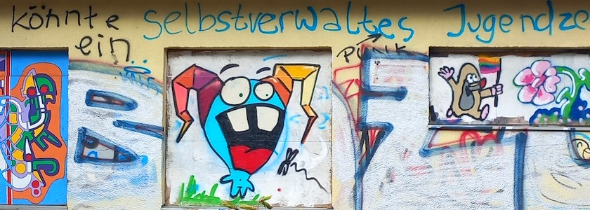

Im Nachgang zu meinem [Beitrag zum Volkspark Rehberge](https://kantel.github.io/posts/2026040701_volkspark_rehberge/) von Dienstag spülte mir unser aller Datenkrake noch zwei Beiträge des [Weddingweisers](https://weddingweiser.de/) in meinen Feedreader, die ich Euch nicht vorenthalten möchte:

- Redaktion Weddingweiser: *[Das Parkcafé Rehberge erwacht zum Leben](https://weddingweiser.de/das-parkcafe-rehberge-erwacht-zum-leben/)*, 9.&nbsp;April&nbsp;2026: Mit dem hereinbrechenden Frühling erwacht auch das seit Jahren brach liegende Parkcafé an der Großen Spielwiese im Volkspark Rehberge wieder zum Leben. Der *Parkcafé Rehberge e.V.* (ehem. *Initiative Parkcafé Rehberge*) wird wie in den vorigen Jahren ein abwechslungsreiches Kulturprogramm bieten. Auch beim Bauprozess und beim Abschluss eines Gestattungsvertrages kann der Verein Fortschritte vermelden.
- Maximilian Ludwig: *[Zur Geschichte des Volksparks Rehberge: Erholung für alle](https://weddingweiser.de/erholung-fuer-alle-1/)*, 1.&nbsp;Juni&nbsp;2025: Im Rahmen einer Freiluftausstellung zeigt die Initiative Parkcafé Rehberge die beeindruckenden Transformationen des Gebiets sowie die Zukunftspläne fürs Parkcafé.

Und dann fand ich noch in meinem begehbaren Zettelkasten (aka Bibliothek) eine Quelle, die ich -- Schande über mich -- übersehen hatte:

- Bezirksamt Wedding von Berlin, Abteilung Bau- und Wohnungswesen -- Gartenbauamt (Hg.): *»…wo eine freye und gesunde Luft athmet…« Zur Entstehung und Bedeutung der Volksparke im Wedding*, Berlin (Kulturbuch-Verlag) 1988

Das 123 Seiten umfassende Buch war der Begleitband zur gleichnamigen Ausstellung im Rahmen der 750-Jahr-Feier Berlin und ist eine unschätzbare, faktenreiche und mit vielen historischen Bildern versehene Quelle nicht nur zum Volkspark Rehberge, sondern auch zum Humboldthain und zum Schillerpark.

---

**Photo** ([cc](https://creativecommons.org/licenses/by-sa/4.0/deed.de)) 2026: *[Jörg Kantel](http://cognitiones.kantel-chaos-team.de/cv.html)*