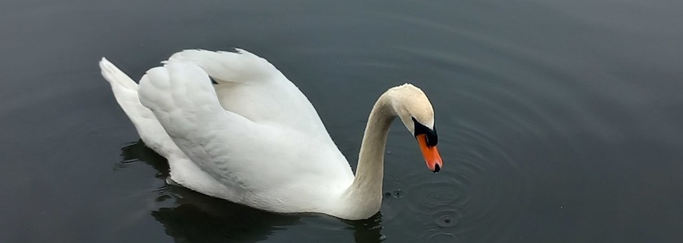

Da das Wetter am gestrigen Sonntag nicht wirklich zu einem ausführlichen Spaziergang einlud, sind die liebste aller Freudinnen und ich ledigliche eine Runde um den Reinickendorfer Schäfersee gelaufen. Dabei geriet uns dieser Schwan vor die Linse meines Smartphones, der mit stolz aufgestelltem Gefieder das Nest seiner Partnerin (oder -- soviel Gendern muss sein -- seines Partners?) bewachte.

Ansonsten kann ich zum derzeigigen Zeitpunkt nur berichten, was mir die [Wikipedia über den Schäfersee](https://de.wikipedia.org/wiki/Sch%C3%A4fersee) erzählt:

>Der Schäfersee ist ein rund 4,5 Hektar großer, rund sieben Meter tiefer, nahezu kreisrunder See im Berliner Ortsteil Reinickendorf. Die Grünanlage am Schäfersee ist ein gelistetes Gartendenkmal. Er ist ein Überbleibsel der letzten Eiszeit. Der Park um den See wurde 1928 fertiggestellt, er ist heute eine geschützte Grünanlage und ein Gartendenkmal. Das Schilfrohr im Westteil wurde durch einen Wassergraben geschützt, es soll als Rückzugs- und Brutplatz für die Wasservögel dienen.

Nach einem (hoffentlich) erneuten Besuch bei schönerem Wetter und damit verbundenen Literaturrecherchen kann ich (noch einmal hoffentlich) mehr darüber schreiben und vermutlich mehr Bilder vom See und den Park um den See zeigen. 

---

**Photo** ([cc](https://creativecommons.org/licenses/by-sa/4.0/deed.de)) 2026: *[Jörg Kantel](http://cognitiones.kantel-chaos-team.de/cv.html)*