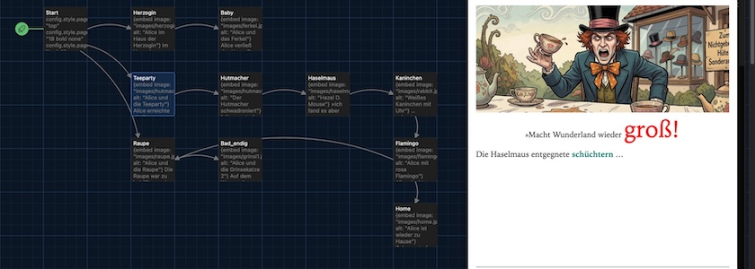

Weil es so viel Spaß gemacht hat, habe ich die Wiederaufbereitung meiner alten Idee, mit [Twine](http://cognitiones.kantel-chaos-team.de/multimedia/spieleprogrammierung/twine2.html) und dem Storyformat [Chapbook](https://klembot.github.io/chapbook/guide/) eine Reise durch das Wunderland zu unternehmen, fortgeführt. Dabei geht es mir einmal darum, die Geheimnisse von Chapbook zu ergründen und daraus ein Tutorial zu basteln, zum anderen möchte aber auch zeigen, welche Möglichkeiten die Bildergenerierung mit Hilfe gekünstelter Intelligenzien den Menschen bietet, denen kein Zeichenstift in die Wiege gelegt worden war.

Alle Bilder für diese Reise ins Wunderland habe ich mit [OpenArt](https://openart.ai/home) erstellt, für die Charakterkonsistenz war das Tool [Character&nbsp;2.0](https://openart.ai/suite/character) und für die eigentlichen Bilder Googles Modell [Nano Banana&nbsp;2](https://en.wikipedia.org/wiki/Gemini_(language_model)#Nano_Banana) (aka *Gemini 3.1 Flash Image*) zuständig.

Das heutige Tutorial baut auf meinem [Beitrag vom 8.&nbsp;April dieses Jahres](https://kantel.github.io/posts/2026040801_chapbook_wunderland_reloaded/) dieses Jahres auf. Dabei bleiben die Erzählstränge »Haus der Herzogin« und »Raupe« unberührt, lediglich die »Teeparty« des Hutmachers wird komplett neugeschrieben (dabei folge ich einer [älteren Version aus dem September 2023](https://kantel.github.io/posts/2023090201_wunderland_wieder_gross/) mit einigen Änderungen und Erweiterungen).

Das heißt, auch die »Start-Passage« mit ihren ganzen Definitionen der `config`-Objekte bleibt erst einmal, wie sie ist.

Doch die Passage `Teeparty` und die ihr folgenden Passagen wurden komplett neu bearbeitet, wobei die `Teeparty` nur recht wenig verändert wurde:

~~~markdown
{embed image: "images/hutmacher.jpg", alt: "Alice und die Teeparty"}

Alice erreichte die Teeparty vor dem Haus des verrückten Hutmachers. Dieser deklamierte 
gerade ein langes, dafür um so langweiligeres Gedicht, stand dann aber auf, hob seine 
Teetasse und begann [[lautstark zu schwadronieren->Hutmacher]].
~~~

Ziel der nächsten beiden Passagen ist es, herauszufinden, welche Einflußmöglichkeiten man mit Twine und Chapbook auf die Gestaltung des Textes besitzt. Also erst einmal die Passage `Hutmacher`,

~~~markdown
{embed image: "images/hutmacher2.jpg", alt: "Der Hutmacher schwadroniert"}

[align center]

»Macht Wunderland wieder groß!
[continue]

Die Haselmaus entgegnete [[schüchtern->Haselmaus]] …
~~~

gefolgt von der Passage `Haselmaus`:

~~~markdown
{embed image: "images/haselmaus.jpg", alt: "Hazel D. Mouse"}

»Ich fand es aber klein viel schöner.«

***

Plötzlich hoppelte das [[weiße Kaninchen->Kaninchen]] in die Szene …
~~~

Um das Ergebnis vorwegzunehmen: Die Möglichkeiten sind relativ gering bis gar nicht vorhanden. Das ist nicht unbedingt ein Beinbruch, da man in der Regel ja auf das darunterliegenden HTML und CSS zurückgreifen kann, aber ich hätte mir doch schon ein paar der komfortablen Möglichkeiten, wie sie das Storyformat [Harlowe](https://twine2.neocities.org/) anbietet, gewünscht.

In der Passage `Hutmacher` gibt es ein neues Sprachelement von Chapbook, einen *[Modifier](https://klembot.github.io/chapbook/guide/modifiers-and-inserts/modifiers-and-text-alignment.html)*. *Modifier* beginnen immer mit einer Zeile, die mit einfachen, eckigen Klammern (`[]`) begrenzt ist. Die Testmodifikationen gelten immer so lange, bis sie durch den Modifier `[continue]` (alternative Schreibweise auch `[cont'd]` oder `[cont.]`) aufgehoben werden. Modifier können nicht nur für das Text-Alignment verwendet werden, sondern auch [Delayed Text](https://klembot.github.io/chapbook/guide/modifiers-and-inserts/delayed-text.html) und [Notizen und Todos](https://klembot.github.io/chapbook/guide/modifiers-and-inserts/notes.html) sind damit möglich.

Hier habe ich mit `[align center]` den Text bis zum `[continue]` zentriert. Die Änderung an der Font-Größe und -Farbe habe ich mit Inline-CSS

~~~html
groß!
~~~
 
 realisiert, genau so, wie in der Passage `Haselmaus`:
 
 ~~~html
 klein
~~~

Zwar beherrscht Chapbook die meisten [Textauszeichungen mit Markdown](https://klembot.github.io/chapbook/guide/text-and-links/text-formatting.html), wie zum Beispiel \**kursiv*\* oder \*\***fett**\*\*, aber für mehr muß man auf das darunterliegende CSS und HTML zurückgreifen. Alles, was Chapbook nicht versteht, reicht es an den Browser durch.

Eine Besonderheit sind noch die drei Sternchen `***`, die Abschnitte voneinander trennen ([Section Breaks](https://klembot.github.io/chapbook/guide/text-and-links/text-formatting.html#section-breaks)).

In den letzten beiden Passagen `Kaninchen` und `Flamingo` gibt es keine neuen, Chapbook-eigenen Sprachelemente mehr. In `Kaninchen` hoppelt relativ unvermittelt das weiße Kaninchen durch die Szene:

~~~markdown
{embed image: "images/rabbit.jpg", alt: "Weißes Kaninchen mit Uhr"}

… schaute erschreckt auf seine Uhr und jammerte: »Ich komme wieder **viel** zu spät …«

Sprach's und hoppelte [[aufgeregt davon->Flamingo]].
~~~

Und in `Flamingo` wundert sich Alice, warum sie auf einmal einen rosaroten Flamingo im Arm hält,

~~~markdown
{embed image: "images/flamingo.jpg", alt: "Alice mit rosa Flamingo"}

Alice dachte, daß ihr dies alles zu dumm sei. Außerdem wußte sie nicht, wieso sie auf 
einmal einen rosa Flamingo im Arm hatte. 

Sie überlegte, ob sie doch noch die [[bekiffte Raupe->Raupe]] besuchen oder gleich 
[[nach Hause gehen->Home]] solle.
~~~

bevor sie dann endgültig entweder noch zu einem Abstecher bei der Raupe (Passage `Raupe`) aufbricht (hier passiert aber frühestens im nächsten Tutorial mehr) oder zu einer Kaffeetafel mit ihren Freunden (Passage `Home`) eintrifft:

~~~markdown
{embed image: "images/home.jpg", alt: "Alice ist wieder zu Hause"}

Zuhause traf Alice ihre Freunde wieder, das weiße Kaninchen und den großen, 
grünen Elephanten, mit mit denen sie noch gemütlich ein Kännchen Kaffee trank. 
(Sie hatte genug von Teepartys.)

***

So wurde es doch noch ein gelungener Nachmittag.
~~~

Die ganze Geschichte könnt Ihr natürlich wieder auch auf diesen Seiten spielen:

---

<iframe src="alice2/index.html" width="90%" height="800px"></iframe>

---

Ich habe auch dieses kleine Tutorial sowohl als [HTML-Datei](https://github.com/kantel/twine-entdecken/blob/master/Twine/alicereloaded/alice2/Alice%20im%20Reich%20der%20Ringe%202.html) wie auch als [Twee-Datei](https://github.com/kantel/twine-entdecken/blob/master/Twine/alicereloaded/alice2/Alice%20im%20Reich%20der%20Ringe%202.twee) mit allen [Assets](https://github.com/kantel/twine-entdecken/tree/master/Twine/alicereloaded/alice2/images) auf meinem GitHub-Account hochgeladen. Falls Ihr damit spielen wollt, müsst Ihr den Pfad zu den Bildern gegebenenfalls noch anpassen.

Außerdem habe ich gegenüber der ursprünglichen Fassung die Passagennamen kapitalisiert, sie beginnen jetzt jeweils mit einem Großbuchstaben. Das scheint eine übliche Konvention von Twine zu sein, der ich mich nicht ohne Grund entgegenstellen will.