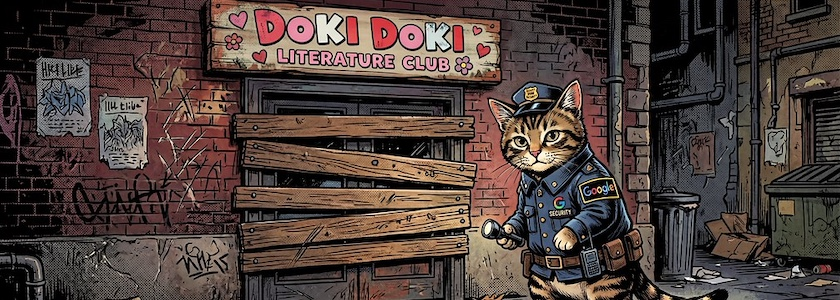

Google hat das beliebte Psychohorror-Spiel »[Doki Doki Literature Club!](https://de.wikipedia.org/wiki/Doki_Doki_Literature_Club!)« aus dem [Play Store entfernt](https://www.engadget.com/gaming/google-removes-doki-doki-literature-club-from-the-play-store-080615951.html). Laut *Dan Salvato*, dem Leiter des Entwicklerteams, und dem Publisher Serenity Forge begründete Google die Entfernung der *Visual Novel* mit einem Verstoß gegen die Nutzungsbedingungen aufgrund der Darstellung sensibler Themen. Das kostenlose Spiel ist eines der beliebtesten und weltweit erfogreichsten *Visual Novels*. Obwohl es zunächst wie eine unbeschwerte Dating-Simulation wirkt, ist es ein metafiktionales psychologisches Horrorspiel, das die vierte Wand ausgiebig durchbricht.

Googles Zensur ist ein weiteres Beispiel, wie wichtig digitale Souveränität (nicht nur in Zeiten *Donald Trumps*) ist. Zensur besteht nämlich nicht nur aus dem Verschweigen und Verändern politischer Nachrichten, sondern auch aus dem moralinsauren Aufstoßen selbsternannter Kultur- und Sittenwächter, die uns vorschreiben wollen, was wir sehen und/oder spielen dürfen. Wenn wir diesen »Hütern einer politischen Korrektheit« das Feld nicht freiwillig überlassen wollen, müssen wir den (meist US-amerikanischen) Monopolisten den Kampf ansagen und für ein freies und unabhängiges Netz eintreten.

---

**Bild**: *[Google zensuriert](https://www.flickr.com/photos/schockwellenreiter/55209206981/)*, erstellt mit [Scenario](http://cognitiones.kantel-chaos-team.de/technikgeschichte/rechnerundnetze/scenario.html): Prompt: »*A cat, dressed in a security guard's uniform with the word "Google" written on its back, stands in front of a boarded-up door. Above the door is a sign that reads "Doki Doki Literature Club". Colored classic American comic style. No speech bubbles, no textboxes, no headlines.*« Modell: Nano Banana&nbsp;2.