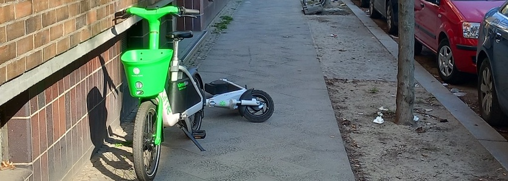

Es gibt auch noch [gute Nachrichten](https://www.rbb24.de/panorama/beitrag/2026/04/berlin-mitte-einnahmen-e-scooter-bussgeld.html): Der Bezirk Berlin-Mitte hat im letzten Jahr durch Bußgelder für falsch abgestellte E-Scooter und Segways auf Gehwegen, in Parks und in Hauseingängen rund 400.000 Euro eingenommen. Das wäre doch auch etwas für meinen chronisch klammen Heimatbezirk Neukölln, denn das sind grob gerechnet die Bruttogehälter von acht Operettenpolizisten (aka Ordnungsamtmitarbeiter). Hier werden -- nicht nur durch falsch abgestellte E-Scooter, sondern auch durch illegal entsorgten Müll -- so viel Ordnungswidrigkeiten begangen, daß jede der Operettenpolizistinnen und jeder der Operettenpolizisten, sich nicht nur selbst tragen, sondern hohe Einnahmen erwirtschaften müsste.

Denn laut einem Beschluss des Senats sollen auch die [Bußgelder für illegale Müllentsorgung an die Bezirke gehen](https://www.rbb24.de/panorama/beitrag/2026/02/berlin-muell-illegal-bezirke-bussgelder-senat-kontrollen.html). Dafür werden neue [Leute eingestellt](https://www.rbb24.de/politik/beitrag/2026/03/berlin-muell-to-go-becher-hoehere-bussgelder-bezirke-ordnungsaemter-bilanz.html) (wenn auch momentan gerade zwei pro Bezirk). Nicht so schüchtern, ruhig mehr, nicht nur für den illegal entsorgten Müll, sondern auch für die illegal abgestellten E-Scooter. Das ist einfacher, denn hier lassen sich die Besitzer leicht ermitteln. Denn wenn ihr die gefährlichen Dinger schon nicht von den Trottoirs und Radwegen wegbekommt, dann lasst die Verleihfirmen wenigstens einen Beitrag zur Sanierung der (Bezirks-) Kassen leisten.

---

**Photo** ([cc](https://creativecommons.org/licenses/by-sa/4.0/deed.de)) 2026: *[Jörg Kantel](http://cognitiones.kantel-chaos-team.de/cv.html)*