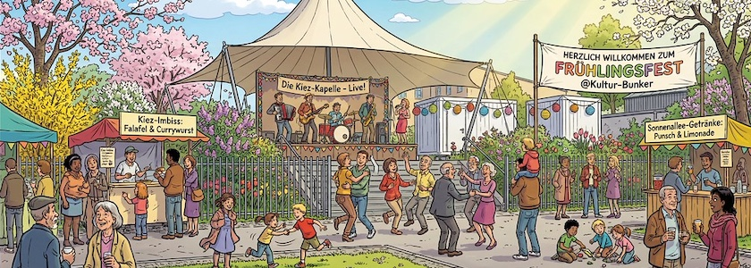

Es ist mal wieder so weit: Das vom [Quartiersmanagement Glasower Straße](https://qm-glasower-strasse.de/) initiierte und vom [Kulturlabor »Trial&nbsp;&&nbsp;Error«](https://www.trial-error.org/projekte-1/kulturbunkerdach/) getragene Projekt zur [Wiederbelebung des Kulturbunkers](https://kantel.github.io/posts/2023100601_kulturbunker/) in der Neuköllner Runguisstraße geht in das dritte Jahr. Und wie schon in den [beiden](https://kantel.github.io/posts/2024042501_kulturbunker_fruehling/) [Jahren](https://kantel.github.io/posts/2024042501_kulturbunker_fruehling/) zuvor wird auch die diesjährige die Saison mit einem Fühlingsfest eingeläutet:

Am Freitag, den **24.&nbsp;April&nbsp;2026** von **15:00&nbsp;Uhr bis 18:00&nbsp;Uhr** geht es los. Es gibt ein abwechslungsreiches Programm, Raum für Gemeinschaftsinitiativen und nachbarschaftlichem Austausch.

- Kaffee- & Kuchen-Potluck: Bringt gerne eine Kleinigkeit für das Buffet mit.
- Live-Musik mit »Chrom Schröder«
- Open Mic für kreative Darbietungen
- Pflanzen- und Kleidertausch (für einen Grundstock an Pflanzen und Kleidung ist gesorgt, bringt gerne eigenes zum Tauschen mit.)

Die Veranstaltung ist kostenlos, im Freien, barrierefrei und für alle offen. Kommt vorbei und lernt die Angebote kennen. Auch in dieser Saison ist Trial&nbsp;&&nbsp;Error von Mai bis September mit dem Nachbarschaftscafé, Kiezfesten und Kulturangeboten wieder für Euch da!

Das Kulturbunkerdach in der **Rungiusstraße&nbsp;19** (barrierefreier Zugang von der Bürgerstraße um die Ecke) in 12347&nbsp;Berlin ist ein inklusiver Ort für Begegnungen und kreativen Austausch in der Nachbarschaft -- jede und jeder ist willkommen!

---

**Bild**: *[Frühlingsfest auf dem Kulturbunker](https://www.flickr.com/photos/schockwellenreiter/55219986973/)*, erstellt mit [OpenArt](https://openart.ai/home). Prompt: »*It's a spring festival at the @image1 cultural bunker. People from the Neukölln neighborhood are standing at makeshift stalls, eating and drinking. A band is playing in the background, and some of the neighbors are dancing along. Children are playing happily among all the adults. It's springtime; the trees and bushes are in bloom, and the spring sun illuminates the scene. Colored Franco-Belgian comic style. Language: German. No speech bubbles, no textboxes, no headlines.*« Modell: Nano Banana&nbsp;2, nach einem [Vorlagenphoto](https://www.flickr.com/photos/schockwellenreiter/47040431434/) von *[Gabriele Kantel](http://www.gabi-kantel.de/)*.