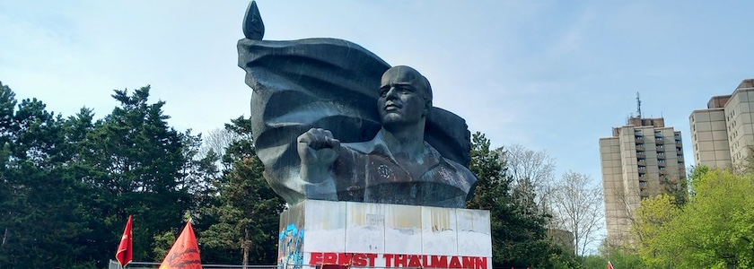
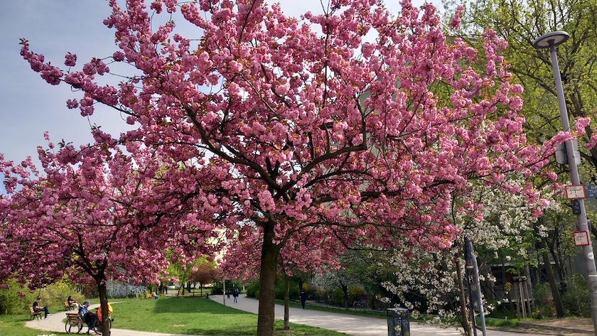
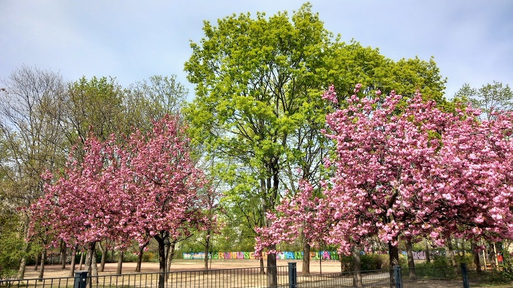
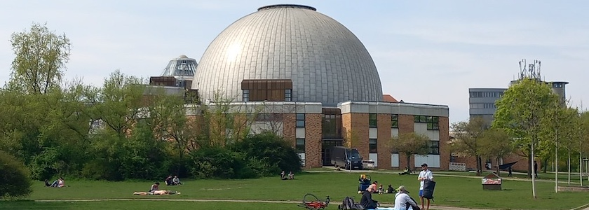
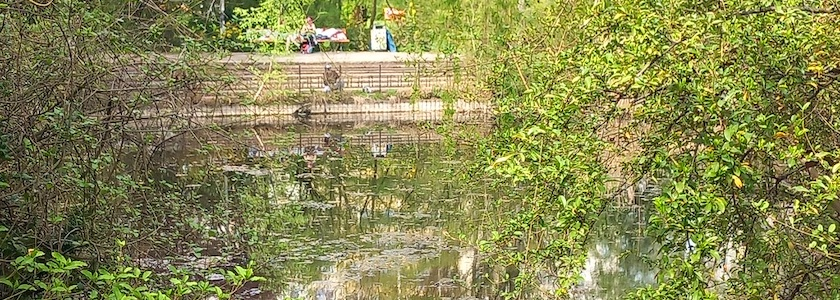
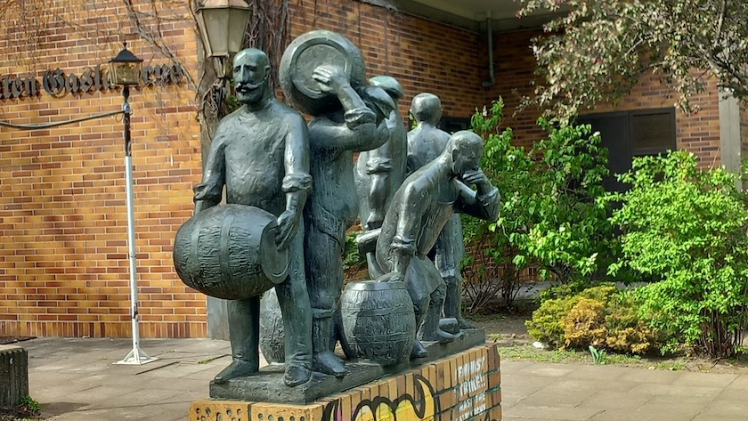
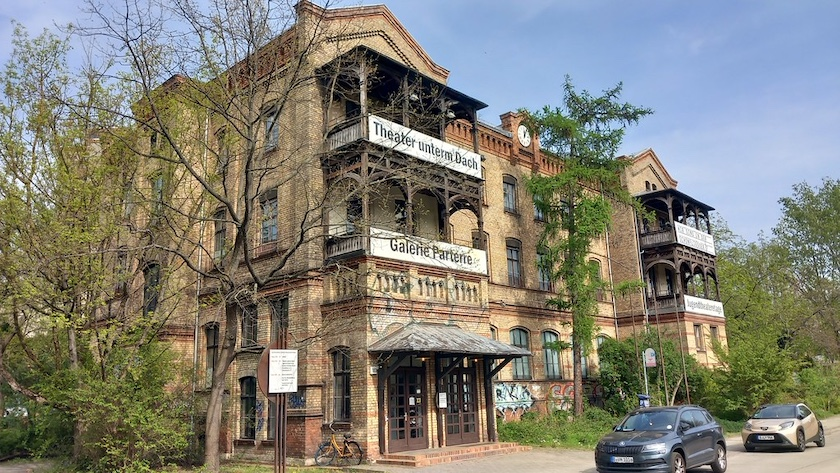
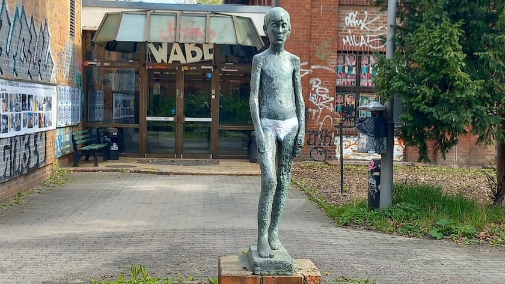
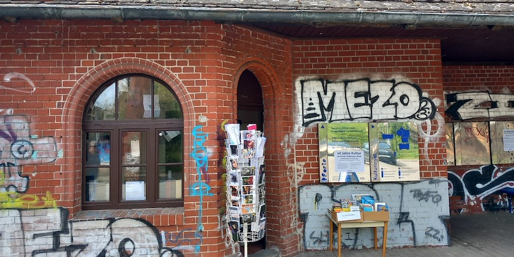

Am Sonnabend waren die liebste aller Freundinnen und ich mal wieder unterwegs. Angeregt durch eine [Pressemitteilung des Bezirksamts Pankow](https://www.berlin.de/ba-pankow/aktuelles/pressemitteilungen/2026/pressemitteilung.1656981.php) wollten wir die Ausstellung »40 Jahre Kultur im Ernst-Thälmann-Park« im Geschichtskiosk an der Pforte am Eingang der Kulturinsel im Ernst-Thälmann-Park besuchen und gleichzeitig ein wenig durch den Park schlendern und den Frühling geniessen.

Der Park zwischen den Ringbahnhöfen *Prenzlauer Allee* im Norden und *Greifswalder Straße* im Süden verläuft in einem schmalen Streifen entlang der S-Bahn-Trasse bis zur Danziger Straße (früher: Dimitroffstraße). Er enstand in den 80er Jahren als letztes großes Bauprojekt der DDR und wurde nach nur drei Jahren Bauzeit pünktlich zum Jubiläum »750 Jahre Berlin« und »100 Jahre Thälmann« eröffent. Die Umgestaltung zum »bewohnten Park« mit Wohn- und Einkaufsmöglichkeiten war bislang einzigartig und ein Prestigeobjekt der DDR. Es wurden 1.332 Wohnungen für 4.000 Bewohner und das Zeiss-Großplanetarium gebaut, je Bewohner ein Baum gepflanzt, Parkflächen, eine Denkmalanlage und ein künstlicher Teich angelegt. Die Anlage wurde zum 100. Geburtstag von Ernst Thälmann am 16. April 1986 eingeweiht. Architekt für den Gesamtkomplex mit Wohnungen, Kindertagesstätte, Geschäften, Schwimmhalle und Parkanlage war *Helmut Stingl*.

Die Planer konzipierten das Wohngebiet bis ins Detail: Ein durchdachtes Wegenetz zwischen den Wohnhäusern, Geschäften, Denkmal und ÖPNV-Anbindung. Gerade im Frühjahr grünt und blüht es überall.

Der Park wurde von Beginn an in der Verbindung zwischen Wohnen, kulturellen Einrichtungen und Natur geplant und angelegt. Neben den Plattenbauten an der Greifswalder Straße befinden sich im Park eine Schule, soziale Einrichtungen, eine Schwimmhalle, mehrere Gaststätten und das 1987 eingeweihte Zeiss-Großplanetarium an der Prenzlauer Allee. Bei den Wohnhäusern handelt es sich um achtgeschossige Plattenbauten der Reihe WBS 70, denen eigens für den Ernst-Thälmann-Park entwickelte zwölf-, fünfzehn- und achtzehngeschossige Hochhäuser vorgelagert wurden.

Das 1987 im zweiten Bauabschnitt fertiggestellte Zeiss-Großplanetarium im Ernst-Thälmann-Park wurde 2015/2015 modernisiert und hat im Herbst 2016 als eines der modernsten Wissenschaftstheater Europas wieder eröffnet.

Im östlichen Bereich entstand ein von geschwungenen Wegen gesäumter Teich mit weißen und roten Seerosen, Wildenten und kleinen Fischen, zu denen sich bald auch Frösche und andere Amphibien gesellten.

Vor der mittlerweile geschlossenen Gaststätte »Zur alten Gaslaterne« (ein neuer Pächter wird gesucht) findet man die 1986 von *Johannes Harbort* (geb. 1951) geschaffene Bronzegruppe »Berliner Typen«.

Im Februar 2014 stellte die Senatsverwaltung für Stadtentwicklung den Ernst-Thälmann-Park wegen der »herausragende[n] Bedeutung«, die ihm innerhalb der Stadtbaugeschichte Berlins zukomme, unter Denkmalschutz. Das Ensemble bringe in hohem Maß die städtebauliche, architektonische und politische Dimension des Wohnungsbaus der 1980er Jahre in Übereinstimmung und »besitzt dank seines bauzeitlichen Erhaltungszustandes eine inzwischen einzigartige Aussagekraft über die Wohnbedingungen in einer sozialistischen Mustersiedlung der späten DDR«.

Die Altbauten des ehemaligen Gaszählerhauses und des Verwaltungsgebäudes des Gaswerkes werden seit 1986 kulturell genutzt. Dieses heute als Kulturareal Ernst-Thälmann-Park bezeichnete Parkgebiet beheimatet unter der Adresse Danziger Straße 101 das Theater unterm Dach, die Galerie parterre, das Veranstaltungshaus WABE, die Kunstwerkstätten und die Jugendtheateretage.

Im Eingangsbereich an der Danziger Straße vor der WABE steht die von *Sabina Grzimek* (geb. 1942) geschaffene Bronzefigur »Stehender Knabe«.

Inzwischen ist der Park ins Visier der Investoren geraten, auch der Bezirk lehnt eine Bebauung nicht mehr ab.

Und die oben erwähnte Ausstellung in der Pforte haben wir auch noch besucht. Sie war eher klein und überladen und wenig hilfreich, um vier Jahrzehnte lokale Kunst- und Kulturgeschichte eindrucksvoll erlebbar zu machen. Aber immerhin hat allein ihre Existenz uns zu diesem Spaziergang verführt.

### Quellen und Literatur

- Anonym: *[Ernst-Thälmann-Park im Prenzlauer Berg](https://vonortzuort.reisen/deutschland/berlin/ernst-thaelmann-park-im-prenzlauer-berg/)*, VonOrtZuOrt.reisen, aufgerufen am 21.&nbsp;April&nbsp;2026
- AnwohnerInitiative Ernst-Thälmann-Park: *[Etwas zur Geschichte des Ernst-Thälmann-Park Areals …](https://thaelmannpark.wordpress.com/geschichte/)*, aufgerufen am 21.&nbsp;April&nbsp;2026
- Bezirksamt Pankow: *[40 Jahre Kultur im Ernst-Thälmann-Park – Ausstellung zum Jubiläum eröffnet am 1. April](https://www.berlin.de/ba-pankow/aktuelles/pressemitteilungen/2026/pressemitteilung.1656981.php)*, Pressemitteilung vom 27.&nbsp;März&nbsp;2026
- Bezirksamt Pankow: *[Der Ernst-Thälmann-Park](https://www.berlin.de/ba-pankow/politik-und-verwaltung/aemter/strassen-und-gruenflaechenamt/gruenflaechen/ausstellung/artikel.1513035.php)*, aufgerufen am 21.&nbsp;April&nbsp;2026
- Toja Gural: *[Neues Wohnhochhaus am Thälmannpark: Bezirk und Investor einigen sich](https://www.entwicklungsstadt.de/neues-wohnquartier-am-thaelmannpark-bezirk-und-investor-einigen-sich/)*, Entwicklungsstadt vom 9.&nbsp;Dezember&nbsp;2025
- Ulrich Werner Grimm, Aktualisierung: Stefanie Gronau: *[Ernst-Thälmann-Park](https://www.pankow-weissensee-prenzlauerberg.berlin/de/ernst-thaelmann-park)*, Kultur- und Tourismusmarketing Berlin-Pankow, aufgerufen am 21.&nbsp;April&nbsp;2026
- Jule Meier: *[Zeitreise in Pankow: Zehn Jahre Denkmalschutz im Thälmann-Park](https://www.nd-aktuell.de/artikel/1178382.berlin-zeitreise-in-pankow-zehn-jahre-denkmalschutz-im-thaelmann-park.html)*, Neues Deutschland vom 8.&nbsp;Dezember&nbsp;2023
- RBB24: *[Innentoilette und Schwimmbad statt Gaswerk und Gestank](https://www.rbb24.de/panorama/beitrag/2026/04/bilder-galerie-ernst-thaelmann-park-40-jahre-prenzlauer-berg-berlin-ddr-brd-geschichte-jubilaeum-panorama.html)*, Bildergalerie 40&nbsp;Jahre Ernst-Thälmann-Park, Stand: 16.&nbsp;April&nbsp;2026
- Dajana Rubert: *[Jubiläum im Ernst-Thälmann-Park: Zwischen Geschichte und Neubau](https://www.entwicklungsstadt.de/ernst-thaelmann-park-jubilaeum-40-jahre/)*, Entwicklungsstadt vom 16.&nbsp;April&nbsp;2026
- Jens Sethmann: *[25 Jahre Ernst-Thälmann-Park: Platten-Fels in der Caffè-Latte-Brandung](https://www.berliner-mieterverein.de/magazin/online/mm0411/041122.htm)*, Berliner Mieterverein, Stand: 28.&nbsp;April&nbsp;2011
- Wikipedia: *[Ernst-Thälmann-Park](https://de.wikipedia.org/wiki/Ernst-Th%C3%A4lmann-Park)*, aufgerufen am 21.&nbsp;April&nbsp;2026
- Wikipedia: *[Ernst-Thälmann-Denkmal (Berlin)](https://de.wikipedia.org/wiki/Ernst-Th%C3%A4lmann-Denkmal_(Berlin))*, aufgerufen am 21.&nbsp;April&nbsp;2026
- WBM Wohnungsbaugesellschaft Berlin-Mitte mbH: *[Ernst-Thälmann Park](https://www.wbm.de/neubau-berlin/plattenbau/ernst-thaelmann-park/)*, aufgerufen am 21.&nbsp;April&nbsp;2026

---

**Photos** ([cc](https://creativecommons.org/licenses/by-sa/4.0/deed.de)) 2026: *[Jörg Kantel](http://cognitiones.kantel-chaos-team.de/cv.html)*