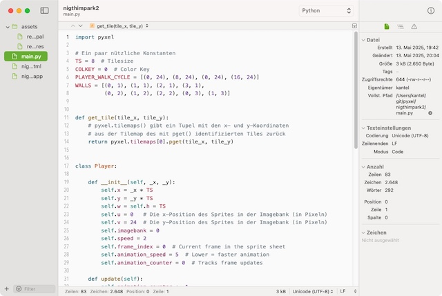

Manchmal benötigt man einfach nur einen schnellen, kleinen Texteditor. Wenn man in einer Datei nur eine kleine Änderung vornehmen oder auch einfach nur hereinschauen will, dann sind die großen und leistungsfähigen, aber auch behäbigen Boliden wie [Visual Studio Code](http://cognitiones.kantel-chaos-team.de/produktivitaet/visualstudiocode.html) oder [PyCharm](http://cognitiones.kantel-chaos-team.de/programmierung/python/pycharm.html) einfach ein Overkill. Daher war ich mehr als neugierig, als mir ifun.de [CotEditor](https://coteditor.com/) als ihre meistgenutzte Mac-App [vorstellten](https://www.ifun.de/coteditor-7-grosses-update-fuer-unsere-meistgenutzten-mac-app-278345/).

Ein kurzer Test und ich bin begeistert: Das Teil ist rasend schnell, beherrscht aber trotzdem *out of the box* Syntax-Highlighting für mehr als 60 Sprachen (unter anderem HTML, CSS, Lua, Markdown, JavaScript, JSON und Python), der Editor kann geteilt werden, um verschiedene Abschnittes des Textes in einem Fenster vergleichen zu können, und es gibt ein *Find and Replace* auch mit Hilfe von Regular Expressions.

Außerdem gibt es keine komplexen Konfigurationsdateien, die fortgeschrittene Kenntnisse erfordern. Ihr könnt alle Eure Einstellungen, einschließlich Syntaxdefinitionen und Designs, über ein Standard-Einstellungsfenster aufrufen. Und es gibt eine automatische Datensicherung. Das Programm ist kostenlos und Open Source (Apache-2-Lizenz), der [Quellcode ist auf GitHub](https://github.com/coteditor/CotEditor) zu finden, und wer -- wie ich -- den App-Store scheut, kann die aktuelle Version 7 auch von den [Release-Seiten herunterladen](https://github.com/coteditor/CotEditor/releases/tag/7.0.0).

Wo Licht ist, da ist aber auch Schatten: Die Software verlangt mindestens macOS 15 (Sequoia) und natürlich rennt man mit ihr in die *Mac-only*-Falle. Aber Texte sind Texte, mit CotEditor erstellte Dateien lassen sich plattformübergreifend mit jedem anderem Texteditor öffnen und weiterverarbeiten, und CotEditor frisst auch alle Texte anderer Texteditoren und Plattformen. So nutze ich auf meinem Chromebook die bezaubernde [Geany](http://cognitiones.kantel-chaos-team.de/produktivitaet/geany.html) als schnellen Editor für zwischendurch (auf meinem Mac bin ich mit ihr leider [nicht warmgeworden](https://kantel.github.io/posts/2023102602_geany_2/)) und auf meinem macOS-Desktop wird ab sofort CotEditor diesen Dienst verrichten.

---

**Bild**: *[Steampunk Rabbit](https://www.flickr.com/photos/schockwellenreiter/55223592581/)*, erstellt mit [Scenario](http://cognitiones.kantel-chaos-team.de/technikgeschichte/rechnerundnetze/scenario.html). Prompt: »*A white rabbit wearing a yellow and black checkered vest, blue jacket, white shirt, and red bow tie sits at an enormous desk in front of a steampunk-style computer. It wears glasses and a large pocket watch on a chain, which lies beside it on the desk. An old-fashioned desk lamp illuminates the table. In the background are shelves with books and all sorts of steampunk knick-knacks. Through a window, a Victorian cityscape is visible. Colored Franco-Belgian comic style. Language: German. No speech bubbles, no textboxes, ne headlines.*« Modell: Nano Banana&nbsp;2.