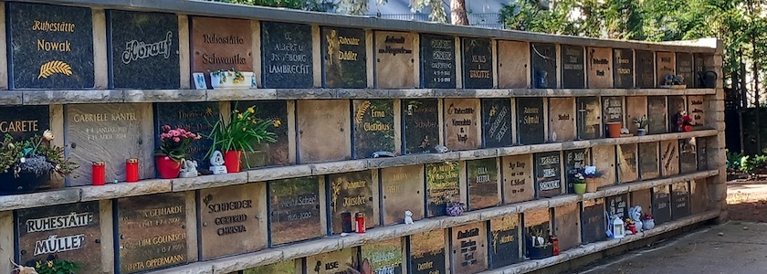

Der Sonntag vor zwei Jahren war der Tag, an dem mich meine Partnerin und Ehefrau und der bessere Teil des Kantel-Chaos-Teams, *[Gabriele (Gabi) Kantel](http://www.gabi-kantel.de/Website/Willkommen.html)*, nach einer kurzen, aber heftigen Krankheit [verlassen musste](https://kantel.github.io/posts/2024041901_rip_gabi/). Heute habe ich -- wie beinahe jede Woche -- ihr Grab auf dem [Neuköllner Emmauskirchhof](https://evfbs.de/start/friedhoefe/region-sued/einzeldarstellung/emmaus/kurzportraet) besucht, ein paar Erdnüsse an die dort lebenden Eichhörnchen verfüttert, und dabei ihre Grabstelle im Frühling photographiert.

Wie immer, wenn ein Photo von Gabis Grab hier auf diesen Seiten veröffentlicht wird, soll es auch an ihr Vermächtnis erinnern, daß der hinter dem Emmauskirchhof liegende [Emmauswald](https://emmauswald-bleibt.de/) nicht einer skrupellosen Immobilienmafia (und ihren Handlangern im Berliner Senat) [geopfert werden](https://www.nd-aktuell.de/artikel/1188194.stadtentwicklung-emmauswald-in-neukoelln-kahlschlag-gegen-zahlung.html) darf, die dort in der Hauptsache teure [Eigentumswohnungen hochziehen](https://taz.de/Debatte-um-den-Neukoellner-Emmauswald/!6013694/) wollen.

Und Widerstand ist zur Zeit wieder dringender denn je erforderlich, denn der [Berliner Senat konkretisierte sein umstrittenes Bauvorhaben](https://www.entwicklungsstadt.de/emmauswald-in-neukoelln-senat-konkretisiert-umstrittenes-bauvorhaben/). Zwar existiert noch kein konkreter Zeitplan, aber die Berliner Politik sieht weder im notwendigen (weil gesetzlich vorgeschriebenen) Abstand zur Autobahn A100 noch im artenschutzrechtlichen Gutachten grundsätzliche Hindernisse.

Daher muß der Kampf gegen die Rodung des größten Neuköllner (und kleinsten Berliner) Waldes (rund vier Hektar) weitergehen (auch der RBB [berichtete](https://www.rbb-online.de/der-tag/ort/vor-ort-in-neukoelln-emmauswald.html)). Das ist Gabis Vermächtnis.

---

**Photo** ([cc](https://creativecommons.org/licenses/by-sa/4.0/deed.de)) 2026: *[Jörg Kantel](http://cognitiones.kantel-chaos-team.de/cv.html)*