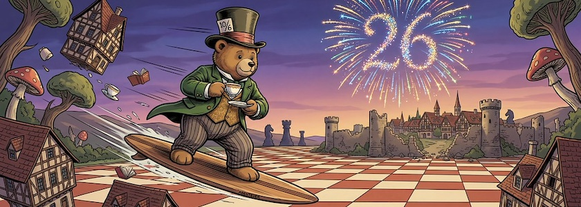

Es ist zwar nicht so eine runde Zahl [wie im letzten Jahr](https://kantel.github.io/posts/2025042401_25_jahre_schockwellenreiter/), aber dennoch ist es (fast) die gleiche Prozedur wie jedes Jahr: **[Heute vor 26 Jahren](http://www.schockwellenreiter.de/2000/04/24.html)** war es in Berlin unerträglich heiß (28°C), doch statt auf unserer [Dachterrasse](http://www.kantel.de/privat/dg.html) (auf die verlinke ich auch nur einmal im Jahr 🤓 – seit unserem Umzug nach Britz vor sechzehn Jahren ist es ja auch nicht mehr »unsere« Dachterrasse) zu hocken und mir die Sonne auf den Bauch scheinen zu lassen, saß ich im schattigen Arbeitszimmer vor dem Rechner, wühlte mich durch die [Frontier](http://cognitiones.kantel-chaos-team.de/webworking/frameworks/frontier.html)- und [Manila](http://cognitiones.kantel-chaos-team.de/webworking/cms/manila.html)-Dokumentation und hob dieses ~~Weblog~~ digitale Kritzelheft aus der Taufe.

Seit mehr als einem vollen Vierteljahrhundert schreibe ich also nahezu (werk-) täglich mit nur kurzen Unterbrechungen von höchstens wenigen Tagen das Internet voll. Und warum das alles? Die Antwort liegt im [Motto des Schockwellenreiters](http://www.schockwellenreiter.de/2000/04/23.html) – ein Zitat aus dem [namensgebenden Roman](https://de.wikipedia.org/wiki/Der_Schockwellenreiter) von *[John Brunner](https://de.wikipedia.org/wiki/John_Brunner)*:

>Wir sind eine zivilisierte Spezies. Deshalb soll künftig niemand einen unrechtmäßigen Vorteil aufgrund der Tatsache erlangen, daß wir gemeinsam mehr wissen als einer von uns wissen kann.

Zwar sind durch meine diversen Wechsel der verwendeten Content Management Systeme *(Manila, [Radio Userland](http://cognitiones.kantel-chaos-team.de/webworking/cms/radiouserland.html), [Plone](http://cognitiones.kantel-chaos-team.de/webworking/cms/plone.html), [WordPress](http://cognitiones.kantel-chaos-team.de/webworking/cms/wordpress.html))* und Internet-Provider etliche Jahrgänge im Daten-Nirwana verschwunden oder nur noch schwer zu aufzutreiben, aber alle Beiträge seit meinem Wechsel zu statischen Seiten im Jahr 2012 sind leicht zu erreichen (entweder im [Archiv](http://blog.schockwellenreiter.de/archiv2022.html) der mit [RubyFrontier](http://cognitiones.kantel-chaos-team.de/webworking/staticsites/rubyfrontier.html) erstellten Ausgaben vom Juli 2012 bis November 2022) oder direkt auf diesen Seiten (seit Dezember 2022). Erstere noch solange, wie ich die Rechnungen von *Amazon&nbsp;AWS* bezahlen kann, letztere so lange, wie *GitHub Pages* existiert, also hoffentlich »für immer«.

Das nächste Ziel wären also »50 Jahre Schockwellenreiter«. Ich weiß, dies ist ein ehrgeiziges Vorhaben, denn ich bin mittlerweile immerhin 72&nbsp;Jahre jung. Aber am kommenden Montag feiert mein Vater seinen 97.&nbsp;Geburtstag. Das beweist: Auch fünfzig Jahre Schockwellen reiten sind zu schaffen!

In diesem Sinne: Happy Birthday, liebes, digitales Kritzelheft. Und mein Dank geht an alle meine Leserinnen und Leser, die mir bis heute die Treue gehalten haben, oder die neu zu diesen Seiten hinzugestoßen sind. *Bleibt mir gewogen!*&nbsp;😎

---

**Bild**: *[26 Jahre Schockwellen reiten](https://www.flickr.com/photos/schockwellenreiter/55226436184/)*, erstellt mit [OpenArt](https://openart.ai/home). Prompt: »*Illustration of the @Mad Teddy surfing on a board in the air between houses and trees above a chessboard-like landscape like in @image1. The town in the background is enclosed by an old, crumbling city wall. A colorful firework in the sky forms the number 26. Colored Franco-Belgian comic style. Language: German. No speech bubbles, no textboxes, no headlines.*« Modell: Nano Banana&nbsp;2.