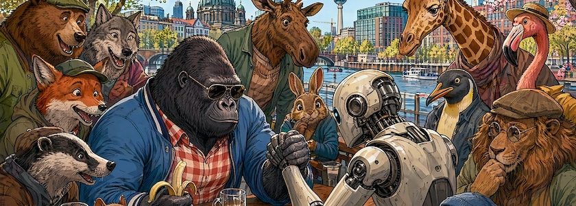
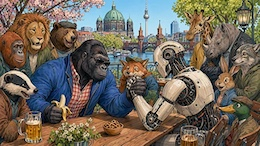
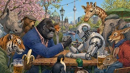
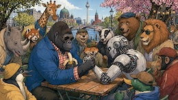
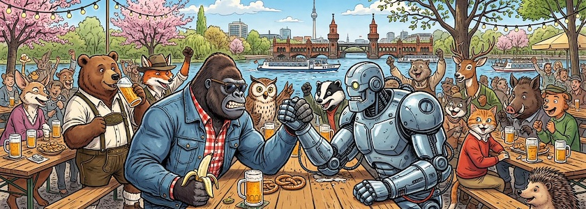
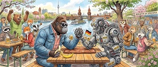
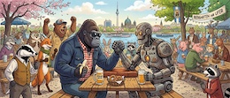
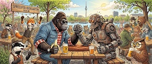

Vor drei Tagen, am 21. April [veröffentlichte OpenAI ChatGPT Images-2.0](https://openai.com/index/introducing-chatgpt-images-2-0/). Es soll -- so OpenAI --  dieselben Fähigkeiten wie Googles Nana Banana Pro besitzen: Das Modell »[denkt](https://www.computerbase.de/news/apps/chatgpt-images-2-0-neuer-bildgenerator-setzt-vor-allem-auf-besseres-verstaendnis.97015/)«, bevor es generiert, je nach eingestelltem Modell kürzer oder länger, und kann dabei sogar das Internet durchsuchen. Das soll eine höhere Vielfalt und Genauigkeit bei generierten Bildern ermöglichen. Diese erweiterte Ausgaben mit »Thinking« kosten allerdings, und das nicht zu knapp (dazu weiter unten mehr).

Laut [diesem Beitrag auf Medium.com](https://medium.com/mlworks/introducing-chatgpt-images-2-0-a-new-era-of-image-generation-1c28cf5342c8) (€) sind das die Hauptmerkmale und Verbesserungen der Version 2.0:

- Verbesserte Textwiedergabe und Genauigkeit: Images 2.0 bietet eine deutliche Verbesserung bei der Darstellung von kleinen Texten, UI-Elementen und komplexen, feinkörnigen Details, wie zum Beispiel präzisem Text auf Produktetiketten.
- Denkvermögen: Bei der Verwendung von höherwertigen, professionellen Modellen in ChatGPT kann Images 2.0 Suchvorgänge durchführen, um Informationen zu gewinnen und durch Eingabeaufforderungen logische Schlussfolgerungen zu ziehen. Dies ermöglicht eine höhere Genauigkeit, aktuellere Inhalte und Selbstkorrektur.
- Höhere Qualität und Auflösung: Das Modell unterstützt eine Auflösung von bis zu 2K, wobei einige Berichte auf 4K-Fähigkeiten für High-End-Ausgaben hinweisen, was für schärfere und detailreichere Bilder sorgt.
- Mehrsprachige Textunterstützung: Das Modell verfügt über eine höhere Leistungsfähigkeit bei der Darstellung nicht-lateinischer Texte, darunter Chinesisch, Japanisch, Koreanisch, Hindi und Bengali.
- Flexible Formatierung: Es unterstützt verschiedene Seitenverhältnisse, von breit (3:1) bis hoch (1:3), und eignet sich für Poster, Präsentationen und soziale Medien.
- Mehrfachbildgenerierung: Es kann aus einer einzigen Eingabe mehrere unterschiedliche Bilder (bis zu acht) generieren, wobei Zeichen, Stile und Objekte konsistent bleiben.

Da ChatGPT Image 2 nahezu zeitgleich [sowohl auf Scenario](https://help.scenario.com/articles/9865491024-gpt-image-2-the-essentials) wie auch [auf OpenArt](https://openart.ai/suite/create-image/gpt-image-2), den beiden von mir zu Zeit bevorzugten Dienste-Providern für Bildgenerierung mit gekünstelter Intelligenzia, freigeschaltet wurde, mußte ich natürlich *stante pede* einen Test starten (dieses Mal mit [Scenario](http://cognitiones.kantel-chaos-team.de/technikgeschichte/rechnerundnetze/scenario.html)). Dafür habe ich -- wie immer in solchen Fällen -- mir erst einmal einen Prompt gebastelt:

>A gorilla in a blue jacket, red-white checkered shirt, and sunglasses, holding a banana in his left hand, is arm wrestling a robot. They are sitting at a table in a Berlin beer garden on the Spree River. The outcome of the contest is uncertain. Numerous antropomorphic animal guests have gathered around the table and are watching the competition. It is springtime in Berlin. Colored Franco-Belgian comic style. Language: German. No speech bubbles, no textboxes, no headlines.

### ChatGPT Image 2

Und den habe ich dann auf ChatGPT Image 2 losgelassen. Leider unterstützt ChatGPT Image&nbsp;2 (momentan?) noch nicht das von mir (wegen der Bannerbilder) bevorzugte Seitenverhältnis von $21:9$, daher musste ich mich mit $16:9$ zufriedengeben. *(Wie immer führt ein Klick auf die daumennagelgroßen Bilder auf eine Flickr-Seite mit größeren Bildern und mehr Informationen.)*

&nbsp;&nbsp;

Auch die maximale Auflösung beträgt zur Zeit noch »nur« 2K, doch für mein Anwendungsszenario, Bilder für interaktive Geschichten und Spiele generieren zu lassen, ist dies mehr als ausreichend.

### Nano Banana 2

Zum Vergleich habe ich denselben Prompt auf Googles Nano Banana&nbsp;2 angewendet, allerdings mit dem Seitenverhältnis $21:9$ und einer Auflösung von 4K:

&nbsp;&nbsp;

### And the Winner is …

Wenn man mal den Kostenfaktor außer acht lässt, dann gefallen mir die Bilder von ChatGPT Image 2 eindeutig besser. Die Zeichnungen sind detailreicher und für meinen Geschmack weniger mit Klischees belastet. Aber: Nicht nur, daß **ein Bild** mit **69 »Credits«** bei Scenario zu Buche schlägt, ich habe, um vier veröffentlichungsreife Bilder zu erhalten, zwölf Bilder generieren müssen. Also muß man gerechterweise für ein Bild drei mal 69 gleich **207&nbsp;Credits** rechnen. Ich habe für diesen Test beinahe die Hälfte meiner monatlichen Credits verplempert. Die hohe Zahl war vor allem notwendig, weil ChatGPT Image&nbsp;2 doch noch massive Probleme mit der Anatomie hat. Insbesondere die Anforderung, daß der Gorilla eine Banane in der *linken* Hand zu halten habe, führte zu Bildern mit dreiarmigen Gorillas. Alternativ vernachlässigte das Modell die Prompttreue und drückte die Banane einfach einem anderen Tier in die Hand.

Hier punktete in allen Fällen Nano Banana&nbsp;2: Einmal kostete ein Bild hochaufgelöst mit 4K und einem Seitenverhältnis von $21:9$ bei Scenario gerade einmal **28&nbsp;Credits** und für vier veröffentlichsfähige Bilder habe ich nur sechs Versuche benötigt, also kostete mich im Endeffekt jedes Bild anderthalb mal 28 gleich **42&nbsp;Credits**. Das ist schon ein eklatanter Unterschied, man muss sich überlegen, ob die zweifelsfrei bessere Qualität einem das etwa fünffache an Kosten wert ist. Und daß Googles KI sich in Sachen Anatomie auch damit elegant aus der Affäre gezogen hat, daß alle Roboter linkshändig agierten, ist bei Robotern zu verschmerzen. Ich kann erwarten, daß ihre Programmierung dafür sorgt, daß sie rechts wie links gleich stark sind.

Auch das Weltwissen scheint in beiden Modellen gleich stark zu sein: Berliner Wahrzeichen wie die Oberbaumbrücke, der Dom oder der Fernsehturm tauchen in beiden Modellen auf.

Aber die ganze Geschichte ist ja immer noch in ständiger Bewegung. An den Preisen wird sich sicher noch geschraubt werden, und die Konkurrenz, vor allem die meist viel kostengünstigere aus China, steht ebenfalls schon in den Startlöchern und scharrt mit den Hufen, um Nano Banana oder ChatGPT Image zu beerben. Schauen wir mal, was uns die Zukunft noch bringen wird. *Still digging!*
