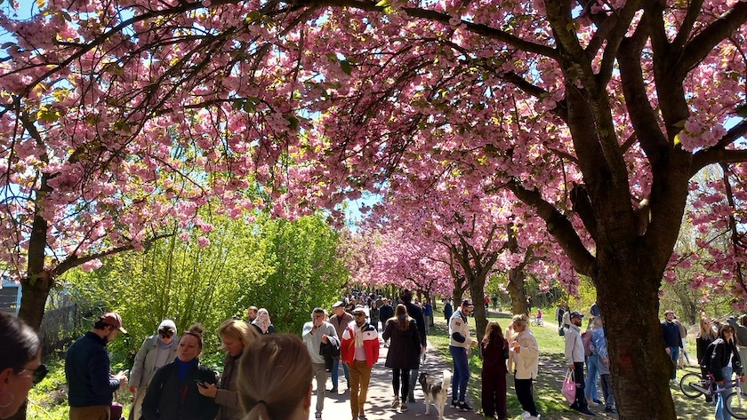
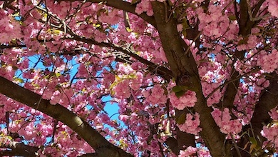
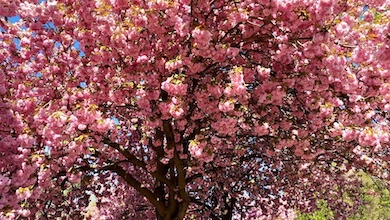
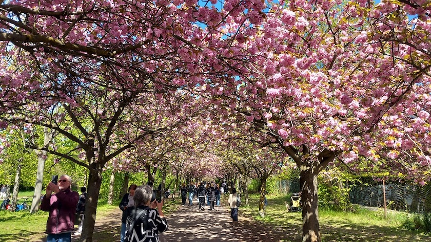

Am gestrigen Sonntag hatten die liebste aller Freudinnen und ich das schöne Frühlingswetter ausgenutzt und uns -- wie gefühlt die Hälfte der Berliner Bevölkerung und noch einmal die gleiche Anzahl von Touristinnen und Touristen -- die Kirschblütenpracht auf dem ehemaligen Grenzstreifen zwischen Ost- und Westberlin an der Bornholmer Straße neben der mittlerweile seit 130 Jahren bestehenden [Kleingartenanlage Bornholm&nbsp;1](https://bornholm1.de/) angeschaut.

&nbsp;

Es hat sich gelohnt, quer über den Weg spannte sich ein rosaroter Blütenhimmel,

der natürlich nicht nur von der liebsten aller Freundinnen und mir, sondern auch von vielen anderen Besitzerinnen und Besitzern eines Mobilphones photographiert werden musste.

---

**Photos** ([cc](https://creativecommons.org/licenses/by-sa/4.0/deed.de)) 2026: *[Jörg Kantel](http://cognitiones.kantel-chaos-team.de/cv.html)*

