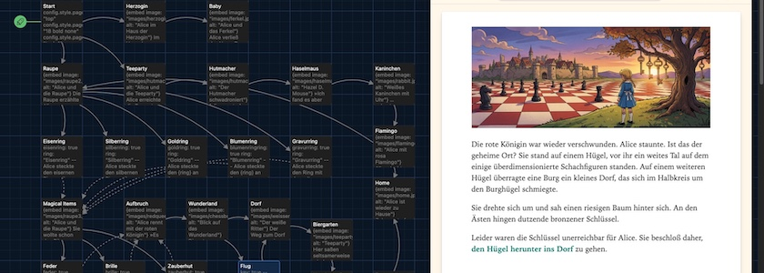

Das heutige Tutorial, das die Möglichkeiten von [Twine](http://cognitiones.kantel-chaos-team.de/multimedia/spieleprogrammierung/twine2.html) mit dem Storyformat [Chapbook](https://klembot.github.io/chapbook/guide/) auf einer Reise durch das Wunderland erkunden will, setzt [das Tutorial vom 14. April dieses Jahres](https://kantel.github.io/posts/2026041401_chapbook_wunderland_2/) fort. Wie schon dort geht es aber nicht nur um die Geheimnisse von Chapbook, sondern auch darum, wie man eine bildergenerierende, gekünstelte Intelligenzia dafür nutzen kann, Illustrationen für interaktive Geschichten und Spiele zu erzeugen.

Auch bei diesem Tutorial habe ich also wieder alle Bilder mit [OpenArt](https://openart.ai/home) erstellt, für die Charakterkonsistenz war das Tool [Character&nbsp;2.0](https://openart.ai/suite/character) und für die eigentlichen Bilder wieder Googles [Nano Banana&nbsp;2](https://en.wikipedia.org/wiki/Gemini_(language_model)#Nano_Banana) (aka *Gemini 3.1 Flash Image*) zuständig.

Die Geschichte bekommt einen komplett neuen Strang, der von der Passage `Raupe` abzweigt. Aber zuerst mußte ich in der Startpassage ein paar weitere Variablen definieren:

~~~twee
config.style.page.verticalAlign: "top"
config.style.page.link.font: "18 bold none"
config.style.page.link.color: "teal-4"
config.style.page.link.active.color: "teal-4"
config.style.dark.page.link.font: "18 bold none"
config.style.dark.page.link.color: "orange-3"
config.style.dark.page.link.active.color: "orange-3"
config.style.page.footer.link.font: "16 italic none"
config.style.page.footer.link.active.font: "16 italic none"
config.style.page.footer.link.active.color: "teal-4"
config.style.dark.page.footer.link.active.color: "orange-3"
config.style.page.footer.font: "16 italic"
config.footer.left: "Alice im Reich der Ringe"
config.style.backdrop: "#fef8ec"
silberring: false
goldring: false
blumenring: false
gravurring: false
eisenring: false
brille: false
feder: false
zauberhut: false
key: false
~~~

`config.style.backdrop: "#fef8ec"` definiert eine Farbe, die der Hintergrund *außerhalb* der eigentlichen Chapbook-Seite bekommen soll. Die weiteren Zeilen definieren boolsche Variablen. 

Im Gegensatz zu den meisten anderen Storyformaten (zum Beispiel [Harlowe](http://twine2.neocities.org/) oder [SugarCube](https://www.motoslave.net/sugarcube/2/docs/)) unterscheidet Chapbook nicht zwischen lokalen und globalen Variablen, alle Variablen sind global. Die manchmal verwendete Schreibweise mit einem führenden Unterstrich (`_variablenname`) ist lediglich eine Konvention, die die Autorinnen und Autoren daran erinnern soll, daß diese Variable lokal gemeint ist und er den gleichen Namen nicht in einer weiteren Passage verwenden sollte. Daher tut man gut daran, Variablen schon in der Startpassage mit Default-Werten vorzubelegen.

Während ansonsten alle anderen bisherigen Passagen unverändert beibehalten wurden (lediglich die Passage `Bad_ending` wurde durch eine Passage `Ende`ersetzt), bekam die Passage `Raupe` einen komplett neuen Inhalt:

~~~twee
{embed image: "images/raupe2.jpg", alt: "Alice und die Raupe"}

Die Raupe erzählte Alice von einem geheimnisvollen Tal im Wunderland, das 
»Reich der Ringe« genannt wurde. Nur fünf Zugänge gäbe es zu diesem Tal, 
jeder sei durch einen besonderen Ring gesichert. Leider wüßte sie nicht, 
welcher Ring zu welchem Zugang führe und welche Gefahren hinter den
jeweiligen Zugängen lauerten. Alice könne aber nur einen Ring mitnehmen. 
Die Raupe öffnete ein kleines Schmuckkästchen und zeigte Ihr einen 
[[eisernen->Eisenring]], einen [[silbernen->Silberring]], einen 
[[goldenen Ring->Goldring]], einen [[Ring mit einer durchbrochenen 
Blume->Blumenring]] und schließlich einen [[Ring mit einer seltsamen
Gravur->Gravurring]].
~~~

Und hier beginnt ein neuer Strang der Geschichte, der erst einmal die diversen Ring-Passagen abhandelt. Die Passage `Eisenring`:

~~~twee
eisenring: true
ring: "Eisenring"
--

Alice steckte den eisernen Ring an ihren Ringfinger. {embed passage: "Magical Items"}
~~~

Die Passage `Silberring`:

~~~twee
silberring: true
ring: "Silberring"
--

Alice steckte den silbernen Ring an ihren Ringfinger. {embed passage: "Magical Items"}
~~~

Die Passage `Goldring`:

~~~twee
goldring: true
ring: "Goldring"
--

Alice steckte den {ring} an ihren Ringfinger. {embed passage: "Magical Items"}
~~~

Die Passage `Blumenring`:

~~~twee
blumenringring: true
ring: "Blumenring"
--

Alice steckte den {ring} an ihren Ringfinger. {embed passage: "Magical Items"}
~~~

Und *last but not least* die Passage `Gravurring`:

~~~twee
gravurring: true
ring: "Gravurring"
--

Alice steckte den Ring mit der seltsamen Gravur an ihren Ringfinger. 
{embed passage: "Magical Items"}
~~~

Es sind ein paar Ringe mehr als für dieses Tutorial wirklich notwendig wären, denn meine Idee ist, daß jeder dieser Ringe zu einem anderen Ort führen kann und Alice dort Dinge finden muß, die nur zusammen ein Puzzle lösen. Aber das sprengt natürlich den Rahmen dieses Tutorials, ich wollte nur zeigen, wie man so etwas anlegen und vorbereiten kann.

Neu ist hier das Konstrukt *[embed passage](https://klembot.github.io/chapbook/guide/modifiers-and-inserts/embedding-passages.html)*, ein weiteres *[Insert](https://klembot.github.io/chapbook/guide/modifiers-and-inserts/link-inserts.html)* aus dem Werkzeugkasten von Chapbook. Hiermit können wiederkehrende Texte/Textpassagen in bestehende Passagen eingebettet werden. In unserem Fall ist das die Passage `Magical Items`:

~~~twee
{embed image: "images/raupe3.jpg", alt: "Alice und die Raupe"}

Sie wollte schon den Pilz verlassen, aber die Raupe ergriff ihren Arm und sagte: 
»Du kannst noch einen, aber nur einen weiteren Gegenstand aus meinem magischen 
Kästchen für Deine gefahrvolle Reise mitnehmen. Jeder von ihnen kann Dir auf seine 
Weise helfen, aber Du weißt nicht wie und ich weiß nicht wann.«

Sie öffnete einen zweiten Kasten. Dort lagen eine [[Feder]], eine [[Brille]] und 
ein [[Zauberhut]].
~~~

Die eingebetteten Passagen werden in Twine/Chapbook durch gestrichelte Pfeile dargestellt, damit man als Autorin oder Autor wenigstens ein wenig die Übersicht behält. Denn alle Ring-Passagen laufen in den `Magical Items` zusammen, um von dort wieder auf die Passagen `Feder`, `Brille` und `Zauberhut` zu verweisen:

Die Passage `Feder`:

~~~twee
feder: true
magical_item: "Feder"
--

Alice ergriff die {magical_item} und verstaute sie vorsichtig in ihrer Tasche. 
{embed passage: "Aufbruch"}
~~~

Die Passage `Brille`:

~~~twee
brille: true
magical_item: "Brille"
--

Alice ergriff die {magical_item} und verstaute sie vorsichtig in ihrer Tasche. 
{embed passage: "Aufbruch"}
~~~

Und die Passage `Zauberhut` (mit einer Reminiszenz) an *Harry Potter*:

~~~twee
zauberhut: true
magical_item: "Zauberhut"
--

Alice ergriff den {magical_item} und setzte ihn sich vorsichtig auf den Kopf. Der Hut 
sagte zu ihr »Guten Tag, Alice. Das war eine gute Wahl.« Alice war etwas überrascht, 
sie hatte noch nie einen Hut getroffen, der reden konnte. Aber im Wunderland überrascht 
sie schon lange nichts mehr. 

{embed passage: "Aufbruch"}
~~~

Alle drei Passagen haben die Passage `Aufbruch` eingebettet (was man in Twine wieder durch die gestrichelten Verbindungslinien erkennen kann). Mit dem `Aufbruch` geht es dann aber für alle drei Passagen gleich weiter:

~~~twee
{embed image: "images/redqueen.jpg", alt: "Alice rennt mit der roten Königin"}

»Es ist Zeit zu gehen« sagte die Raupe, »der {ring} und die rote Königin werden 
Dich führen.«

Alice strich mit dem Zeigefinger über den {ring} und eine rote Königin tauchte 
aus dem Nichts auf, ergriff sie am Arm und rannte mit ihr zu einem 
[[neuen Ort voller Wunder->Wunderland]].
~~~

Wie Ihr sicher schon gesehen habt, kann man in Chapbook Variablen mit geschweiften Klammern (`{variable}`) in den Text einfügen. Und weiter geht es mit dem `Wunderland`:

~~~twee
{embed image: "images/chessboard.jpg", alt: "Blick auf das Wunderland"}

Die rote Königin war wieder verschwunden. Alice staunte. Ist das der geheime Ort? 
Sie stand auf einem Hügel, vor ihr ein weites Tal auf dem einige überdimensionierte 
Schachfiguren standen. Auf einem weiteren Hügel überragte eine Burg ein kleines Dorf, 
das sich im Halbkreis um den Burghügel schmiegte.

Sie drehte sich um und sah einen riesigen Baum hinter sich. An den Ästen hingen 
dutzende bronzener Schlüssel.

[if feder]
Die Feder schien sich in ihrer Tasche zu bewegen, so als ob sie Alice daran 
erinnern wollte, daß sie [[fliegen könne->Flug]]. Oder sollte sie erst einmal das 
[[Dorf aufsuchen->Dorf]] und weitere Erkundundungen einziehen?
[else]
Leider waren die Schlüssel unerreichbar für Alice. Sie beschloß daher, 
[[den Hügel herunter ins Dorf->Dorf]] zu gehen.
~~~

Hier heben wir wieder ein neues Chapbook-Konstrukt, einen `[if] … [else]`-Block. Auch dieser wird durch *[Modifiers](https://klembot.github.io/chapbook/guide/modifiers-and-inserts/modifiers-and-text-alignment.html)* geklammert und er steuert, das ein Textblock abhängig vom Wert einer Variablen angezeigt wird. In diesem Falle also: Wenn Alice die Feder besitzt, kann sie fliegen, wenn nicht (`[else]`) hat sie keine andere Wahl und muß ins Dorf laufen.

Der `[else]`-Block ist optional und kann entfallen. Ebenso kann die Bedingug durch ein `[continue]` aufgehoben werden und die Passage geht ab hier normal weiter.

**Wichtig!** Im Gegensatz zu vielen anderen Programmier- oder Scriptsprachen, aber auch den Twine-Storyformaten *Harlowe* oder *SugarCube*, können in *Chapbook* `if`-Bedingungen nicht ineinander verschachtelt werden, also zum Beispiel

~~~twee
[if hasKey]
Du kannst die [[Tür öffnen]] …

[if monsterDistance < 2]
… und das könnte Deine beste Überlebensstrategie sein.
~~~

schreibt, wenn `hasKey == false` und `monsterDistance = 1` nur die Zeile

~~~
… und das könnte Deine beste Überlebensstrategie sein.
~~~

heraus. Das liegt daran, das *Modifiers* nur den direkt folgenden Text beeinflussen. Sie wirken sich weder auf *Modifiers* davor noch danach im Text aus, noch auf anderen Text. Man sollte stattdessen schreiben:

~~~twee
[if hasKey]
Du kannst die [[Tür öffnen]] …

[if hasKey && monsterDistance < 2]
… und das könnte Deine beste Überlebensstrategie sein.
~~~

Im [Handbuch zu Chapbook](https://klembot.github.io/chapbook/guide/state/conditional-display.html) gibt es noch mehr Beispiele und wie man damit umgeht.

Aber ich lasse Alice in der Passage `Flug` erst einmal fliegen und einen Schlüssel einsammeln:

~~~twee
key: true
--

{embed image: "images/chessboard2.jpg", alt: "Blick auf das Wunderland"}

Alice nahm die Feder in ihre Hand und schwebte langsam nach oben. Die Feder brachte 
auch ihren {ring} zum Schimmern und der lenkte ihre Hand zu einem der Schlüssel. Alice 
pflückte ihn vom Ast und verstaute ihn in ihrer Schürzentasche. Vorsichtig schwebte 
sie wieder nach unten.

Nun war sie bereit, das [[Dorf->Dorf]] zu erkunden.
~~~

Dann geht es -- relativ -- unabhängig von der Vorgeschichte am weißen Ritter vorbei und weiter ins `Dorf`:

~~~twee
{embed image: "images/weisserritter.jpg", alt: "Der weiße Ritter"}

Der Weg zum Dorf war von einem großen, steineren Wall versperrt. Nur ein
Durchgang war offen, der von einem traurig aussehenden, weißen Ritter auf einem
dürren Pferd blockiert wurde, der träumend vor sich hindöste.

[if zauberhut]
Der {magical_item} vibrierte.
[else]
Die {magical_item} vibrierte.
[continue]

[if feder]
Alice nahm die bewährte Feder und schwebte über den dösenden Ritter, der 
sie nicht bemerkte.
[if brille]
Alice setzte sich die Brille auf und bemerkte, daß sie unsichtbar wurde. 
Leise schlich sie an den Ritter vorbei auf die andere Seite.
[if zauberhut]
Der Zauberhut zog Alice förmlich direkt auf den Wall zu. Sie fühlte sich 
elastisch wie eine Gummipuppe. Unbemerkt schob sie sich durch die Ritzen 
der Mauer. Ihr Körper wurde dabei dünn wie ein Faden. Als sie die andere 
Seite erreicht hatte, nahm sie wieder ihre normale Form an.
[continue]

Alice erreichte so das Dorf und betrat einen [[Biergarten]] am Ortseingang.
~~~

Hier stößt man erst einmal auf eine Hilfskonstrkuktion, die man oft benötigt, wenn man eine Geschichte in deutscher Sprache schreibt. Die Auswahl des korrekten Artikels benötigt oft ebenfalls eine `[if] … [else]`-Konstrkuktion (der Engländer und/oder Amerikaner schreibt einfach *the* und ist damit glücklich).

Und man sieht, wie man die `[continue]`-Zeile verwenden kann: Egal, mit welchen Hilfsmitteln sich Alice an dem weißen Ritter vorbeimogelt, am Ende führen alle Geschichtsstränge zusammen und Alice in den `Biergarten`,

~~~twee
{embed image: "images/teeparty.jpg", alt: "Teeparty"}

Hier saßen seltsamerweise wieder ihre alten Freunde, der Märzhase, der verrückte 
Hutmacher und die Haselmaus an einem Tisch und begrüßten sie lautstark. Alice war 
verwirrt – aber [[blieb noch eine Weile->Haselmaus2]].
~~~

den sie dann aber bald wieder fluchtartig zu verläßt (Passage `Haselmaus2`):

~~~twee
{embed image: "images/haselmaus2.jpg", alt: "Schabernack mit der Haselmaus"}

Als der Hutmacher und der Märzhase jedoch anfingen, die Haselmaus kopfüber in eine 
Teetasse zu stülpen, hatte sie genug. Sie beschloß, die Party zu [[verlassen->Ende]].
~~~

Um als letzte Passage die Passage `Ende` zu erreichen:

~~~twee
{embed image: "images/grinsi1.jpg", alt: "Grinsekatze"}

Am Ausgang des Biergartens traf sie auf die Grinsekatze. Sie grinste nur und meinte: 
»Hat die Raupe wieder zu viel gekifft?« Und verschwand …

Hier ist die Geschichte vorläufig zu Ende.

[if key]
Glückwunschsch! Das war der längste Durchlauf, der bisher spielbar ist.
[else]
Du bist schon weit gekommen, aber da geht noch mehr…
[continue]

{restart link, label: "Noch einmal spielen"}? Oder lieber [[nach Hause gehen->Home]]?
~~~

Hier gibt es dann zum ersten Mal so etwas wie eine Bewertung; Hat Alice den Schlüssel, dann hat sie die größtmögliche Anzahl von Passagen durchgespielt, aber noch lange nicht alle. Daher auch hier zum Schluß wieder die Möglichkeit, das Spiel noch einmal zu spielen. Doch wenn Alice genug hat, geben wir ihr natürlich die Möglichkeit, nach Hause zu gehen und mit ihren Freunden einen Kaffee zu trinken (Passage `Home`):

~~~twee
{embed image: "images/home.jpg", alt: "Alice ist wieder zu Hause"}

Zuhause traf Alice ihre Freunde wieder, das weiße Kaninchen und den großen, 
grünen Elephanten, mit mit denen sie noch gemütlich ein Kännchen Kaffee trank. 
(Sie hatte genug von Teepartys.)

***

So wurde es doch noch ein gelungener Nachmittag.
~~~

Das Projekt hat mittlerweile schon eine gewisse Komplexität erreicht und besteht aus 26&nbsp;Passagen (wie der [Screenhot](https://www.flickr.com/photos/schockwellenreiter/55236651884/) im Banner oben zeigt).

Wer die Geschichte nachbauen, nachvollziehen oder einfach nur spielen will: Den [HTML-Code](https://github.com/kantel/twine-entdecken/blob/master/Twine/alicereloaded/alice2/Alice%20im%20Reich%20der%20Ringe.html), den aus Twine generierten [Twee-Code](https://github.com/kantel/twine-entdecken/blob/master/Twine/alicereloaded/alice2/Alice%20im%20Reich%20der%20Ringe.twee) und die [Bilder](https://github.com/kantel/twine-entdecken/tree/master/Twine/alicereloaded/alice2/images) findet Ihr in meinem GitHub-Repositorium.

Und ich bin mit dieser kleinen Tutorialreihe zu Twine und Chapbook noch lange nicht fertig. Es wird mindestens noch eine, eventuell sogar zwei Fortsetzungen geben. *Still digging!*

