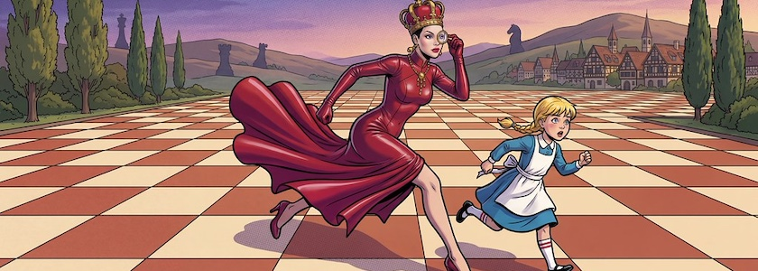

Bei der [Veröffentlichung](https://kantel.github.io/posts/2026042801_weisser_ritter/) des neuen Tutorials zu Alice und ihrer Reise ins Wunderland mit [Twine](http://cognitiones.kantel-chaos-team.de/multimedia/spieleprogrammierung/twine2.html) und [Chapbook](https://klembot.github.io/chapbook/guide/) gestern abend war es wohl schon so spät, daß ich glatt verschlafen hatte, auch eine spielbare Version in diesen Seiten einzubinden. Das sei hiermit nachgeholt:

---

<iframe src="alice3/index.html" width="90%" height="800px"></iframe>

---

Gelegentlich kommt es vor, daß sich die Webseite/das Iframe beim Laden verschluckt und statt des Twine-Spiels wird eine Fehlermeldung angezeigt. Hier reicht es in der Regel, die Seite einfach neu zu laden und alles ist wieder schick.

---

**Bild**: *[Alice und die rote Königin](https://www.flickr.com/photos/schockwellenreiter/55206035734/)*, erstellt mit [OpenArt](https://openart.ai/home). Prompt: »*The @Red Queen runs very fast across a wide plain, tiled with squares like a chessboard, running with @Alice who looks somewhat surprised, after her. A few tall trees stand at the edges of the plain, and in the background, some hills and a small, picturesque village can be seen. Colored Franco-Belgian comic style. Language German. No speech bubbles, no textboxes, no headlines.*« Modell: Nano Banana&nbsp;2