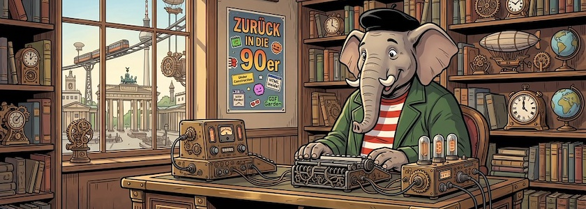

Nach dem [Ende meines Spielplatzes auf Glitch 🎏](https://kantel.github.io/posts/2025052402_glitch_ende/) im letzten Jahr, war es recht still geworden um meine Idee, wie in den 90er Jahren [Websites ohne Sinn und Verstand](http://blog.schockwellenreiter.de/2022/05/2022052401.html) zu basteln, Websites, die keinen Ziel und keinen Zweck verfolgen, sondern die einfach nur da sind und mir -- und nicht den asozialen Netzen -- gehören. Websites, mit denen ich tun und lassen kann, was ich will.

Die Stille lag vor allem darin begründet, daß ich keinen adäquaten Ersatz für [Glitch&nbsp;🎏](http://cognitiones.kantel-chaos-team.de/webworking/staticsites/glitch.html) gefunden hatte. Doch nun spielte immer häufiger unser aller Datenkrake Videos in meinen Feedreader, in denen meist sehr junge Damen die Rückkehr zu einem Web der 90er Jahre propagieren, zu einem Web, das nur aus statischen Seiten mit HTML, CSS und ein wenig JavaScript (und meist auch noch aus einer Menge zappeliger GIFs) besteht, einem Web, das man komplett selbst gebastelt hat, ohne Frameworks und vor allem – ohne Facebook und Instagram (und all die anderen asozialen Medien).

<iframe class="if16_9" src="https://www.youtube.com/embed/Tv223kX0SRg?si=3Xo84PE5am7ndrbI" title="YouTube video player" frameborder="0" allow="accelerometer; autoplay; clipboard-write; encrypted-media; gyroscope; picture-in-picture; web-share" referrerpolicy="strict-origin-when-cross-origin" allowfullscreen></iframe>

Sie nennen es das »[IndieWeb](https://en.wikipedia.org/wiki/IndieWeb)«. Okay, ich [verstand unter »IndieWeb« bisher etwas anderes](http://blog.schockwellenreiter.de/2016/03/2016032903.html), was auch der Grund dafür sein mag, daß dieser nostalgische Trend bisher an mir vorbeigegangen war, aber das klingt alles nach meiner Idee von »Webseiten basteln ohne Sinn und Verstand« und ist mir daher auf jeden Fall symphatisch.

Kern dieses Trends scheinen die beiden (in der Grundversion kostenlosen) Hoster [Neocities](https://de.wikipedia.org/wiki/Neocities) und [Nekoweb](https://nekoweb.org/) zu sein. Neocities bietet in der kostenlosen Version 1&nbsp;Gigabyte Speicherplatz für kostenlose Seiten und kein serverseitiges Scripting.

>Das erklärte Ziel des Dienstes ist es, »die Unterstützung für das kostenlose Webhosting des inzwischen eingestellten GeoCities wiederzubeleben«. Neocities startete im Jahr 2013. Im Mai 2024 beherbergte es mehr als 782.800 Webseiten. […] Die Dateien, die kostenlose Nutzer auf Neocities hosten können, sind auf HTML-Dateien, CSS-Dateien, Javascript-Dateien, Markdown-Dateien, XML-Dateien, Textdateien, Schriftarten und Bilder beschränkt.

[Nekoweb](https://nekoweb.org/) ist jünger, gegründet 2024 von einer Gruppe aus Programmierern, Entwicklern und Künstlern, die sich für das klassische Web und persönliche Websites begeistern. Sie schreiben:

>Soziale Medien schränken uns zu sehr ein. Wir glauben, daß jeder sich in seiner eigenen kleinen Ecke des Internets frei ausdrücken können sollte, ohne sich Gedanken über Algorithmen, Tracking oder Werbung machen zu müssen. Nekoweb ist werbefrei und wird ausschließlich durch Spenden seiner Nutzer finanziert.

Statt einem Gigabyte ist der Speicherplatz in der kostenlosen Version von Nekoweb auf 500&nbsp;MB begrenzt (das ist aber auch schon eine ganze Menge), aber dafür ist das Hochladen von Dateien einfacher (man ist nicht auf den internen Editor angewiesen) und es gibt keine Beschränkung für Dateitypen.

Die Macher von Neocities und Nekoweb scheinen sich nicht ganz grün zu sein. Es gibt (unbestätigte!) Gerüchte, daß Neocities-Accounts gelöscht wurden, weil sie angeblich positiv über Nekoweb berichtet hätten.

### Links

- Josiah Brown: *[Intro to the Indie Web](https://medium.com/@josiah.alen.brown/intro-to-the-indie-web-581dbef591c2)*, Medium.com (€) vom 20.&nbsp;Dezember&nbsp;2025
- Aeon Flex: *[Neocities vs Nekoweb: Why I Graduated](https://medium.com/@neonmaxima/neocities-vs-nekoweb-why-i-graduated-59090b1b6a57)*, Medium.com vom 27.&nbsp;Mai&nbsp;2025
- Aeon Flex: *[Why Nekoweb and Neocities Are the Real Metaverse](https://medium.com/@neonmaxima/why-nekoweb-and-neocities-are-the-real-metaverse-611f329b1efb)*, Medium.com vom 18.&nbsp;August&nbsp;2025

Einer von beiden oder auch beide Dienste könnten ein guter Ersatz für meinen Glitch&nbsp;🎏-Account werden, so daß auch ich endlich wieder Webseiten ohne Sinn und Verstand basteln kann. *Still digging!*

---

**Bild**: *[Steampunk Qumbo](https://www.flickr.com/photos/schockwellenreiter/55238757356/)*, erstellt mit [OpenArt](https://openart.ai/home). Prompt: »*@Qumbo sits at a massive desk in front of a steampunk-style computer, using an old-fashioned keyboard. Shelves line the wall, crammed with books and steampunk knick-knacks. Through a window, one can see an alternative steampunk Berlin. A poster on one wall, between the shelves, reads "Back to the 90s," adorned with a few Neocities-style stickers. Colored classic American comic style. Language: German. No textboxes, no speech bubbles, no headlines.*« Modell: Nano Banana&nbsp;2.